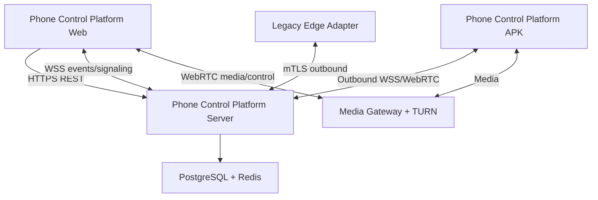
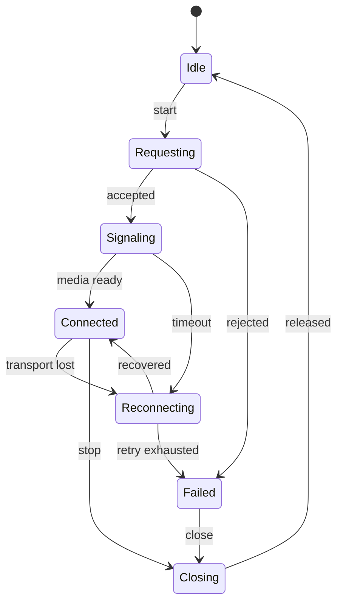
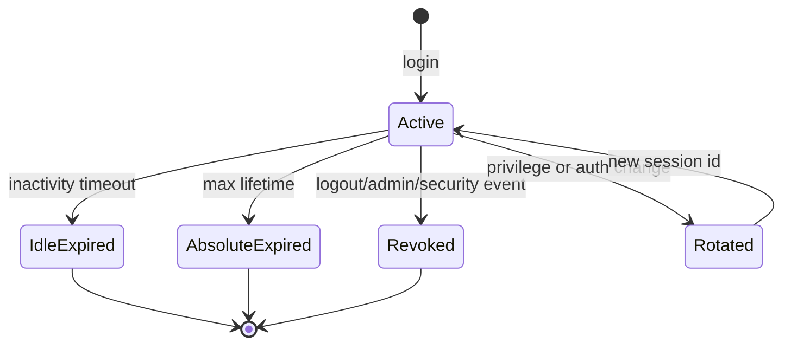
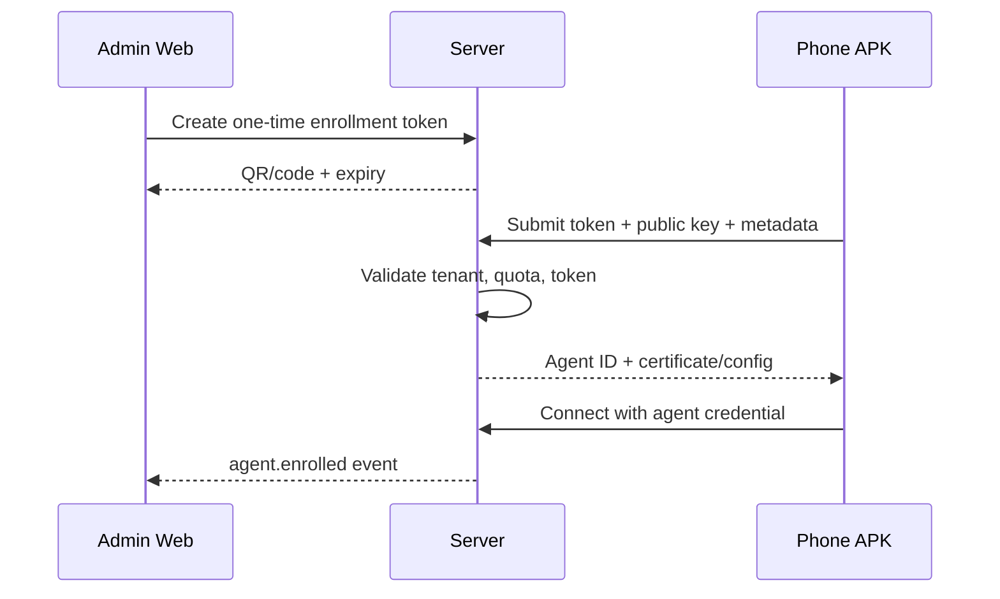
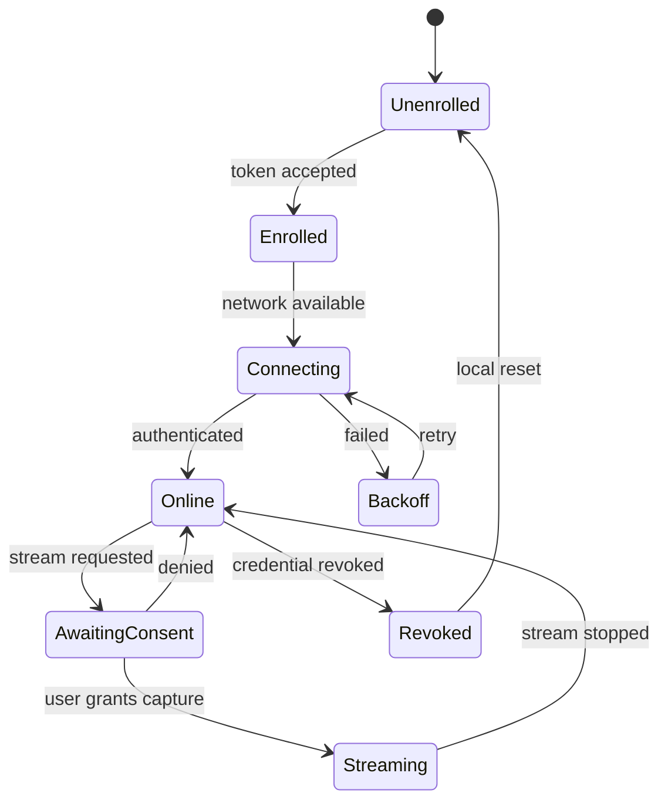
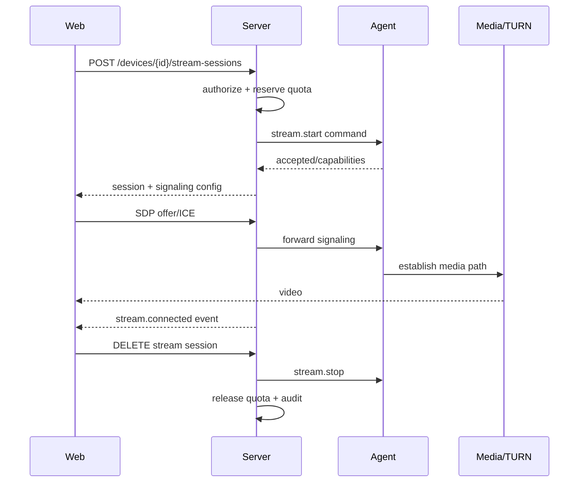
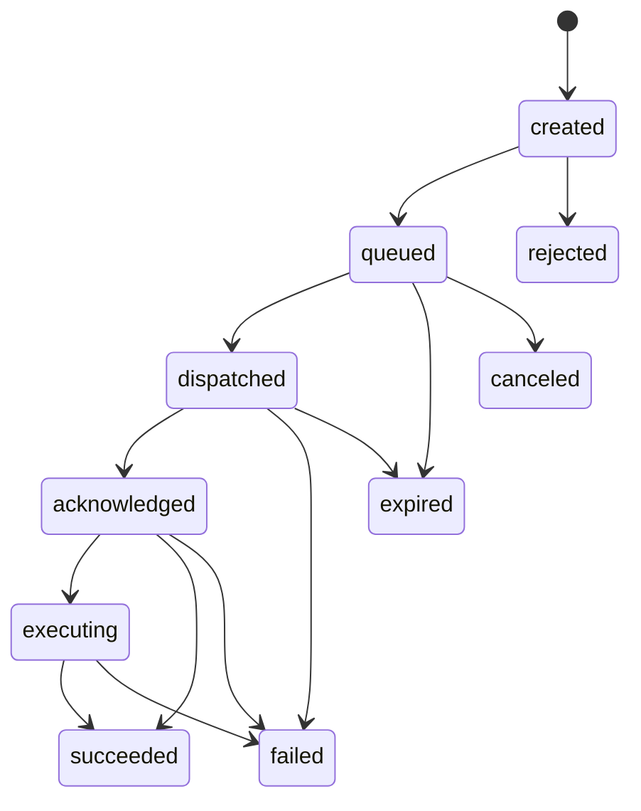
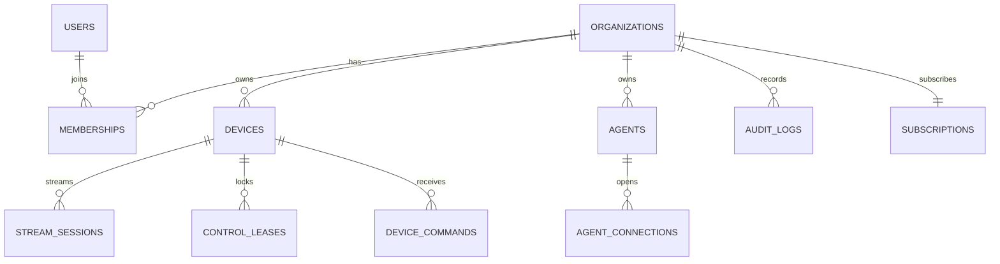

# Phone Control Platform — Product & Engineering Blueprint

> **Tài liệu nguồn triển khai từ MVP đến thương mại**  
> Product name: **Phone Control Platform**  
> Web client display name: **Phone Control Platform**  
> Android APK display name: **Phone Control Platform**  
> Server/platform display name: **Phone Control Platform**  
> Document status: **Baseline v1.0**  
> Last updated: **2026-08-13**  
> Primary deployment: **Ubuntu Server + Docker**

---

## Mục lục

### Nền tảng sản phẩm

- [0. Cách sử dụng tài liệu](#0-cách-sử-dụng-tài-liệu)
- [1. Nhận diện sản phẩm và quy ước tên](#1-nhận-diện-sản-phẩm-và-quy-ước-tên)
- [2. Tầm nhìn, mục tiêu và giới hạn](#2-tầm-nhìn-mục-tiêu-và-giới-hạn)
- [3. Persona, tổ chức và use case](#3-persona-tổ-chức-và-use-case)
- [4. Kiến trúc hệ thống chuẩn](#4-kiến-trúc-hệ-thống-chuẩn)
- [5. Technology baseline](#5-technology-baseline)
- [6. Cấu trúc monorepo](#6-cấu-trúc-monorepo)

### Client, Server, APK và media

- [7. Phone Control Platform Web Client](#7-phone-control-platform-web-client)
- [8. Phone Control Platform Server](#8-phone-control-platform-server)
- [9. Identity, authentication và session](#9-identity-authentication-và-session)
- [10. Multi-tenancy, RBAC và ABAC](#10-multi-tenancy-rbac-và-abac)
- [11. Device, Agent và presence domain](#11-device-agent-và-presence-domain)
- [12. Phone Control Platform Android APK](#12-phone-control-platform-android-apk)
- [13. Legacy Edge Adapter và Solumate mapping](#13-legacy-edge-adapter-và-solumate-mapping)
- [14. Media, stream và control transport](#14-media-stream-và-control-transport)

### Contract, dữ liệu và bảo mật

- [15. Client–Server mapping tổng thể](#15-clientserver-mapping-tổng-thể)
- [16. REST API contract](#16-rest-api-contract)
- [17. WebSocket và realtime event contract](#17-websocket-và-realtime-event-contract)
- [18. Agent command protocol](#18-agent-command-protocol)
- [19. Database blueprint](#19-database-blueprint)
- [20. Security blueprint](#20-security-blueprint)
- [21. Observability, audit và diagnostics](#21-observability-audit-và-diagnostics)
- [22. Optional authorized LIVE monitor integration](#22-optional-authorized-live-monitor-integration)
- [23. Network profile và proxy management](#23-network-profile-và-proxy-management)

### Triển khai và thương mại

- [24. Ubuntu/Docker deployment blueprint](#24-ubuntudocker-deployment-blueprint)
- [25. CI/CD và release engineering](#25-cicd-và-release-engineering)
- [26. Testing strategy và acceptance matrix](#26-testing-strategy-và-acceptance-matrix)
- [27. Performance, capacity và SLO](#27-performance-capacity-và-slo)
- [28. Backup, disaster recovery và continuity](#28-backup-disaster-recovery-và-business-continuity)
- [29. Commercialization blueprint](#29-commercialization-blueprint)
- [30. Delivery roadmap và exit gates](#30-delivery-roadmap-và-exit-gates)
- [31. Sprint-level implementation backlog](#31-sprint-level-implementation-backlog)
- [32. Definition of Ready và Definition of Done](#32-definition-of-ready-và-definition-of-done)
- [33. Risk register](#33-risk-register)
- [34. Operational runbook index](#34-operational-runbook-index)
- [35. Pre-production checklists](#35-pre-production-checklists)
- [36. Initial ADR list](#36-initial-adr-list)
- [37. Open questions requiring explicit decision](#37-open-questions-requiring-explicit-decision)
- [38. Reference links](#38-reference-links)
- [39. Final architecture baseline](#39-final-architecture-baseline)
- [40. Blueprint sign-off](#40-blueprint-sign-off)

---

## 0. Cách sử dụng tài liệu

### 0.1 Mục đích

Tài liệu này là nguồn sự thật duy nhất (single source of truth) cho việc phân tích, thiết kế, lập trình, kiểm thử, triển khai, vận hành và thương mại hóa **Phone Control Platform**.

Mọi thay đổi ảnh hưởng đến kiến trúc, giao thức, dữ liệu, phân quyền, tính phí hoặc bảo mật MUST được cập nhật vào tài liệu này trước hoặc cùng pull request triển khai.

### 0.2 Ý nghĩa từ khóa

- **MUST / MUST NOT:** bắt buộc hoặc cấm tuyệt đối.
- **SHOULD / SHOULD NOT:** mặc định phải tuân theo; chỉ được khác khi có ADR giải thích.
- **MAY:** tùy chọn, không tạo phụ thuộc bắt buộc.
- **Exit gate:** điều kiện bắt buộc để chuyển sang giai đoạn tiếp theo.
- **ADR:** Architecture Decision Record.

### 0.3 Nguyên tắc chống nhầm lẫn

1. Tên hiển thị sản phẩm ở mọi bề mặt MUST là **Phone Control Platform**.
2. Tên kỹ thuật nội bộ MAY có hậu tố để phân biệt thành phần, ví dụ `pcp-web`, `pcp-server`, `pcp-android`.
3. Web Client không được gọi trực tiếp database hoặc Android Agent.
4. Android Agent không được truy cập trực tiếp database.
5. Media plane và control plane MUST tách biệt.
6. Mọi bảng dữ liệu tenant-owned MUST có `organization_id`.
7. Mọi lệnh tới thiết bị MUST có `command_id`, actor, TTL, trạng thái và audit record.
8. Mọi thay đổi quyền MUST có audit record.
9. Không đưa secret, refresh token, API key hoặc certificate private key vào source code, frontend bundle hay log.
10. Không triển khai tính năng chưa có acceptance criteria và owner.

### 0.4 Quy trình thay đổi blueprint

1. Tạo issue mô tả vấn đề.
2. Nếu thay đổi kiến trúc hoặc giao thức, tạo ADR.
3. Cập nhật blueprint và OpenAPI/event schema.
4. Review bởi ít nhất Backend, Frontend và Security owner nếu thay đổi chạm cả ba.
5. Merge tài liệu trước hoặc cùng code.
6. Gắn version blueprint vào release note.

---

## 1. Nhận diện sản phẩm và quy ước tên

### 1.1 Tên chính thức

| Bề mặt | Tên hiển thị bắt buộc | Tên kỹ thuật đề xuất |
|---|---|---|
| Toàn hệ thống | Phone Control Platform | `phone-control-platform` |
| Website quản lý | Phone Control Platform | `pcp-web` |
| Control/API server | Phone Control Platform | `pcp-server` |
| Android APK | Phone Control Platform | `pcp-android` |
| Media gateway | Phone Control Platform | `pcp-media` |
| Mock device agent | Phone Control Platform | `pcp-mock-agent` |
| Legacy ADB adapter | Phone Control Platform | `pcp-edge-adapter` |
| LIVE monitor tùy chọn | Phone Control Platform | `pcp-live-monitor` |

### 1.2 Định danh dự kiến

Các giá trị dưới đây là placeholder và MUST được xác minh quyền sở hữu domain/trademark trước thương mại:

- Android application ID: `com.phonecontrolplatform.app`
- API base path: `/api/v1`
- WebSocket path: `/ws/v1`
- Agent WebSocket path: `/agent/v1/connect`
- Health endpoints: `/health/live`, `/health/ready`
- OpenAPI title: `Phone Control Platform API`
- Event namespace: `pcp.v1.*`
- Command namespace: `pcp.v1.command.*`

### 1.3 Quy ước ID

- Public entity ID SHOULD dùng UUIDv7 hoặc ULID.
- Database primary key MUST không tuần tự lộ số lượng tenant.
- `organization_id`, `device_id`, `stream_session_id`, `control_lease_id`, `command_id` MUST là ID bất biến.
- Tên thiết bị, group, tag là mutable và không được dùng làm foreign key.

### 1.4 Quy ước thời gian

- Database lưu UTC.
- API dùng RFC 3339, ví dụ `2026-08-13T09:30:00Z`.
- Web hiển thị theo timezone hồ sơ người dùng; mặc định `Asia/Ho_Chi_Minh`.
- TTL và duration dùng millisecond integer hoặc ISO 8601 duration theo schema đã chọn; không trộn lẫn.

---

## 2. Tầm nhìn, mục tiêu và giới hạn

### 2.1 Tầm nhìn

Phone Control Platform là nền tảng quản lý, quan sát và điều khiển từ xa nhiều thiết bị Android hợp lệ qua website, phục vụ vận hành LIVE, QA, phòng lab thiết bị, kiosk, hỗ trợ từ xa và quản trị đội ngũ.

### 2.2 Mục tiêu sản phẩm

- Quản lý tập trung hàng chục đến hàng nghìn thiết bị.
- Xem màn hình nhiều thiết bị trên một dashboard.
- Điều khiển một thiết bị với độ trễ thấp.
- Phân nhóm, gắn tag và phân công thiết bị cho operator.
- Quản lý quyền theo tổ chức và vai trò.
- Theo dõi trạng thái, lỗi, phiên stream và lịch sử lệnh.
- Hỗ trợ Android Agent không root/ADB sau khi cài đặt và cấp quyền hợp lệ.
- Hỗ trợ legacy edge adapter dùng Solumate/scrcpy/ADB trong lab riêng.
- Triển khai on-premise hoặc cloud bằng Ubuntu/Docker.
- Có nền tảng billing, subscription, quota và support để thương mại hóa.

### 2.3 Mục tiêu phi chức năng

- Nhẹ, ổn định, dễ triển khai.
- Client và server có contract rõ ràng.
- Tenant isolation từ thiết kế đầu tiên.
- Không public ADB/shell/file API ra Internet.
- Có audit đầy đủ cho thao tác nhạy cảm.
- Có đường nâng cấp không downtime cho schema thông thường.
- Có khả năng rollback release.

### 2.4 Ngoài phạm vi và giới hạn bắt buộc

Phone Control Platform MUST NOT cung cấp hoặc quảng bá:

- tạo view/comment/like/follow giả;
- né hệ thống chống bot hoặc tránh thực thi chính sách nền tảng;
- giả mạo IMEI, serial, SIM, hardware identity hoặc sensor nhằm né phát hiện;
- chiếm quyền tài khoản, vượt khóa màn hình, vượt xác thực hoặc truy cập trái phép;
- backup/restore dữ liệu riêng của ứng dụng khác khi Android/vendor không cấp quyền;
- tự động hóa tương tác mạng xã hội trái điều khoản dịch vụ;
- mở ADB TCP/5555 công khai;
- dùng AccessibilityService trái chính sách phân phối hoặc ngoài consent rõ ràng.

Các network/proxy profile chỉ phục vụ routing doanh nghiệp, kiểm thử địa lý được phép và quản trị mạng hợp lệ; MUST NOT được mô tả là anti-detection.

### 2.5 Phạm vi phiên bản

| Giai đoạn | Phạm vi |
|---|---|
| Prototype | Web UI + mock devices + mock stream |
| MVP | Auth, organization, RBAC, device grid, stream một máy, control lease, audit |
| Pilot | Android Agent hoặc Edge Adapter, WebRTC/TURN, monitoring, backup |
| Commercial v1 | Billing, quota, support, SLA, hardening, DR |
| Scale | Multi-region, sharding presence, SFU khi cần nhiều viewer |

---

## 3. Persona, tổ chức và use case

### 3.1 Persona

| Persona | Mục tiêu | Giới hạn |
|---|---|---|
| Organization Owner | Quản lý toàn bộ tenant, billing, security | Không được đọc secret thô |
| Admin | Quản lý thiết bị, nhóm, thành viên | Không đổi owner/billing nếu không có quyền |
| Manager | Phân công operator và group | Không quản lý security cấp tổ chức |
| Operator | Xem/điều khiển thiết bị được giao | Không xem thiết bị ngoài scope |
| Viewer | Chỉ xem stream/metadata được phép | Không gửi input |
| Billing | Quản lý gói, hóa đơn | Không điều khiển thiết bị |
| Support Agent | Hỗ trợ theo ticket được ủy quyền | Quyền có thời hạn, luôn audit |
| Platform Admin | Vận hành hạ tầng toàn cục | Không tự động có quyền xem nội dung tenant |

### 3.2 Use case cốt lõi

- UC-001: đăng ký tài khoản và xác minh email.
- UC-002: tạo hoặc tham gia organization.
- UC-003: mời thành viên và gán vai trò.
- UC-004: enroll Android Agent bằng mã một lần.
- UC-005: phát hiện thiết bị online/offline.
- UC-006: lọc thiết bị theo group/tag/status/operator.
- UC-007: mở device grid.
- UC-008: yêu cầu phiên stream.
- UC-009: xin control lease độc quyền.
- UC-010: gửi touch/swipe/key/text hợp lệ.
- UC-011: thu hồi control lease.
- UC-012: xem command history và audit log.
- UC-013: cấu hình notification.
- UC-014: giới hạn theo subscription entitlement.
- UC-015: support truy cập có consent và thời hạn.

### 3.3 User journey MVP

1. User đăng ký.
2. Hệ thống gửi email verification.
3. User xác minh và đăng nhập.
4. User tạo organization hoặc chấp nhận invitation.
5. Admin tạo enrollment token.
6. Android Agent nhập/scan token và đăng ký.
7. Device xuất hiện trạng thái `online`.
8. Operator mở Device Grid.
9. Operator chọn device và bắt đầu stream.
10. Operator xin control lease.
11. Server cấp lease nếu không xung đột.
12. Input đi qua WebRTC DataChannel hoặc secure control WebSocket.
13. Agent thực thi và gửi result.
14. Server ghi audit và telemetry.
15. Operator đóng phiên; lease và stream được giải phóng.

---

## 4. Kiến trúc hệ thống chuẩn

### 4.1 Kiến trúc logic



### 4.2 Tách control plane và media plane

#### Control plane

Bao gồm:

- đăng nhập, organization, RBAC;
- device registry;
- presence;
- stream session orchestration;
- control lease;
- command metadata và result;
- audit, notification, billing;
- WebRTC signaling.

Control plane đi qua HTTPS/WSS và Phone Control Platform Server.

#### Media plane

Bao gồm:

- H.264/VP8 RTP media;
- TURN relay khi không đi P2P được;
- WebRTC DataChannel cho input thời gian thực;
- H.264 binary WSS fallback trong môi trường được cho phép.

Media payload SHOULD không đi qua core REST API.

### 4.3 Component ownership

| Component | Trách nhiệm | Không chịu trách nhiệm |
|---|---|---|
| `pcp-web` | UI, local presentation state, render stream | Quyền cuối cùng, business rules, secret |
| `pcp-server` | Auth, RBAC, orchestration, durable state | Encode/decode video trực tiếp |
| `pcp-media` | Signaling adapter, TURN credential, media relay | Billing, user management |
| `pcp-android` | Capture, encode, control execution, telemetry | Tenant authorization cuối cùng |
| `pcp-edge-adapter` | Bridge legacy ADB/scrcpy trong mạng riêng | Public SaaS API |
| PostgreSQL | Durable transactional state | Presence tốc độ cao |
| Redis | Cache, presence TTL, rate limit, short queues | Nguồn dữ liệu billing/audit lâu dài |

### 4.4 Mô hình triển khai ban đầu

- Một region.
- Một `pcp-server` modular monolith có thể scale ngang.
- PostgreSQL primary + backup; replica khi cần.
- Redis một instance có persistence ở MVP; HA ở commercial.
- coturn một hoặc nhiều node có public IP.
- Caddy reverse proxy và TLS.
- `pcp-web` static assets.
- Agent luôn kết nối outbound; server không kết nối inbound tới LAN của device.

### 4.5 Lý do chọn modular monolith trước microservices

- Giảm số deployment unit và lỗi phân tán.
- Transaction organization/device/billing rõ ràng.
- Dễ debug trong MVP.
- Module boundary vẫn được giữ trong source.
- Chỉ tách service khi có bằng chứng scale hoặc ownership độc lập.

### 4.6 Điều kiện tách service

Một module chỉ được tách khi ít nhất một điều kiện đúng:

- cần scale độc lập hơn 5 lần core API;
- có failure domain khác;
- có security boundary khác;
- có team ownership độc lập;
- deployment cadence khác đáng kể;
- performance profiling chứng minh bottleneck.

---

## 5. Technology baseline

### 5.1 Stack bắt buộc cho MVP

| Lớp | Công nghệ |
|---|---|
| Web language | TypeScript strict mode |
| Web framework | React + Vite |
| Styling | Tailwind CSS + Radix primitives/shadcn-style components |
| Routing | React Router |
| Server state | TanStack Query |
| Table/virtualization | TanStack Table + TanStack Virtual |
| Local UI state | Zustand |
| Forms | React Hook Form + Zod |
| Internationalization | i18next |
| Backend language | Go |
| HTTP router | `chi` hoặc standard library wrapper mỏng; chốt `chi` cho MVP |
| Database | PostgreSQL |
| Database access | `pgx` + `sqlc` |
| Cache/presence | Redis |
| API description | OpenAPI 3.1 |
| Realtime | Native WebSocket protocol có schema |
| Media | WebRTC + coturn |
| Android | Kotlin + Android SDK |
| Container | Docker + Docker Compose |
| Reverse proxy | Caddy |
| Observability | OpenTelemetry + Prometheus/Grafana/Loki |

### 5.2 Version policy

- Không ghi `latest` trong image production.
- Pin major/minor; patch được cập nhật qua dependency bot sau CI.
- Runtime MUST dùng version còn được upstream hỗ trợ tại thời điểm release.
- Database major upgrade MUST có rehearsal trên staging clone.
- Android `minSdk` dự kiến 24 để hỗ trợ gesture dispatch trên Galaxy S7 chạy Android 7+; MUST xác minh trên thiết bị thật.
- `targetSdk` MUST theo yêu cầu phân phối hiện hành; mỗi lần tăng targetSdk phải chạy permission regression suite.

### 5.3 Công nghệ không dùng trong core MVP

- Không dùng Kubernetes ở MVP nếu chưa có nhu cầu multi-node phức tạp.
- Không dùng Kafka chỉ để truyền vài loại event.
- Không đưa Python vào request path chính.
- Không viết codec tùy chỉnh khi MediaCodec/WebRTC đáp ứng được.
- Không dùng JWT trong `localStorage`.
- Không dùng GraphQL nếu REST/OpenAPI đã đủ.

---

## 6. Cấu trúc monorepo

```text
phone-control-platform/
├── apps/
│   ├── web/                       # React/TypeScript SPA
│   ├── server/                    # Go control server
│   ├── android/                   # Kotlin Android APK
│   ├── mock-agent/                # Device simulator for development
│   └── edge-adapter/              # Legacy Solumate/scrcpy bridge
├── packages/
│   ├── ui/                        # Design system
│   ├── web-contracts/             # Generated TS OpenAPI/event types
│   ├── protocol/                  # JSON Schema/Protobuf definitions
│   └── config/                    # Shared lint/build configuration
├── services/
│   ├── media-gateway/             # WebRTC signaling/media integration
│   └── live-monitor/              # Optional authorized LIVE monitor
├── database/
│   ├── migrations/
│   ├── queries/
│   └── seeds/
├── api/
│   ├── openapi.yaml
│   ├── events/
│   └── examples/
├── infra/
│   ├── docker/
│   ├── caddy/
│   ├── coturn/
│   ├── monitoring/
│   └── scripts/
├── deploy/
│   ├── compose/
│   ├── staging/
│   └── production/
├── docs/
│   ├── adr/
│   ├── runbooks/
│   ├── threat-model/
│   └── product/
├── tests/
│   ├── e2e/
│   ├── contract/
│   ├── load/
│   └── security/
├── .github/workflows/
├── Makefile
├── README.md
└── LICENSES.md
```

### 6.1 Source ownership

| Path | Primary owner | Required reviewers |
|---|---|---|
| `apps/web` | Frontend | Product/UX khi đổi flow |
| `apps/server` | Backend | Security khi đổi auth/RBAC |
| `apps/android` | Android | Backend khi đổi protocol |
| `packages/protocol` | Platform | Frontend + Backend + Android |
| `database/migrations` | Backend | DBA/Platform |
| `infra` | DevOps | Security |
| `services/live-monitor` | Integrations | Legal/Security trước production |

---

## 7. Phone Control Platform Web Client

### 7.1 Trách nhiệm

Web Client MUST:

- hiển thị dữ liệu theo organization và quyền;
- quản lý navigation, filters, pagination và UI state;
- gọi REST API thông qua generated client;
- nhận event/signaling qua authenticated WebSocket;
- render WebRTC stream hoặc H.264 fallback;
- gửi input chỉ khi có control lease hợp lệ;
- hiển thị trạng thái pending/ack/succeeded/failed của lệnh;
- không giả định frontend authorization là đủ;
- không lưu secret hoặc long-lived bearer token.

### 7.2 Cấu trúc source web

```text
apps/web/src/
├── app/
│   ├── App.tsx
│   ├── router.tsx
│   ├── providers.tsx
│   └── error-boundary.tsx
├── pages/
│   ├── auth/
│   ├── dashboard/
│   ├── devices/
│   ├── device-grid/
│   ├── groups/
│   ├── agents/
│   ├── team/
│   ├── audit/
│   ├── billing/
│   └── settings/
├── features/
│   ├── auth/
│   ├── organizations/
│   ├── devices/
│   ├── streams/
│   ├── control/
│   ├── notifications/
│   └── billing/
├── components/
│   ├── layout/
│   ├── device-tile/
│   ├── stream-view/
│   ├── data-table/
│   └── feedback/
├── services/
│   ├── api-client.ts
│   ├── websocket-client.ts
│   ├── media-client.ts
│   └── telemetry.ts
├── stores/
├── hooks/
├── i18n/
├── styles/
└── generated/
```

### 7.3 Route map

| Route | Page | Required permission | Data source |
|---|---|---|---|
| `/login` | Login | Public | Auth API |
| `/register` | Registration | Public | Auth API |
| `/verify-email` | Verify email | Public token | Auth API |
| `/forgot-password` | Forgot password | Public | Auth API |
| `/reset-password` | Reset password | Public token | Auth API |
| `/app` | Dashboard | `dashboard.read` | Metrics API + WS |
| `/app/devices` | Device List | `device.read` | Device API + WS |
| `/app/devices/grid` | Device Grid | `device.read` | Device/Stream API + WS/WebRTC |
| `/app/devices/:id` | Device Detail | `device.read` | Device/Event/Command APIs |
| `/app/groups` | Groups | `group.read` | Group API |
| `/app/agents` | Agents | `agent.read` | Agent API + WS |
| `/app/team` | Members/Roles | `member.read` | Organization API |
| `/app/audit` | Audit Logs | `audit.read` | Audit API |
| `/app/billing` | Plans/Invoices | `billing.read` | Billing API |
| `/app/settings/profile` | Profile | Authenticated | User API |
| `/app/settings/security` | Security | Authenticated | Auth/session API |
| `/app/settings/organization` | Organization | `organization.manage` | Organization API |

### 7.4 Layout

- Desktop sidebar expanded: 256 px.
- Desktop sidebar collapsed: 72 px.
- Top bar: 64 px.
- Main background: neutral light surface.
- Content uses 12-column grid.
- Sidebar collapse state MAY lưu local; security state MUST không lưu local.
- Mobile sidebar chuyển thành drawer.
- Device Grid phải ưu tiên diện tích video; không đặt banner quảng cáo lớn.

### 7.5 Navigation groups

1. Overview
   - Dashboard
2. Devices
   - Device Grid
   - Device List
   - Groups & Tags
   - Agents
3. Operations
   - Active Sessions
   - Command History
   - Notifications
4. Organization
   - Team
   - Roles
   - Audit Logs
5. Commerce
   - Subscription
   - Usage
   - Invoices
6. Settings
   - Profile
   - Security
   - Organization

### 7.6 Design tokens

```css
:root {
  --pcp-color-primary: #2563eb;
  --pcp-color-accent: #7c3aed;
  --pcp-color-bg: #f4f7fb;
  --pcp-color-surface: #ffffff;
  --pcp-color-text: #0f172a;
  --pcp-color-muted: #64748b;
  --pcp-color-border: #e2e8f0;
  --pcp-color-success: #16a34a;
  --pcp-color-warning: #f59e0b;
  --pcp-color-danger: #dc2626;
  --pcp-radius-sm: 8px;
  --pcp-radius-md: 12px;
  --pcp-radius-lg: 16px;
  --pcp-shadow-card: 0 4px 16px rgba(15, 23, 42, 0.08);
}
```

- Font mặc định: Inter.
- Vietnamese typography MAY dùng Be Vietnam Pro nếu kiểm thử cho thấy dễ đọc hơn.
- Spacing theo hệ 4 px/8 px.
- Contrast MUST đạt WCAG AA cho text và control chính.

### 7.7 Device Tile specification

Mỗi tile MUST có:

- device display name;
- status dot: online/offline/degraded/maintenance;
- thumbnail hoặc stream surface;
- Android version/model;
- network quality;
- current operator nếu có;
- stream/control indicators;
- latency hoặc last seen;
- overflow menu theo quyền.

Tile states:

| State | UI |
|---|---|
| `offline` | Placeholder + last seen; disable stream/control |
| `online_idle` | Thumbnail + Open button |
| `connecting` | Skeleton/spinner + timeout counter |
| `streaming_view` | Video + viewer badge |
| `streaming_control` | Video + control lease countdown |
| `degraded` | Warning badge + retry action |
| `error` | Error code + diagnostic link |
| `maintenance` | Locked badge; no user command |

### 7.8 Device Grid performance rules

- Virtualize tiles ngoài viewport.
- Không mở stream cho mọi tile mặc định.
- Grid overview dùng thumbnail hoặc profile thấp.
- Focused tile nâng profile chất lượng.
- Chỉ một decode pipeline trên mỗi active stream.
- Worker decode/render SHOULD tách khỏi main UI thread khi dùng H.264 fallback.
- Giữ tối đa một frame pending; drop frame cũ khi renderer bận.
- Reconnect dùng exponential backoff có jitter.
- Không reconnect vô hạn khi token/permission lỗi.
- Browser tab hidden SHOULD hạ FPS hoặc pause nonessential streams.

### 7.9 Stream view states



### 7.10 Control UX

- View và control là hai quyền riêng.
- User MUST bấm “Yêu cầu điều khiển”.
- Web MUST nhận lease trước khi enable input.
- Hiển thị owner và thời gian còn lại của lease.
- Khi lease sắp hết, Web MAY gia hạn nếu tab active và server cho phép.
- Khi mất lease, input MUST dừng ngay.
- High-frequency pointer move không ghi từng event vào audit; ghi session summary.
- Các hành động nhạy cảm như reboot, app install hoặc reset MUST yêu cầu confirm và permission riêng; không nằm trong MVP APK không ADB.

### 7.11 State ownership

| State | Owner |
|---|---|
| User/session/permissions | Server; cached by TanStack Query |
| Organization selection | Server-validated; URL/session scoped |
| Devices/groups | Server |
| Presence | Server event stream; Redis-backed |
| Filter/sort/page | URL query string |
| Sidebar/theme | Local browser preference |
| Stream state | Server authoritative + local transport state |
| Control lease | Server authoritative |
| Form draft | Component/local store |

### 7.12 Error handling

- Global error boundary cho lỗi render.
- API error hiển thị `request_id` nhưng không hiển thị stack trace.
- `401`: thử refresh session theo cookie flow một lần, sau đó redirect login.
- `403`: hiển thị missing permission; không retry.
- `409`: hiển thị conflict, ví dụ lease đang thuộc user khác.
- `422`: map field errors vào form.
- `429`: hiển thị retry-after.
- `5xx`: retry idempotent reads; không tự retry mutation không có idempotency key.

### 7.13 Accessibility và i18n

- Keyboard navigation cho toàn bộ dashboard.
- Focus trap cho dialog/drawer.
- `aria-live` cho trạng thái connect/control.
- Không dùng màu là tín hiệu duy nhất.
- Locale MVP: `vi-VN`, `en-US`.
- Chuỗi UI không hardcode trong component.
- Ngày, tiền, số và timezone dùng Intl API.

### 7.14 Frontend testing

- Unit: formatter, permission guards, reducers, protocol parsing.
- Component: device tile states, dialogs, forms.
- Integration: auth, list/filter, stream state transitions.
- E2E: register/login, enroll mock device, start stream, acquire/release lease.
- Visual regression: dashboard, grid sizes, dark/light nếu hỗ trợ.
- Performance: 1000 device rows; 25 visible tiles; 9 concurrent low-profile streams.

---

## 8. Phone Control Platform Server

### 8.1 Trách nhiệm

Phone Control Platform Server là control plane authoritative và MUST:

- xác thực user và agent;
- resolve organization/tenant;
- thực thi RBAC/ABAC;
- quản lý device registry và presence;
- orchestration stream session và WebRTC signaling;
- quản lý control lease;
- validate, route và audit command;
- quản lý group/tag, member, notification, billing và entitlement;
- tạo credential TURN ngắn hạn;
- xuất metrics, trace, structured logs;
- không chuyển video frame qua REST handler thông thường.

### 8.2 Server module layout

```text
apps/server/
├── cmd/
│   ├── api/
│   ├── migrate/
│   └── worker/
├── internal/
│   ├── auth/
│   ├── organization/
│   ├── membership/
│   ├── device/
│   ├── group/
│   ├── agent/
│   ├── presence/
│   ├── stream/
│   ├── control/
│   ├── command/
│   ├── audit/
│   ├── notification/
│   ├── billing/
│   ├── entitlement/
│   ├── support/
│   └── platform/
├── pkg/
│   ├── httpx/
│   ├── websocket/
│   ├── observability/
│   ├── crypto/
│   └── validation/
├── generated/
└── go.mod
```

### 8.3 Dependency direction

```text
transport handler
  -> application use case
    -> domain policy
      -> repository/interface
        -> PostgreSQL/Redis/external adapter
```

Rules:

- Handler MUST không chứa SQL.
- Repository MUST không quyết định authorization.
- Domain/application layer MUST không phụ thuộc HTTP type.
- Module khác truy cập qua exported service/interface, không truy cập table trực tiếp.
- Cross-module event MUST có schema và version.

### 8.4 Request lifecycle

1. Reverse proxy gắn/request ID nếu chưa có.
2. Server parse và giới hạn body.
3. Session middleware xác thực cookie hoặc agent certificate.
4. Organization resolver xác định tenant.
5. CSRF middleware kiểm tra mutation browser.
6. Rate limiter kiểm tra actor/IP/organization.
7. Validator kiểm tra schema.
8. Authorization policy kiểm tra permission và resource scope.
9. Use case chạy transaction nếu cần.
10. Audit ghi trong cùng transaction hoặc outbox.
11. Response dùng standard envelope/header.
12. Metrics/trace ghi duration và result class, không ghi secret.

### 8.5 Transaction policy

- Một use case business SHOULD dùng một transaction.
- Không giữ database transaction khi chờ agent/network.
- Command creation commit trước khi publish.
- Dùng transactional outbox cho event không được mất.
- Worker publish outbox với retry/idempotency.
- Handler trả `202 Accepted` cho tác vụ thiết bị bất đồng bộ.

### 8.6 Concurrency policy

- Go goroutine MUST có owner/cancellation context.
- Không tạo goroutine không giới hạn theo frame/event.
- Dùng bounded worker pool cho background jobs.
- WebSocket outbound queue có giới hạn; slow client bị disconnect theo policy.
- Command dispatch per-device phải giữ ordering khi command type yêu cầu.
- Presence update được coalesce để giảm write amplification.

### 8.7 Background jobs

| Job | Tần suất/trigger | Chức năng |
|---|---|---|
| Outbox publisher | Continuous | Publish durable event |
| Presence sweeper | Mỗi vài giây | Mark stale connection offline |
| Lease reaper | Mỗi giây/Redis expiry | Thu hồi lease hết hạn |
| Session cleanup | Mỗi phút | Đóng stream orphan |
| Notification dispatcher | Queue | Email/in-app/webhook |
| Usage aggregator | Mỗi 5 phút/giờ | Tổng hợp billing usage |
| Audit archiver | Daily | Archive theo retention |
| Token cleanup | Daily | Xóa token hết hạn |
| Backup verifier | Daily/weekly | Kiểm tra backup restore sample |

### 8.8 Health checks

- `/health/live`: process còn hoạt động; không kiểm tra dependency xa.
- `/health/ready`: PostgreSQL, Redis và migration compatibility.
- Readiness fail khi instance không thể phục vụ traffic an toàn.
- Health response public không lộ version dependency hoặc topology.

### 8.9 Graceful shutdown

1. Mark instance unready.
2. Dừng nhận request mới.
3. Thông báo WebSocket reconnect.
4. Drain request trong timeout.
5. Flush outbox/telemetry trong giới hạn.
6. Close DB/Redis.
7. Exit non-zero nếu shutdown không sạch do lỗi.

---

## 9. Identity, authentication và session

### 9.1 Auth model mặc định

MVP dùng server-managed opaque session cookie:

- cookie `HttpOnly`;
- `Secure` ở mọi môi trường ngoài localhost;
- `SameSite=Lax` mặc định;
- cookie value là random session identifier, không chứa profile/permission;
- session hash lưu server-side;
- không lưu JWT trong `localStorage` hoặc `sessionStorage`.

### 9.2 Password

- Hash bằng Argon2id với parameter được benchmark trên production class host.
- Password tối thiểu theo policy sản phẩm và block password phổ biến/bị lộ.
- Không ép rotate định kỳ nếu không có dấu hiệu compromise.
- Reset token random, one-time, short TTL, lưu hash.
- Login response không tiết lộ email có tồn tại hay không vượt mức cần thiết.

### 9.3 Session lifecycle



Defaults cần xác nhận trước production:

- idle timeout: 30 phút cho privileged session;
- absolute lifetime: 12 giờ;
- remember-device session MAY dài hơn nhưng phải có refresh/re-auth policy;
- re-auth bắt buộc cho đổi password, MFA, owner, billing payout hoặc secret.

### 9.4 MFA

- TOTP là phương thức MVP.
- Recovery codes single-use, hash at rest.
- Owner/Admin SHOULD bắt buộc MFA ở commercial.
- WebAuthn/passkey là roadmap ưu tiên.

### 9.5 CSRF và CORS

- Mutation từ browser dùng CSRF token hoặc origin-bound defense tương đương.
- CORS allowlist theo environment; không dùng `*` với credential.
- Kiểm tra `Origin` cho WebSocket upgrade.
- Agent endpoint không dùng browser cookie.

### 9.6 OAuth/OIDC tùy chọn

- Enterprise SSO dùng Authorization Code + PKCE.
- Không dùng implicit grant.
- State, nonce và redirect URI exact match.
- Mapping IdP group sang role phải explicit và audit.
- Tuân theo [RFC 9700 — OAuth 2.0 Security Best Current Practice](https://datatracker.ietf.org/doc/rfc9700/).

---

## 10. Multi-tenancy, RBAC và ABAC

### 10.1 Tenant model

- `organization` là tenant boundary.
- User có thể thuộc nhiều organization.
- Mọi request tenant-scoped MUST xác định `organization_id` từ route/session context; không tin body tùy ý.
- Repository method tenant-owned MUST nhận organization ID bắt buộc.
- Query thiếu tenant predicate phải bị static review/test phát hiện.

### 10.2 Roles mặc định

| Role | Mô tả |
|---|---|
| `owner` | Toàn quyền tenant và transfer ownership |
| `admin` | Quản trị member/device/config trừ owner-only |
| `manager` | Group, assignment, session overview |
| `operator` | View/control resource được gán |
| `viewer` | View-only resource được gán |
| `billing` | Subscription, invoice, usage |
| `support_limited` | Quyền ticket-bound, time-bound |

### 10.3 Permission catalog

```text
dashboard.read
device.read
device.update
device.assign
device.stream.view
device.control.acquire
device.control.input
device.command.basic
device.command.sensitive
group.read
group.manage
agent.read
agent.enroll
agent.revoke
member.read
member.invite
member.manage
role.manage
audit.read
billing.read
billing.manage
organization.read
organization.manage
organization.transfer
support.access.grant
```

### 10.4 Resource scope

Ngoài role, authorization MUST kiểm tra:

- device/group có thuộc organization không;
- user có assignment tới device/group không;
- subscription có entitlement không;
- device có maintenance/security hold không;
- control lease có thuộc đúng user/session không;
- support grant có đúng ticket, scope và TTL không.

### 10.5 Permission evaluation order

1. Authenticated actor.
2. Active membership.
3. Role contains permission.
4. Resource belongs to tenant.
5. Assignment/attribute scope.
6. Subscription entitlement.
7. Resource operational state.
8. Security policy/step-up auth.
9. Allow; otherwise fail closed.

### 10.6 UI permission behavior

- Web MAY ẩn action không có quyền để UX sạch.
- Server MUST kiểm tra lại mọi action.
- Permission set trả từ `/auth/session` có version.
- Khi role thay đổi, server phát `session.permissions.changed` và client refresh.

---

## 11. Device, Agent và presence domain

### 11.1 Phân biệt entity

- **Agent:** software connection identity, ví dụ một APK installation hoặc Edge Adapter.
- **Device:** thiết bị logic được quản lý.
- **Agent connection:** một kết nối online cụ thể.
- **Device session:** phiên stream/control.
- Một Agent APK thường ánh xạ một Device.
- Một Edge Adapter MAY quản lý nhiều Device qua lab ADB riêng.

### 11.2 Device status

```text
provisioning
online
offline
degraded
maintenance
revoked
retired
```

Status rules:

- `online` chỉ khi heartbeat còn TTL và agent authenticated.
- `degraded` khi online nhưng stream/control/permission health fail.
- `revoked` không được kết nối lại bằng credential cũ.
- `retired` là terminal business state; record giữ lại theo retention.

### 11.3 Device capabilities

Agent gửi capability document versioned:

```json
{
  "protocol_version": "1.0",
  "capture": {
    "supported": true,
    "codecs": ["h264"],
    "max_width": 1280,
    "max_height": 720,
    "max_fps": 30
  },
  "control": {
    "supported": true,
    "touch": true,
    "swipe": true,
    "global_actions": ["back", "home", "recents"],
    "text_input": "limited"
  },
  "telemetry": ["battery", "network", "orientation"],
  "transport": ["webrtc", "wss_h264"]
}
```

Server MUST không gửi command ngoài capability.

### 11.4 Presence

- Agent heartbeat mặc định mỗi 10 giây.
- Redis presence TTL mặc định 30 giây.
- PostgreSQL `last_seen_at` update coalesced, không mỗi heartbeat.
- Connection replacement phải có generation/connection ID để tránh stale disconnect đánh offline connection mới.
- Presence event có sequence number per device.

### 11.5 Enrollment flow



Enrollment token requirements:

- single use;
- TTL ngắn, mặc định 10 phút;
- bound organization;
- optional bound device group;
- token lưu hash;
- redemption audit;
- rate limited;
- invalidated khi admin revoke.

### 11.6 Agent credential lifecycle

- Private key sinh và giữ trên Agent/Android Keystore khi khả dụng.
- Server lưu public key/certificate metadata.
- Credential rotation định kỳ và sau security event.
- Revoke có hiệu lực trên lần request/connect tiếp theo.
- Lost device flow: revoke agent, terminate sessions, rotate dependent tokens.

---

## 12. Phone Control Platform Android APK

### 12.1 Tên và package

- App display name MUST là **Phone Control Platform**.
- Package placeholder: `com.phonecontrolplatform.app`.
- Release package name chỉ chốt sau khi xác minh domain/trademark.
- Flavor: `dev`, `staging`, `production` với application ID suffix ngoài production.

### 12.2 Trách nhiệm APK

- enrollment và credential storage;
- kết nối outbound an toàn;
- MediaProjection consent flow;
- foreground service cho active capture;
- MediaCodec hardware encoding;
- WebRTC/WSS transport;
- Accessibility-based control trong giới hạn Android và consent;
- device telemetry;
- heartbeat và command result;
- local diagnostics có redaction.

### 12.3 Không phải trách nhiệm APK

- quyết định tenant authorization;
- lưu user password của Web;
- giả mạo hardware identity;
- đọc dữ liệu riêng của app khác;
- tự cấp MediaProjection/Accessibility permission;
- vượt secure window/lock screen;
- mở listener công khai trên thiết bị.

### 12.4 Module Android

```text
apps/android/app/src/main/java/.../
├── enrollment/
├── auth/
├── connection/
├── capture/
├── encoder/
├── media/
├── control/
├── accessibility/
├── telemetry/
├── diagnostics/
├── settings/
└── ui/
```

### 12.5 Android runtime state



### 12.6 MediaProjection

- Capture dùng Android MediaProjection API.
- User consent MUST được trình bày rõ ràng theo yêu cầu Android.
- Foreground service và notification MUST tồn tại khi capture active.
- Rotation/resolution change phải trigger encoder reconfiguration có kiểm soát.
- Secure content MAY hiển thị đen theo Android policy; không cố vượt.
- Tài liệu triển khai phải bám [Android Media Projection](https://developer.android.com/media/grow/media-projection).

### 12.7 Accessibility control

- Accessibility phải được user bật thủ công trong Settings.
- App MUST giải thích chức năng, dữ liệu và cách tắt.
- Chỉ dùng gesture/global actions đã khai báo và được pháp lý/chính sách phân phối cho phép.
- Không đọc hoặc lưu nội dung UI không cần thiết.
- Không log password/OTP/keyboard content.
- Release qua store phải review lại policy vì AccessibilityService có giới hạn mục đích sử dụng.

### 12.8 Encoder profile mặc định

| Profile | Resolution target | FPS | Bitrate target | Use |
|---|---:|---:|---:|---|
| Thumbnail | 240–360p | 2–5 | 100–250 kbps | Grid overview |
| Low | 360–480p | 10–15 | 300–700 kbps | Multi-device grid |
| Interactive | 540–720p | 20–30 | 0.8–2.5 Mbps | Focused control |
| Diagnostic | Configurable | 5–15 | Limited | Support/debug |

Values là starting targets; actual phải adaptive theo codec/device/network.

### 12.9 Galaxy S7 constraints

- Test matrix MUST bao gồm model/SoC/ROM thực tế.
- Android 7/8 cần kiểm thử MediaCodec H.264 hardware encoder, orientation và thermal throttling.
- Không giả định app tự capture lại sau reboot mà không có user consent.
- Kiểm thử process kill, Doze, battery optimization và network handover.
- Chế độ grid MUST ưu tiên profile thấp để tránh nóng máy.

### 12.10 APK release requirements

- Signed AAB/APK với key quản lý ngoài repo.
- Build reproducibility ở mức khả thi.
- ProGuard/R8 rules được test.
- SBOM và dependency/license scan.
- Crash reporting không chứa screen frame hoặc sensitive payload.
- Privacy disclosure phù hợp capture/control/telemetry.
- Update channel và rollback policy.

---

## 13. Legacy Edge Adapter và Solumate mapping

### 13.1 Mục đích

Edge Adapter cho phép tái sử dụng Solumate/scrcpy trong lab có USB/ADB mà không đưa ADB ra Internet. Đây là adapter tạm thời hoặc lựa chọn on-premise; không phải core public API.

### 13.2 Giữ lại từ Solumate

- ADB device tracking trong edge network.
- scrcpy H.264 launch/forwarding.
- binary control mapping.
- reconnect/watchdog logic tham khảo.
- device grid patterns tham khảo.

### 13.3 Không đưa nguyên trạng lên production public

- HTTP/CORS mở;
- WebSocket không auth;
- API install APK/file/shell;
- localStorage tenant state;
- in-memory sync mapping toàn cục;
- bundled ADB binaries không checksum/SBOM.

### 13.4 Edge Adapter boundary

```text
Cloud Server <--- outbound mTLS ---> Edge Adapter <--- local ADB ---> Devices
```

- Không inbound public port từ cloud vào edge.
- Không public ADB 5555.
- Edge device inventory map sang canonical `device_id` của Server.
- Mọi command cloud phải qua authorization, TTL và audit.
- Sensitive edge operation disabled mặc định.

### 13.5 Adapter interface

```go
type DeviceAgent interface {
    Register(ctx context.Context, meta DeviceMetadata) error
    Capabilities(ctx context.Context, deviceID string) (Capabilities, error)
    StartStream(ctx context.Context, req StartStreamRequest) (StreamHandle, error)
    StopStream(ctx context.Context, streamID string) error
    Execute(ctx context.Context, command CommandEnvelope) (CommandResult, error)
    Heartbeat(ctx context.Context, snapshot HealthSnapshot) error
}
```

APK Agent và Edge Adapter MUST cùng tuân contract semantic dù transport khác nhau.

---

## 14. Media, stream và control transport

### 14.1 Transport priority

1. WebRTC video + WebRTC DataChannel.
2. WebRTC video + WSS control fallback.
3. H.264 binary WSS + WSS control cho legacy/controlled environment.
4. JPEG/Base64 chỉ dùng debug, không production grid.

### 14.2 WebRTC responsibilities

- Server phát TURN credential ngắn hạn.
- Signaling authenticated và tenant-scoped.
- Agent/browser exchange SDP/ICE qua WSS.
- Media ưu tiên P2P; TURN relay khi cần.
- Production MUST có TURN vì kết nối qua NAT/firewall không đảm bảo P2P; tham khảo [WebRTC TURN server guidance](https://webrtc.org/getting-started/turn-server).

### 14.3 Stream session lifecycle



### 14.4 Stream session states

```text
requested
authorizing
waiting_agent
signaling
connected
reconnecting
closing
closed
failed
expired
```

### 14.5 Quality adaptation

- Web gửi viewport/tile priority.
- Server chọn requested profile trong entitlement/capability.
- Agent thích nghi bitrate dựa trên feedback.
- Focused device được ưu tiên interactive profile.
- Non-visible tile hạ hoặc pause.
- Reconnect phải yêu cầu keyframe/SPS/PPS mới khi H.264 fallback.

### 14.6 Backpressure

- Video frame cũ được drop, không queue vô hạn.
- Control move events được coalesce.
- Critical key/button events không được drop tùy tiện.
- WebSocket queue vượt giới hạn: close với code/reason có thể quan sát.
- Agent queue command có max size và reject `busy` khi quá tải.

### 14.7 Control lease

- Một device tối đa một exclusive control lease ở MVP.
- Nhiều viewer MAY xem nếu entitlement cho phép.
- Lease mặc định 60 giây, renewable.
- Lease gắn `user_id`, `web_session_id`, `device_id`, `organization_id`.
- Browser disconnect tạo grace period ngắn; sau đó release.
- Admin revoke ngay lập tức.
- Input envelope MUST mang `control_lease_id`.

### 14.8 Control lease conflict

- Nếu lease trống: cấp `201`.
- Nếu cùng owner/session: idempotently return current lease.
- Nếu owner khác: `409 CONTROL_LEASE_CONFLICT`.
- Force takeover chỉ role có `device.control.force` và MUST yêu cầu confirm/audit.

### 14.9 Coordinate mapping

Web input coordinate phải chuẩn hóa:

```json
{
  "x": 0.5234,
  "y": 0.7812,
  "pointer_id": 0,
  "action": "move",
  "orientation": 0,
  "frame_width": 720,
  "frame_height": 1280
}
```

Rules:

- `x`, `y` normalized trong `[0,1]`.
- Agent map sang current display dimensions.
- Event mang orientation/version để phát hiện stale layout.
- Web phải tính letterbox/crop trước normalize.
- Agent reject coordinate version không còn phù hợp sau rotation nếu vượt grace.

### 14.10 Recording

- Recording không thuộc MVP mặc định.
- Khi bật, phải có consent, permission, retention và audit.
- Recording worker MAY dùng FFmpeg với process isolation và resource limit.
- Object storage encryption và signed download URL bắt buộc.
- Không ghi màn hình chứa dữ liệu nhạy cảm nếu không có lawful basis/consent.

---

## 15. Client–Server mapping tổng thể

### 15.1 Quy tắc mapping

Mỗi feature MUST có đủ:

1. Route/page hoặc agent action.
2. Permission.
3. REST endpoint hoặc realtime channel.
4. Server module/use case.
5. Bảng durable state.
6. Redis key/stream nếu có.
7. Event phát ra.
8. Audit action.
9. Acceptance test.

Không được triển khai UI trước khi xác định tối thiểu các mục 2–8, trừ mock prototype được gắn cờ rõ ràng.

### 15.2 Mapping page → API → module → data → event

| Web page/feature | Permission | API/transport | Server module | Durable data | Realtime event |
|---|---|---|---|---|---|
| Register | Public | `POST /auth/register` | auth | users, email_tokens | none |
| Verify email | Public token | `POST /auth/verify-email` | auth | users, email_tokens | none |
| Login | Public | `POST /auth/login` | auth | user_sessions | `security.login` audit only |
| Security sessions | Authenticated | `GET/DELETE /auth/sessions` | auth | user_sessions | `session.revoked` |
| Dashboard | `dashboard.read` | `GET /dashboard/summary` + WS | device/stream/usage | aggregate/read models | device/stream events |
| Device List | `device.read` | `GET /devices` | device | devices, groups/tags | `device.*` |
| Device Detail | `device.read` | `GET /devices/{id}` | device | devices, device_events | `device.updated` |
| Rename device | `device.update` | `PATCH /devices/{id}` | device | devices | `device.updated` |
| Assign group | `device.assign` | `PUT /devices/{id}/groups` | group | device_group_members | `device.groups.changed` |
| Device Grid | `device.read` | list + WS subscriptions | device/presence | devices | `device.presence.changed` |
| Start stream | `device.stream.view` | `POST /devices/{id}/stream-sessions` | stream | stream_sessions | `stream.state.changed` |
| Stop stream | session owner/admin | `DELETE /stream-sessions/{id}` | stream | stream_sessions | `stream.state.changed` |
| Acquire control | `device.control.acquire` | `POST /devices/{id}/control-leases` | control | control_leases | `control.lease.changed` |
| Renew control | lease owner | `POST /control-leases/{id}/renew` | control | control_leases | optional |
| Release control | lease owner/admin | `DELETE /control-leases/{id}` | control | control_leases | `control.lease.changed` |
| Send input | `device.control.input` + lease | WebRTC DC/WSS | control/command | summarized session | command result/error |
| Command History | `device.read` | `GET /devices/{id}/commands` | command | device_commands | `command.updated` |
| Agents | `agent.read` | `GET /agents` | agent | agents, connections | `agent.*` |
| Create enrollment | `agent.enroll` | `POST /agent-enrollments` | agent | enrollment_tokens | `agent.enrollment.created` |
| Revoke agent | `agent.revoke` | `POST /agents/{id}/revoke` | agent | agents, credentials | `agent.revoked` |
| Team | `member.read` | `GET /organizations/{id}/members` | membership | memberships | `member.*` |
| Invite member | `member.invite` | `POST /organizations/{id}/invitations` | membership | invitations | `member.invited` |
| Change role | `member.manage` | `PATCH /memberships/{id}` | membership | memberships | `member.role.changed` |
| Audit | `audit.read` | `GET /audit-logs` | audit | audit_logs | none |
| Billing | `billing.read` | `/billing/*` | billing | subscriptions/invoices/usage | `billing.*` |
| Notifications | authenticated/scoped | `/notifications/*` + WS | notification | notifications | `notification.created` |

### 15.3 Mapping agent message → use case → state

| Agent message | Direction | Server validation | State affected | Web event |
|---|---|---|---|---|
| `agent.hello` | Agent→Server | credential/protocol | connection | `agent.connected` |
| `agent.heartbeat` | Agent→Server | connection ID/sequence | presence/last seen | coalesced presence |
| `device.capabilities` | Agent→Server | schema/version | capabilities | `device.updated` |
| `device.telemetry` | Agent→Server | bounds/redaction | metrics/event | optional `device.telemetry` |
| `stream.accepted` | Agent→Server | stream/session ID | stream state | `stream.state.changed` |
| `stream.failed` | Agent→Server | stream/session ID | stream failure | `stream.state.changed` |
| `command.ack` | Agent→Server | command ID/agent | command status | `command.updated` |
| `command.result` | Agent→Server | command ID/agent | command result | `command.updated` |
| `agent.diagnostic` | Agent→Server | size/redaction/rate | diagnostic record | admin notification |

### 15.4 Mapping action → audit

| Action | Audit action code | Required fields |
|---|---|---|
| Login success/failure | `auth.login.succeeded/failed` | user/email hash, IP class, request ID |
| Role change | `member.role.changed` | actor, target, before, after |
| Device rename | `device.updated` | actor, device, changed fields |
| Stream start/stop | `stream.started/stopped` | actor, device, session, result |
| Lease acquire/release/force | `control.lease.*` | actor, device, owner, TTL |
| Sensitive command | `device.command.sensitive` | actor, device, command type/result |
| Agent enroll/revoke | `agent.enrolled/revoked` | actor, agent/device, fingerprint |
| Billing change | `billing.subscription.changed` | actor/provider ref/before/after |
| Support access | `support.access.granted/used/revoked` | ticket, approver, scope, expiry |

### 15.5 Device Tile field mapping

| UI field | REST DTO | WS/event | PostgreSQL | Redis/ephemeral | Agent source |
|---|---|---|---|---|---|
| Device ID | `device.id` | `resource.id` | `devices.id` | key suffix | Enrollment/server assignment |
| Display name | `device.display_name` | `device.updated.data.display_name` | `devices.display_name` | none | Server-owned, agent does not override |
| Model | `device.model` | `device.updated` | `devices.model` | none | `agent.hello.device.model` |
| Android version | `device.android_version` | `device.updated` | `devices.android_version` | none | Agent metadata |
| Status | `device.status` | `device.presence.changed.data.status` | `devices.status` durable state | `pcp:presence:*` for live status | Heartbeat/connection |
| Last seen | `device.last_seen_at` | presence event timestamp | `devices.last_seen_at` coalesced | presence TTL/value | Heartbeat time |
| Battery | `device.telemetry.battery` | `device.telemetry.updated` | optional aggregate/event | latest telemetry key | Android BatteryManager |
| Network quality | `device.telemetry.network` | telemetry event | aggregate/event | latest telemetry key | Agent network stats |
| Orientation | `device.telemetry.orientation` | telemetry/stream event | optional last value | stream state | Display/capture callback |
| Capabilities | `device.capabilities` | `device.updated` | `devices.capabilities_json` | optional cache | Agent capability document |
| Groups | `device.groups[]` | `device.groups.changed` | `device_group_members` | query cache only | Server-owned |
| Tags | `device.tags[]` | `device.tags.changed` | `device_tags` | query cache only | Server-owned |
| Current stream | `device.active_stream` | `stream.state.changed` | `stream_sessions` | active stream cache | Agent stream state |
| Current operator | `device.control_lease` | `control.lease.changed` | `control_leases` | atomic active lease key | Server-owned; agent validates binding |
| Agent health | `device.agent` | `agent.connected/disconnected` | `agents`, `agent_connections` | connection key | Agent socket |

Rules:

- UI không được tự suy ra `online` chỉ từ WebSocket đang mở; dùng authoritative device presence event/snapshot.
- Agent không được đổi display name, group, tag hoặc assignment bằng metadata heartbeat.
- Telemetry có thể trễ; UI MUST hiển thị timestamp/freshness khi giá trị ảnh hưởng quyết định.
- API DTO không trả field secret/internal fingerprint nếu UI không cần.

### 15.6 Stream/control field mapping

| UI/transport concept | Server entity/field | Agent field/state | Notes |
|---|---|---|---|
| Stream tile instance | `stream_sessions.id` | `stream_session_id` | Canonical correlation ID |
| Requested quality | `stream_sessions.profile` | encoder profile request | Agent may downgrade and report actual |
| Actual resolution/FPS | session telemetry | encoder output stats | Web renders actual values |
| Signaling revision | transient signaling state | local peer revision | Reject stale offer/answer |
| Control badge owner | active `control_leases.user_id` | lease binding metadata | UI may show display name only |
| Lease countdown | `control_leases.expires_at` | allowed-until/lease ID | Server clock authoritative |
| Touch coordinate | high-frequency control payload | normalized-to-display mapping | Not stored per move |
| Global action | `device_commands.type/payload` | Accessibility action | Durable command status |
| Command spinner | `device_commands.status` | ack/executing/result | Updated via WS event |
| Failure banner | stream/command error code | sanitized agent error | Translate client-side by code |

### 15.7 Web source mapping

| Feature | React page/component | Query/mutation hook | Transport client |
|---|---|---|---|
| Login/session | `pages/auth/*` | `useSession`, `useLogin` | generated REST client |
| Device list | `pages/devices/DeviceListPage` | `useDevices` | REST + event invalidation |
| Device grid | `pages/device-grid/DeviceGridPage` | `useDevices`, `useGridPreferences` | REST + WebSocket |
| Device tile | `components/device-tile/DeviceTile` | `useDevicePresence` | WebSocket store |
| Stream surface | `components/stream-view/StreamView` | `useStreamSession` | REST + signaling + WebRTC |
| Control overlay | `features/control/ControlOverlay` | `useControlLease` | REST + DataChannel/WSS |
| Agent enrollment | `pages/agents/EnrollmentDialog` | `useCreateEnrollment` | REST |
| Team/RBAC | `pages/team/*` | `useMembers`, `useUpdateRole` | REST + permission event |
| Audit | `pages/audit/AuditPage` | `useAuditLogs` | REST cursor |
| Billing | `pages/billing/*` | `useSubscription`, `useUsage` | REST/provider redirect |

Generated contracts MUST nằm dưới `src/generated`; feature code không tự khai báo lại DTO giống server.

---

## 16. REST API contract

### 16.1 General rules

- Base URL: `/api/v1`.
- JSON UTF-8.
- Request/response schema trong OpenAPI 3.1.
- Unknown field SHOULD bị reject ở security-sensitive mutation.
- Body size limit theo endpoint.
- `Content-Type: application/json` bắt buộc cho JSON mutation.
- Pagination dùng cursor, không dùng offset cho bảng lớn/thay đổi nhanh.
- `Idempotency-Key` bắt buộc cho create/payment/command quan trọng.
- Response header chứa `X-Request-ID`.
- ETag/version MAY dùng cho optimistic concurrency.

### 16.2 Standard success envelope

Single resource:

```json
{
  "data": {
    "id": "01J...",
    "name": "Galaxy S7 #01"
  },
  "meta": {
    "request_id": "01J..."
  }
}
```

Collection:

```json
{
  "data": [],
  "meta": {
    "request_id": "01J...",
    "next_cursor": "opaque-or-null",
    "has_more": false
  }
}
```

### 16.3 Standard error envelope

```json
{
  "error": {
    "code": "CONTROL_LEASE_CONFLICT",
    "message": "Device is controlled by another operator.",
    "details": {
      "current_owner_display_name": "Operator A",
      "expires_at": "2026-08-13T10:00:00Z"
    }
  },
  "meta": {
    "request_id": "01J..."
  }
}
```

Error message không chứa stack, SQL hoặc internal secret.

### 16.4 HTTP status policy

| Status | Use |
|---:|---|
| 200 | Read/update synchronous success |
| 201 | Resource created |
| 202 | Async command accepted |
| 204 | Success without body |
| 400 | Malformed request |
| 401 | Not authenticated/invalid agent credential |
| 403 | Authenticated but forbidden |
| 404 | Not found within authorized tenant scope |
| 409 | State/version/lease conflict |
| 410 | Expired/revoked one-time token |
| 422 | Field/business validation |
| 429 | Rate limited |
| 500 | Unexpected server error |
| 503 | Dependency/service temporarily unavailable |

### 16.5 Auth endpoints

```text
POST   /api/v1/auth/register
POST   /api/v1/auth/verify-email
POST   /api/v1/auth/login
POST   /api/v1/auth/logout
GET    /api/v1/auth/session
GET    /api/v1/auth/sessions
DELETE /api/v1/auth/sessions/{session_id}
POST   /api/v1/auth/password/forgot
POST   /api/v1/auth/password/reset
POST   /api/v1/auth/password/change
POST   /api/v1/auth/mfa/totp/begin
POST   /api/v1/auth/mfa/totp/confirm
DELETE /api/v1/auth/mfa/totp
POST   /api/v1/auth/recovery-codes/regenerate
```

### 16.6 Organization/member endpoints

```text
GET    /api/v1/organizations
POST   /api/v1/organizations
GET    /api/v1/organizations/{organization_id}
PATCH  /api/v1/organizations/{organization_id}
GET    /api/v1/organizations/{organization_id}/members
POST   /api/v1/organizations/{organization_id}/invitations
GET    /api/v1/organizations/{organization_id}/invitations
DELETE /api/v1/organizations/{organization_id}/invitations/{invitation_id}
POST   /api/v1/invitations/{token}/accept
PATCH  /api/v1/memberships/{membership_id}
DELETE /api/v1/memberships/{membership_id}
POST   /api/v1/organizations/{organization_id}/transfer-ownership
```

### 16.7 Device/group endpoints

```text
GET    /api/v1/devices
GET    /api/v1/devices/{device_id}
PATCH  /api/v1/devices/{device_id}
POST   /api/v1/devices/{device_id}/retire
GET    /api/v1/devices/{device_id}/events
GET    /api/v1/devices/{device_id}/commands
GET    /api/v1/device-groups
POST   /api/v1/device-groups
GET    /api/v1/device-groups/{group_id}
PATCH  /api/v1/device-groups/{group_id}
DELETE /api/v1/device-groups/{group_id}
PUT    /api/v1/device-groups/{group_id}/devices
PUT    /api/v1/devices/{device_id}/groups
GET    /api/v1/tags
POST   /api/v1/tags
PUT    /api/v1/devices/{device_id}/tags
```

Device filters:

```text
?status=online,degraded
&group_id=...
&tag=live-room-a
&assigned_to=...
&agent_type=android
&q=galaxy
&sort=-last_seen_at,name
&cursor=...
&limit=50
```

### 16.8 Agent endpoints

```text
GET    /api/v1/agents
GET    /api/v1/agents/{agent_id}
POST   /api/v1/agent-enrollments
GET    /api/v1/agent-enrollments/{enrollment_id}
DELETE /api/v1/agent-enrollments/{enrollment_id}
POST   /api/v1/agent-enrollments/redeem      # agent-facing bootstrap
POST   /api/v1/agents/{agent_id}/rotate
POST   /api/v1/agents/{agent_id}/revoke
GET    /api/v1/agents/{agent_id}/connections
```

### 16.9 Stream endpoints

```text
POST   /api/v1/devices/{device_id}/stream-sessions
GET    /api/v1/stream-sessions/{stream_session_id}
PATCH  /api/v1/stream-sessions/{stream_session_id}/quality
DELETE /api/v1/stream-sessions/{stream_session_id}
POST   /api/v1/stream-sessions/{stream_session_id}/signal
POST   /api/v1/stream-sessions/{stream_session_id}/keyframe
```

Start stream request:

```json
{
  "profile": "interactive",
  "preferred_transport": "webrtc",
  "audio": false,
  "client_capabilities": {
    "webrtc": true,
    "webcodecs_h264": true,
    "wasm_h264": true
  }
}
```

Start stream response:

```json
{
  "data": {
    "id": "stream_01J...",
    "device_id": "dev_01J...",
    "state": "waiting_agent",
    "transport": "webrtc",
    "signaling_channel": "stream:stream_01J...",
    "expires_at": "2026-08-13T10:30:00Z"
  },
  "meta": { "request_id": "01J..." }
}
```

### 16.10 Control endpoints

```text
POST   /api/v1/devices/{device_id}/control-leases
GET    /api/v1/control-leases/{control_lease_id}
POST   /api/v1/control-leases/{control_lease_id}/renew
DELETE /api/v1/control-leases/{control_lease_id}
POST   /api/v1/control-leases/{control_lease_id}/force-takeover
```

Acquire request:

```json
{
  "stream_session_id": "stream_01J...",
  "requested_ttl_seconds": 60
}
```

### 16.11 Device command endpoints

```text
POST /api/v1/devices/{device_id}/commands
GET  /api/v1/commands/{command_id}
POST /api/v1/commands/{command_id}/cancel
```

Command create request:

```json
{
  "type": "global_action",
  "payload": { "action": "home" },
  "control_lease_id": "lease_01J...",
  "ttl_ms": 5000
}
```

### 16.12 Dashboard/audit/notification endpoints

```text
GET    /api/v1/dashboard/summary
GET    /api/v1/audit-logs
GET    /api/v1/notifications
POST   /api/v1/notifications/{id}/read
POST   /api/v1/notifications/read-all
GET    /api/v1/notification-preferences
PUT    /api/v1/notification-preferences
GET    /api/v1/usage
```

### 16.13 Billing endpoints

```text
GET    /api/v1/billing/plans
GET    /api/v1/billing/subscription
POST   /api/v1/billing/checkout-sessions
POST   /api/v1/billing/portal-sessions
GET    /api/v1/billing/invoices
GET    /api/v1/billing/usage
POST   /api/v1/billing/provider/webhook      # provider-signed, not browser auth
```

### 16.14 Idempotency

- `POST` create có external side effect MUST hỗ trợ `Idempotency-Key`.
- Key scope theo organization + endpoint + actor.
- Lưu request hash; reuse key với payload khác trả `409`.
- Result retention tối thiểu bằng retry window.
- Agent command cũng idempotent theo `command_id`.

---

## 17. WebSocket và realtime event contract

### 17.1 Web socket endpoints

- Browser: `wss://<host>/ws/v1`
- Agent: `wss://<host>/agent/v1/connect`
- Browser auth bằng secure session cookie + origin check.
- Agent auth bằng certificate/credential challenge, không browser cookie.

### 17.2 Event envelope

```json
{
  "id": "evt_01J...",
  "type": "pcp.v1.device.presence.changed",
  "occurred_at": "2026-08-13T10:00:00Z",
  "organization_id": "org_01J...",
  "resource": {
    "type": "device",
    "id": "dev_01J..."
  },
  "sequence": 184,
  "data": {
    "status": "online",
    "connection_id": "conn_01J..."
  }
}
```

### 17.3 Browser subscription messages

```json
{
  "type": "subscribe",
  "request_id": "sub_01J...",
  "topics": [
    "organization:org_01J...:devices",
    "device:dev_01J...:stream"
  ]
}
```

Server MUST authorize từng topic; không tin client-provided organization.

### 17.4 Browser event catalog

| Event type | Consumers | Notes |
|---|---|---|
| `pcp.v1.device.created` | List/Grid | Fetch/inject new device |
| `pcp.v1.device.updated` | List/Grid/Detail | Partial versioned update |
| `pcp.v1.device.presence.changed` | Dashboard/Grid | Sequence per device |
| `pcp.v1.device.telemetry.updated` | Detail/Grid | Rate-limited/coalesced |
| `pcp.v1.device.groups.changed` | List/Groups | Invalidate queries |
| `pcp.v1.agent.connected` | Agents/Dashboard | No secret metadata |
| `pcp.v1.agent.disconnected` | Agents/Dashboard | Reason class |
| `pcp.v1.stream.state.changed` | Stream view | Authoritative session state |
| `pcp.v1.control.lease.changed` | Grid/Stream | Owner display + expiry |
| `pcp.v1.command.updated` | Stream/History | Status/result |
| `pcp.v1.member.role.changed` | Team/Auth | Refresh permission if self |
| `pcp.v1.session.revoked` | Global | Logout matching web session |
| `pcp.v1.notification.created` | Global | Badge/toast |
| `pcp.v1.billing.entitlement.changed` | Global | Refresh gates |

### 17.5 Delivery semantics

- WebSocket event là at-least-once best effort trong connection.
- Client MUST de-duplicate theo event ID/sequence.
- Sau reconnect, client refresh REST snapshot; không dựa vào replay vô hạn.
- Critical durable events qua outbox.
- Presence MAY mất event trung gian; latest sequence thắng.

### 17.6 Heartbeat và reconnect

- Server ping interval: cấu hình, ví dụ 20 giây.
- Client pong timeout: cấu hình, ví dụ 10 giây.
- Reconnect backoff: 1s, 2s, 4s, 8s, max 30s + jitter.
- `401/4401`: không retry vô hạn; refresh/re-login.
- `403/4403`: stop và hiển thị permission error.
- Server deploy close code SHOULD báo reconnectable.

### 17.7 Signaling messages

```text
pcp.v1.stream.signal.offer
pcp.v1.stream.signal.answer
pcp.v1.stream.signal.ice
pcp.v1.stream.signal.renegotiate
pcp.v1.stream.signal.error
```

Mỗi signal MUST gắn `stream_session_id`, sender connection, monotonic revision và authorization.

---

## 18. Agent command protocol

### 18.1 Command envelope

```json
{
  "protocol_version": "1.0",
  "command_id": "cmd_01J...",
  "type": "pcp.v1.command.global_action",
  "organization_id": "org_01J...",
  "device_id": "dev_01J...",
  "issued_at": "2026-08-13T10:00:00Z",
  "expires_at": "2026-08-13T10:00:05Z",
  "actor": {
    "type": "user",
    "id": "usr_01J..."
  },
  "control_lease_id": "lease_01J...",
  "payload": {
    "action": "home"
  }
}
```

### 18.2 Command status

```text
created
queued
dispatched
acknowledged
executing
succeeded
failed
expired
canceled
rejected
```

### 18.3 Status transitions



### 18.4 Command types MVP

```text
stream.start
stream.stop
stream.set_quality
stream.request_keyframe
control.touch
control.swipe
control.global_action
control.text_input_limited
agent.refresh_config
agent.rotate_credential
agent.collect_diagnostics
```

### 18.5 Command validation

Server MUST validate:

- actor permission;
- tenant/resource ownership;
- device online state;
- capability support;
- subscription entitlement;
- control lease khi cần;
- TTL bounds;
- payload schema;
- rate limit;
- idempotency.

Agent MUST validate:

- authenticated server channel;
- device ID;
- protocol version;
- TTL chưa hết;
- command ID chưa thực thi;
- local capability/permission;
- lease token/binding khi protocol yêu cầu.

### 18.6 Command result

```json
{
  "command_id": "cmd_01J...",
  "status": "failed",
  "finished_at": "2026-08-13T10:00:01Z",
  "error": {
    "code": "ACCESSIBILITY_PERMISSION_MISSING",
    "message": "Control permission is not enabled."
  },
  "agent_sequence": 9082
}
```

### 18.7 Error code registry

```text
DEVICE_OFFLINE
DEVICE_BUSY
DEVICE_REVOKED
CAPABILITY_UNSUPPORTED
CAPTURE_CONSENT_REQUIRED
CAPTURE_PERMISSION_DENIED
ACCESSIBILITY_PERMISSION_MISSING
CONTROL_LEASE_REQUIRED
CONTROL_LEASE_CONFLICT
CONTROL_LEASE_EXPIRED
COMMAND_EXPIRED
COMMAND_RATE_LIMITED
STREAM_SIGNALING_FAILED
STREAM_TRANSPORT_FAILED
ENCODER_INITIALIZATION_FAILED
AGENT_PROTOCOL_INCOMPATIBLE
ENTITLEMENT_EXCEEDED
INTERNAL_AGENT_ERROR
```

Error registry MUST có owner, HTTP mapping, retryability và user-facing translation.

---

## 19. Database blueprint

### 19.1 Database rules

- PostgreSQL là nguồn durable truth.
- Migrations forward-only trong release bình thường.
- Mỗi migration có rollback strategy, dù rollback có thể là forward fix.
- Không sửa migration đã chạy production.
- Foreign key dùng khi không gây conflict với partition/scale strategy.
- Soft delete chỉ dùng khi business cần restore/history; không áp dụng mù quáng.
- PII và secret field phải được phân loại.
- JSONB chỉ dùng cho metadata/capability thay đổi; không thay thế schema cốt lõi.

### 19.2 Core entity relationship



### 19.3 Identity tables

#### `users`

| Column | Type/notes |
|---|---|
| `id` | UUID/ULID PK |
| `email_normalized` | unique, indexed |
| `email_display` | original display form |
| `password_hash` | nullable for SSO-only |
| `email_verified_at` | nullable timestamp |
| `status` | pending/active/locked/disabled |
| `locale` | `vi-VN` default |
| `timezone` | `Asia/Ho_Chi_Minh` default |
| `created_at`, `updated_at` | UTC |
| `last_login_at` | nullable |

#### `user_sessions`

| Column | Notes |
|---|---|
| `id` | public session ID |
| `user_id` | FK |
| `secret_hash` | hash opaque cookie secret |
| `created_at`, `last_seen_at` | UTC |
| `idle_expires_at`, `absolute_expires_at` | UTC |
| `revoked_at`, `revoke_reason` | nullable |
| `ip_prefix_hash` | privacy-preserving risk signal |
| `user_agent_summary` | sanitized |
| `mfa_level` | auth assurance |

Additional auth tables:

- `email_verification_tokens`
- `password_reset_tokens`
- `mfa_totp_credentials`
- `mfa_recovery_codes`
- `auth_identities` cho OIDC/SSO
- `login_attempts` hoặc security event store phù hợp retention

### 19.4 Organization tables

#### `organizations`

- `id`
- `name`
- `slug` unique theo platform
- `status`: active/suspended/closed
- `default_locale`, `default_timezone`
- `owner_user_id`
- `created_at`, `updated_at`
- `settings_version`

#### `memberships`

- `id`
- `organization_id`
- `user_id`
- `role_id` hoặc role key
- `status`: invited/active/suspended
- `joined_at`
- `created_by`
- unique `(organization_id, user_id)`

#### `invitations`

- `id`, `organization_id`
- `email_normalized`
- `role_key`
- `token_hash`
- `expires_at`, `accepted_at`, `revoked_at`
- `created_by`, `created_at`

### 19.5 Device/group tables

#### `devices`

- `id`
- `organization_id`
- `agent_id` nullable during provisioning
- `display_name`
- `model`, `manufacturer`
- `android_version`, `sdk_int`
- `agent_type`: android/edge/mock
- `status`
- `capabilities_json`, `capabilities_version`
- `metadata_json`
- `last_seen_at`
- `created_at`, `updated_at`, `retired_at`
- `row_version` for optimistic concurrency

Indexes:

- `(organization_id, status, last_seen_at desc)`
- `(organization_id, display_name)`
- `(organization_id, agent_id)`
- trigram/full-text index nếu search cần.

#### `device_groups`

- `id`, `organization_id`, `name`, `description`
- `color`, `sort_order`
- `created_by`, timestamps
- unique `(organization_id, lower(name))`

#### `device_group_members`

- `organization_id`, `group_id`, `device_id`
- `added_by`, `created_at`
- composite unique `(group_id, device_id)`

#### `tags` và `device_tags`

- Tag normalized per organization.
- Không dùng tag thay permission boundary nếu chưa có explicit policy.

### 19.6 Agent tables

#### `agents`

- `id`, `organization_id`
- `type`: android/edge/mock
- `display_name`
- `status`: active/revoked/retired
- `public_key_fingerprint`
- `protocol_version`
- `software_version`
- `last_seen_at`
- `created_at`, `revoked_at`, `revoke_reason`

#### `agent_credentials`

- `id`, `agent_id`
- certificate/public key metadata
- `not_before`, `expires_at`, `revoked_at`
- Không lưu plaintext private key.

#### `agent_connections`

- `id`, `agent_id`, `organization_id`
- `server_instance_id`
- `connected_at`, `disconnected_at`
- `disconnect_reason`
- `remote_network_class` sanitized
- Connection hot state ở Redis; DB dùng history/audit.

#### `agent_enrollments`

- `id`, `organization_id`
- `token_hash`
- `expires_at`, `redeemed_at`, `revoked_at`
- `created_by`
- `default_group_id` nullable
- `max_redemptions` default 1

### 19.7 Stream/control/command tables

#### `stream_sessions`

- `id`, `organization_id`, `device_id`
- `requested_by_user_id`
- `agent_id`
- `state`, `transport`, `profile`
- `started_at`, `connected_at`, `ended_at`
- `failure_code`, `failure_detail_redacted`
- `viewer_count_peak`
- `bytes_sent`, `duration_seconds`
- `client_connection_id`

Indexes:

- `(organization_id, state, created_at desc)`
- `(device_id, created_at desc)`
- partial index active states.

#### `control_leases`

- `id`, `organization_id`, `device_id`
- `user_id`, `web_session_id`, `stream_session_id`
- `acquired_at`, `expires_at`, `released_at`
- `release_reason`
- unique partial active lease per device, hoặc Redis atomic lock + DB record.

#### `device_commands`

- `id`, `organization_id`, `device_id`, `agent_id`
- `type`, `status`
- `actor_type`, `actor_id`
- `control_lease_id` nullable
- `payload_redacted_json`
- `idempotency_key`
- `issued_at`, `expires_at`, `acknowledged_at`, `finished_at`
- `error_code`, `result_redacted_json`
- `sequence`

### 19.8 Audit table

#### `audit_logs`

- `id`, `organization_id`
- `occurred_at`
- `actor_type`, `actor_id`, `actor_display_snapshot`
- `action`
- `resource_type`, `resource_id`
- `result`: success/failure/denied
- `request_id`, `correlation_id`
- `ip_context_hash`, `user_agent_summary`
- `before_redacted_json`, `after_redacted_json`
- `metadata_redacted_json`
- append-only application policy

Audit logs MUST NOT chứa password, session token, OTP, raw screen frame, complete text input hoặc private key.

### 19.9 Billing tables

- `plans`
- `plan_entitlements`
- `subscriptions`
- `subscription_items`
- `usage_counters`
- `usage_ledger`
- `invoices`
- `payment_customers`
- `provider_webhook_events`
- `billing_adjustments`

Provider IDs là external reference; không dùng làm primary key.

### 19.10 Notification/support tables

- `notifications`
- `notification_preferences`
- `webhook_endpoints`
- `webhook_deliveries`
- `support_tickets` hoặc external ticket reference
- `support_access_grants`

### 19.11 Outbox/inbox

#### `outbox_events`

- `id`, `aggregate_type`, `aggregate_id`
- `event_type`, `payload_json`, `occurred_at`
- `published_at`, `attempt_count`, `next_attempt_at`

#### `inbox_messages`

- dùng khi consume event có at-least-once delivery;
- unique provider/message ID;
- record processed result để idempotent.

### 19.12 Redis key conventions

```text
pcp:presence:{organization_id}:{device_id}
pcp:agent-conn:{agent_id}
pcp:control-lease:{device_id}
pcp:session:{session_hash}
pcp:rate:{scope}:{subject}:{window}
pcp:ws-user:{user_id}:{connection_id}
pcp:ws-agent:{agent_id}:{connection_id}
pcp:idempotency:{organization_id}:{key}
pcp:turn-credential:{session_id}
```

- Mọi ephemeral key có TTL.
- Không đặt email/plain token vào key.
- Key schema version khi thay đổi incompatible.

### 19.13 Data retention defaults

| Data | Default planning target | Notes |
|---|---:|---|
| Active session | Theo lifetime | Xóa/revoke đúng hạn |
| Device events | 90 ngày | Aggregate trước khi xóa |
| High-resolution metrics | 30 ngày | Downsample lâu hơn |
| Command history | 180 ngày | Payload redacted |
| Audit logs | 365 ngày | Enterprise configurable |
| Stream metadata | 180 ngày | Không phải recording |
| Recordings | Disabled | Per-policy khi bật |
| Billing/invoice | Theo luật áp dụng | Legal xác nhận theo thị trường |
| Backup | 30–90 ngày | Encrypted, tested |

Retention MUST cấu hình theo jurisdiction và hợp đồng trước commercial launch.

---

## 20. Security blueprint

### 20.1 Security baseline

- Threat modeling từ MVP.
- Secure coding checklist dựa trên [OWASP ASVS](https://owasp.org/www-project-application-security-verification-standard/).
- Least privilege cho user, agent, database và container.
- Deny by default.
- Defense in depth; không tin LAN/agent/browser.
- Security logging có privacy redaction.

### 20.2 Trust boundaries

1. Public browser ↔ reverse proxy.
2. Reverse proxy ↔ server.
3. Server ↔ PostgreSQL/Redis.
4. Server ↔ Agent/Edge.
5. Browser/Agent ↔ media/TURN.
6. Platform ↔ billing/email/external provider.
7. Platform admin ↔ tenant data.

Mỗi boundary MUST có authentication, authorization, encryption và rate limit phù hợp.

### 20.3 Threat checklist

| Threat | Primary controls |
|---|---|
| Account takeover | MFA, rate limit, breached password check, session revoke |
| Session theft | HttpOnly/Secure cookie, rotation, TLS, short lifetime |
| CSRF | SameSite, CSRF token, Origin checks |
| XSS | React escaping, CSP, no unsafe HTML, dependency scan |
| SQL injection | Parameterized sqlc/pgx queries |
| Tenant escape | Mandatory tenant filters, tests, policy checks |
| Unauthorized device control | RBAC + assignment + lease + audit |
| Replay command | command ID, TTL, agent dedupe, secure channel |
| Rogue agent | enrollment token, certificate, revoke, fingerprint |
| Slow WebSocket client | bounded queue, timeout, backpressure |
| TURN abuse | time-limited credential, quota, rate limit |
| Webhook forgery | provider signature, timestamp, replay cache |
| Supply chain | lockfiles, SBOM, signature/checksum, image scan |
| Insider access | scoped support grants, approval, audit, break-glass |

### 20.4 Secret management

- Production secret lưu trong secret manager hoặc protected Docker secret mechanism.
- `.env` production không commit.
- Separate secret per environment.
- Rotation runbook cho session signing/encryption key, agent CA, billing webhook, email credential, TURN secret.
- Không dùng cùng key cho nhiều purpose.
- Logs MUST redact header `Authorization`, cookies, CSRF, enrollment token.

### 20.5 TLS và network

- HTTPS/WSS bắt buộc.
- TLS certificate automatic renewal monitored.
- PostgreSQL/Redis không public Internet.
- Admin ports giới hạn private network/VPN.
- TURN mở port cần thiết và được firewall/document rõ.
- Agent chỉ outbound.
- Edge Adapter không expose ADB.

### 20.6 Content Security Policy

Production CSP target:

```text
default-src 'self';
script-src 'self';
style-src 'self' 'unsafe-inline';
img-src 'self' data: blob:;
connect-src 'self' https: wss: turn: turns:;
media-src 'self' blob:;
frame-ancestors 'none';
base-uri 'self';
form-action 'self';
```

Giảm/loại `'unsafe-inline'` khi build pipeline cho phép nonce/hash.

### 20.7 Security headers

- Strict-Transport-Security.
- Content-Security-Policy.
- X-Content-Type-Options: nosniff.
- Referrer-Policy.
- Permissions-Policy phù hợp.
- Frame-ancestors hoặc X-Frame-Options deny.
- Cache-Control no-store cho auth/security response.

### 20.8 File/upload policy

- MVP không cho arbitrary file upload tới device.
- Nếu thương mại cần avatar/document: type allowlist, size limit, malware scan, random object key.
- Không tin filename/client MIME.
- Không serve upload từ cùng origin executable context nếu có thể.

### 20.9 Platform admin access

- Platform Admin không tự động thấy stream tenant.
- Support access cần ticket + tenant approval hoặc break-glass reason.
- Grant có scope, TTL, approver.
- Hiển thị banner cho tenant/operator khi support đang truy cập nếu phù hợp.
- Mọi hành động support audit riêng và review định kỳ.

### 20.10 Security release gate

- SAST/secret scan pass.
- Dependency/container scan không có critical chưa được chấp nhận.
- Auth/RBAC/tenant isolation integration tests pass.
- Threat model cập nhật.
- Backup/restore test pass.
- Pen test trước commercial launch và sau thay đổi lớn.
- Security contact và incident runbook tồn tại.

---

## 21. Observability, audit và diagnostics

### 21.1 Structured logging

Log JSON fields:

```text
timestamp
level
service
version
environment
request_id
trace_id
organization_id (when safe)
actor_id (pseudonymous where needed)
device_id
stream_session_id
command_id
event
duration_ms
result
error_code
```

Không log raw media, password, OTP, cookie, complete text input hoặc enrollment secret.

### 21.2 Metrics

#### Server

- HTTP request count/latency/status.
- WebSocket current connections/reconnects/queue drops.
- Agent online count.
- Device online/degraded/offline.
- Command latency/status/error.
- Stream start latency/state/failure.
- Control lease conflict/expiry.
- DB pool saturation/query latency.
- Redis latency/errors.
- Outbox backlog/age.

#### Media

- Active peer connections.
- P2P vs TURN ratio.
- Bitrate, packet loss, jitter, RTT.
- Stream setup latency.
- Encoder profile changes.
- TURN bandwidth/egress.

#### Android Agent

- Process uptime.
- Capture/encoder start failures.
- CPU/memory/thermal class.
- Network type/change.
- Reconnect attempts.
- Command result rates.

### 21.3 Tracing

Trace command flow:

```text
Web mutation -> Server authorize -> DB command -> dispatch -> Agent ack -> result -> Web event
```

Media frame không trace từng frame. Dùng session-level spans/metrics.

### 21.4 Alerting

| Alert | Trigger example | Owner |
|---|---|---|
| API availability | 5xx/error budget burn | Backend/On-call |
| DB saturation | pool > 85% sustained | Platform |
| Agent disconnect spike | baseline anomaly | Platform/Android |
| Stream failure spike | error rate threshold | Media |
| TURN bandwidth spike | quota/anomaly | Platform/Finance |
| Outbox backlog | oldest event > threshold | Backend |
| Backup failure | any scheduled failure | Platform |
| Certificate expiry | < 30/14/7 days | Security/Platform |

### 21.5 Diagnostics bundle

- Generated only by explicit authorized command.
- Includes version, sanitized config, recent error classes, network summary.
- Excludes frames, credentials, raw input and third-party app data.
- Size capped.
- Download signed and short-lived.
- Audit create/download/delete.

---

## 22. Optional authorized LIVE monitor integration

### 22.1 Boundary

`pcp-live-monitor` là worker backend độc lập để quan sát phòng LIVE mà tổ chức có quyền quản lý. Nó không phải device controller và MUST NOT tạo view/comment/engagement giả.

### 22.2 Allowed use cases

- hiển thị trạng thái LIVE do khách hàng sở hữu/ủy quyền;
- tổng hợp metric/event được phép;
- đưa comment/event hợp lệ vào dashboard moderation;
- cảnh báo stream offline hoặc bất thường kỹ thuật;
- liên kết một LIVE session với nhóm operator/device cho vận hành hợp lệ;
- recording/archival chỉ khi có quyền và retention rõ ràng.

### 22.3 Architecture

```text
Official/authorized LIVE source
  -> live-monitor connector
  -> normalized event
  -> Redis Stream/worker
  -> PostgreSQL aggregate
  -> Phone Control Platform WebSocket
  -> Dashboard
```

### 22.4 Connector interface

```go
type LiveMonitorConnector interface {
    Connect(ctx context.Context, authorizedRoom AuthorizedRoom) error
    Events() <-chan LiveEvent
    Health() ConnectorHealth
    Close(ctx context.Context) error
}
```

### 22.5 Risks and production gate

- Official APIs MUST được ưu tiên.
- Connector dựa trên reverse engineering/unofficial signing có rủi ro thay đổi, khóa truy cập, license và điều khoản dịch vụ.
- AGPL dependency có thể ảnh hưởng nghĩa vụ phân phối source; Legal review bắt buộc.
- Euler Stream hoặc signing service bên thứ ba là external dependency, cần DPA/SLA/security review nếu sử dụng.
- WebSocket/Protobuf schema upstream có thể thay đổi; contract tests và circuit breaker cần thiết.
- Không đưa connector unofficial vào commercial core nếu chưa có legal approval bằng văn bản.

### 22.6 Recording worker

- FFmpeg chạy container/process riêng.
- CPU/memory/time/output size limit.
- Input URL/token không log.
- Output encrypted object storage.
- Retention policy và access audit.
- Worker failure không ảnh hưởng core device control.

---

## 23. Network profile và proxy management

### 23.1 Scope hợp lệ

Network profile quản lý egress route cho doanh nghiệp, lab test hoặc yêu cầu địa lý hợp lệ. Không cung cấp fingerprint spoofing hoặc anti-detection.

### 23.2 Entity

`network_profiles` fields:

- `id`, `organization_id`, `name`
- `type`: direct/http_proxy/socks5/vpn_profile
- encrypted credential reference
- region/label metadata
- status/health
- assigned group/device
- created_by, timestamps

### 23.3 Security

- Proxy password encrypted at rest; never returned after create.
- Web chỉ thấy masked endpoint/username.
- Agent nhận short-lived decrypted config qua secure channel khi cần.
- Health checks không truy cập destination trái phép.
- Rotation audit.
- Tenant quota và policy.

### 23.4 MVP status

- Network profile UI/data model MAY thiết kế ở Pilot.
- Agent-level proxy/VPN apply không thuộc MVP đầu tiên.
- Không quảng cáo “xoay proxy tránh phát hiện”.

---

## 24. Ubuntu/Docker deployment blueprint

### 24.1 Environments

| Environment | Purpose | Data policy |
|---|---|---|
| Local | Developer workstation | Synthetic only |
| Test | Automated CI | Ephemeral synthetic |
| Staging | Production-like validation | Sanitized/synthetic |
| Production | Customer workload | Protected/retained |

- Không dùng production database cho development.
- Staging phải giống production về topology quan trọng.
- Secret và external provider account tách theo environment.

### 24.2 Docker Compose services

```text
pcp-web
pcp-server
pcp-worker
postgres
redis
caddy
coturn
otel-collector
prometheus
grafana
loki
backup-job
```

Optional:

```text
pcp-media
pcp-live-monitor
pcp-recording-worker
object-storage/minio (on-premise)
```

### 24.3 Container rules

- Run non-root khi image hỗ trợ.
- Read-only root filesystem khi có thể.
- Drop Linux capabilities không cần.
- Resource limits cho CPU/memory/PID.
- Healthcheck.
- Immutable version tag/digest.
- Minimal base image.
- Không mount Docker socket vào application container.
- Database data ở named volume/encrypted disk.
- Secret không bake vào image layer.

### 24.4 Reverse proxy routing

```text
/                         -> pcp-web static
/api/*                    -> pcp-server HTTP
/ws/*                     -> pcp-server WebSocket
/agent/*                  -> pcp-server agent gateway
/metrics                   -> private only
TURN UDP/TCP/TLS           -> coturn directly/firewall controlled
```

### 24.5 Port policy example

| Port | Service | Exposure |
|---:|---|---|
| 80 | Caddy redirect/ACME | Public |
| 443 | HTTPS/WSS | Public |
| 3478 | TURN UDP/TCP | Public if used |
| 5349 | TURN TLS | Public if used |
| TURN relay range | coturn | Public restricted range |
| 5432 | PostgreSQL | Internal only |
| 6379 | Redis | Internal only |
| 9090/3000/etc. | Monitoring | Private/VPN only |

Exact TURN range MUST được chốt với firewall và capacity plan.

### 24.6 Environment variables

#### Server non-secret

```text
PCP_ENVIRONMENT
PCP_HTTP_ADDR
PCP_PUBLIC_BASE_URL
PCP_LOG_LEVEL
PCP_DATABASE_URL             # may contain secret; inject securely
PCP_REDIS_URL                # may contain secret; inject securely
PCP_ALLOWED_ORIGINS
PCP_SESSION_IDLE_TTL
PCP_SESSION_ABSOLUTE_TTL
PCP_AGENT_HEARTBEAT_INTERVAL
PCP_AGENT_OFFLINE_TTL
PCP_CONTROL_LEASE_TTL
PCP_STREAM_SETUP_TIMEOUT
PCP_OTEL_ENDPOINT
```

#### Secret values

```text
PCP_SESSION_SECRET_CURRENT
PCP_SESSION_SECRET_PREVIOUS
PCP_FIELD_ENCRYPTION_KEY
PCP_AGENT_CA_PRIVATE_KEY
PCP_TURN_SHARED_SECRET
PCP_EMAIL_PROVIDER_SECRET
PCP_BILLING_WEBHOOK_SECRET
PCP_OBJECT_STORAGE_SECRET
```

Secret names được liệt kê; values không xuất hiện trong docs/log/compose committed.

### 24.7 Deployment flow

1. Build immutable images.
2. Generate SBOM và scan.
3. Run unit/integration/contract tests.
4. Push signed images.
5. Backup database.
6. Run backward-compatible migration.
7. Deploy server canary/staging.
8. Run smoke tests.
9. Deploy web/static.
10. Monitor error/latency/agent reconnect.
11. Promote hoặc rollback.
12. Complete post-deploy checklist.

### 24.8 Database migration strategy

Use expand–migrate–contract:

1. Expand: add nullable column/table/index concurrently.
2. Deploy code đọc được old/new.
3. Backfill có rate limit.
4. Switch write/read.
5. Verify.
6. Contract: remove old field ở release sau.

Không deploy destructive migration cùng lúc với code phụ thuộc ngay lập tức.

### 24.9 Edge Adapter deployment

- Chạy trên Ubuntu host gần USB devices.
- SHOULD chạy systemd để truy cập ADB/USB rõ ràng; container chỉ khi udev/device passthrough đã được kiểm soát.
- Outbound mTLS tới cloud.
- Local admin socket restricted.
- Auto-update signed artifact.
- Không chạy bằng root trừ phần nhỏ được review.

---

## 25. CI/CD và release engineering

### 25.1 Branch model

- Trunk-based hoặc short-lived feature branches.
- Protected `main`.
- Pull request bắt buộc.
- Không push trực tiếp production tag.
- Conventional commit hoặc changelog category nhất quán.

### 25.2 Required CI checks

#### Web

- format/lint;
- TypeScript strict compile;
- unit/component tests;
- build;
- bundle size budget;
- dependency/license scan;
- Playwright smoke.

#### Go server

- `gofmt`/lint;
- unit tests + race detector ở suite phù hợp;
- integration tests với PostgreSQL/Redis;
- OpenAPI compatibility;
- migration validation;
- static/security scan;
- container build/scan.

#### Android

- Kotlin lint;
- unit tests;
- instrumentation tests trên emulator/device matrix;
- signed staging build;
- APK/AAB size budget;
- permission manifest diff;
- dependency/license/SBOM scan.

#### Protocol

- schema validation;
- generated code up to date;
- backward compatibility test;
- golden payload tests giữa TS/Go/Kotlin.

### 25.3 Release versioning

- Product release: SemVer-like `MAJOR.MINOR.PATCH`.
- API major trong URL chỉ tăng khi breaking.
- Event type chứa `v1`.
- Agent/server handshake trao protocol min/max.
- Server hỗ trợ tối thiểu current và previous compatible agent version trong commercial policy.

### 25.4 Release channels

```text
dev -> internal -> staging -> pilot -> stable
```

Android rollout tăng dần theo cohort; có kill switch cho feature rủi ro.

### 25.5 Rollback

- Web: đổi static release pointer.
- Server: deploy previous image nếu schema compatible.
- Android: cannot guarantee immediate downgrade; server MUST handle previous client.
- Migration destructive không được ngăn rollback.
- Feature flags cho protocol mới.

---

## 26. Testing strategy và acceptance matrix

### 26.1 Test pyramid

1. Unit tests nhiều, nhanh.
2. Contract tests cho client/server/agent.
3. Integration tests với real dependencies.
4. E2E critical journeys.
5. Load/soak tests.
6. Security tests.
7. Device lab tests trên Galaxy S7 và model đại diện.

### 26.2 Critical E2E cases

| ID | Scenario | Expected |
|---|---|---|
| E2E-001 | Register → verify → login | Session cookie active, audit written |
| E2E-002 | Invite operator | Membership active đúng role |
| E2E-003 | Enroll mock/Android agent | Device online trong tenant đúng |
| E2E-004 | Tenant A request device B | 404/403 fail closed, no leakage |
| E2E-005 | Start stream online device | Connected within target |
| E2E-006 | Start stream offline device | Deterministic error/status |
| E2E-007 | Two users acquire lease | One wins, other 409 |
| E2E-008 | Lease expires during input | Input stops/rejected |
| E2E-009 | Agent reconnect generation race | New connection remains online |
| E2E-010 | Role revoked while connected | Permission refresh, action denied |
| E2E-011 | Server rolling deploy | Browser/agent reconnect safely |
| E2E-012 | TURN-only network | Stream connects through TURN |
| E2E-013 | Device rotates | Video/input mapping remains correct |
| E2E-014 | Android capture denied | Clear consent-required error |
| E2E-015 | Accessibility disabled | View works, control blocked clearly |

### 26.3 Contract tests

- OpenAPI request/response examples compile in generated TS client.
- Go handler conformance to OpenAPI.
- Kotlin command parser accepts current schema.
- Unknown future optional field ignored where allowed.
- Unknown command type rejected safely.
- TTL boundary and clock skew tests.
- Coordinate normalized mapping tests.
- Event de-dup/sequence tests.

### 26.4 Device lab matrix

Minimum:

- Galaxy S7 Android 7/8 official/target ROM used by deployment.
- Một Android tầm trung hiện đại.
- Một Android low-memory.
- Wi-Fi tốt/yếu, packet loss, mobile data, network switch.
- Portrait/landscape/rotation lock.
- Screen off/on, app background/foreground.
- Process kill/restart/reboot.
- Thermal/battery long-running stream.
- MediaProjection consent grant/deny/revoke.
- Accessibility enabled/disabled.

### 26.5 Load model

Planning profiles; MUST được load-test trước commit SLA:

| Stage | Online agents | Concurrent web users | Concurrent streams |
|---|---:|---:|---:|
| MVP | 250 | 50 | 25 |
| Pilot | 1,000 | 200 | 100 |
| Commercial initial | 5,000/region | 1,000 | 500 |

### 26.6 Load scenarios

- Agent connect storm sau outage.
- Heartbeat steady-state.
- 1000 device list filter/pagination.
- WebSocket fanout presence burst.
- Stream start burst.
- Control high-frequency event within limit.
- Outbox backlog recovery.
- Billing webhook retries.
- Slow client/slow agent behavior.

### 26.7 Soak test

- 24–72 giờ cho server/agent connection.
- Quan sát memory/goroutine/file descriptor leak.
- Reconnect count, decoder stability, encoder thermal.
- Database growth và cleanup.
- TURN bandwidth và cost.

### 26.8 Security tests

- Tenant ID tampering.
- Horizontal/vertical privilege escalation.
- CSRF/CORS/WebSocket Origin.
- Session fixation/revocation.
- Enrollment replay/bruteforce.
- Command replay/expired command.
- Webhook replay/signature failure.
- XSS via device name/agent metadata.
- Injection in filters/sort.
- Rate limit bypass attempts.
- SSRF if any external URL integration exists.

---

## 27. Performance, capacity và SLO

### 27.1 Initial SLO targets

| Metric | MVP target | Commercial target |
|---|---:|---:|
| Control API availability | 99.5% | 99.9% |
| Read API p95 | < 300 ms | < 200 ms |
| Mutation API p95 excluding device | < 500 ms | < 300 ms |
| Device presence detection | < 30 s | < 20 s |
| Command dispatch to online agent p95 | < 1 s | < 500 ms |
| Stream setup p95 | < 8 s | < 5 s |
| Interactive glass-to-glass target | < 800 ms | < 500 ms on good network |
| Audit write durability | No acknowledged mutation lost | Same |

Targets không phải cam kết cho mọi mạng/thiết bị; SLA thương mại chỉ chốt sau pilot data.

### 27.2 Bandwidth formula

Approximate source media bandwidth:

```text
total_mbps = concurrent_streams × average_stream_bitrate_mbps
```

TURN relay egress có thể tăng đáng kể vì media đi qua relay; capacity/cost phải đo theo P2P/TURN ratio.

Example planning:

```text
100 streams × 0.5 Mbps = 50 Mbps source media
```

Chưa gồm protocol overhead, retransmission, multi-viewer và relay accounting.

### 27.3 Browser performance budget

- Initial JS compressed budget do team chốt và CI enforce.
- Route-level code splitting.
- Không load media decoder fallback khi WebRTC/WebCodecs path đủ.
- Device list 1000 rows không freeze main thread.
- 25 tiles overview không mở 25 high-profile streams.
- Long task > 50 ms được theo dõi trong performance profiling.

### 27.4 Server limits

- Max request body per endpoint.
- Max WebSocket message size theo event/control type.
- Max subscriptions per connection.
- Max concurrent stream per user/org theo entitlement.
- Max commands/sec per user/device/org.
- DB connection pool sized theo instance và Postgres limit.
- File descriptor limit và WebSocket capacity documented.

---

## 28. Backup, disaster recovery và business continuity

### 28.1 Backup scope

- PostgreSQL full/base backup + WAL/PITR phù hợp tier.
- Redis chỉ backup khi data cần; durable truth không phụ thuộc Redis.
- Object storage version/replication khi recordings/assets được bật.
- Configuration, infrastructure code, secrets recovery procedure.
- Android signing key backup đặc biệt bảo vệ.
- Agent CA/key backup hoặc rotation/re-enrollment plan.

### 28.2 Backup requirements

- Encrypted in transit/at rest.
- Tách account/location khỏi production khi khả thi.
- Access least privilege.
- Retention documented.
- Backup success alert.
- Restore test định kỳ; backup chưa restore thử không được coi là hợp lệ.

### 28.3 Recovery targets planning

| Tier | RPO | RTO |
|---|---:|---:|
| MVP internal | 24h | 8h |
| Pilot | 4h | 4h |
| Commercial | ≤1h planning target | ≤2h planning target |

Final RPO/RTO phụ thuộc hợp đồng, chi phí và kiến trúc HA.

### 28.4 Disaster runbook

1. Declare incident và freeze risky writes nếu cần.
2. Xác định affected region/data window.
3. Rotate compromised secret nếu security incident.
4. Provision clean infrastructure.
5. Restore PostgreSQL/object data.
6. Validate schema/count/integrity.
7. Start server in restricted mode.
8. Reconnect agents gradually.
9. Validate stream/control/audit.
10. Reopen traffic.
11. Communicate status.
12. Post-incident review và corrective action.

---

## 29. Commercialization blueprint

### 29.1 Commercial capabilities

- Tenant signup/onboarding.
- Trial plan.
- Subscription and entitlement.
- Usage metering.
- Invoice/payment provider adapter.
- Upgrade/downgrade/cancel.
- Grace period/dunning.
- Support ticket and scoped access.
- Legal documents and consent.
- Service status and incident communication.
- Data export/deletion request workflow.

### 29.2 Entitlement model

Không hardcode plan name trong feature logic. Server kiểm tra entitlement keys:

```text
device.max_registered
device.max_online
stream.max_concurrent
stream.max_viewers_per_device
stream.max_profile
team.max_members
group.max_count
audit.retention_days
api.access
webhook.access
support.level
recording.enabled
network_profiles.enabled
```

### 29.3 Suggested plan structure

| Plan | Intended scope | Example entitlement direction |
|---|---|---|
| Trial | Evaluation | Few devices, limited duration/profile |
| Starter | Small operator | Low device/member/concurrency |
| Team | Operational team | More devices, roles, audit |
| Business | Larger lab/operation | Higher concurrency, API/webhook |
| Enterprise | Custom/on-premise | SSO, SLA, custom retention/support |

Giá và quota chính xác không chốt trong code; quản lý bằng plan data/config và commercial approval.

### 29.4 Metering

Metrics billable MAY gồm:

- registered device-month;
- online device-hour;
- stream minute by profile;
- TURN bandwidth;
- recording storage/minute;
- team seat;
- support tier.

Metering rules MUST:

- idempotent;
- reconstructable từ usage ledger;
- timezone/billing period rõ;
- không tính hai lần khi retry;
- có customer-visible usage;
- có dispute/debug trail.

### 29.5 Billing provider abstraction

```go
type BillingProvider interface {
    CreateCheckout(ctx context.Context, req CheckoutRequest) (CheckoutSession, error)
    CreatePortal(ctx context.Context, customerID string) (PortalSession, error)
    VerifyWebhook(ctx context.Context, headers http.Header, body []byte) (ProviderEvent, error)
    GetSubscription(ctx context.Context, ref string) (ProviderSubscription, error)
}
```

Provider có thể là Stripe hoặc cổng phù hợp thị trường Việt Nam; core domain không phụ thuộc provider-specific status.

### 29.6 Suspension behavior

- Payment past due không được ngay lập tức xóa data.
- Grace period theo plan.
- Khi suspended: login/billing/export MAY vẫn hoạt động; new stream/control bị chặn theo policy.
- Owner nhận thông báo.
- Device agent connection MAY duy trì tối thiểu để recover subscription, nhưng không cấp feature vượt entitlement.

### 29.7 Rental Store roadmap

Sau core management ổn định, thêm:

- catalog;
- hardware/virtual device SKU;
- daily/weekly/monthly pricing;
- inventory availability;
- rental order;
- assignment device to customer organization;
- renew/expire/reclaim lifecycle;
- deposit/tax/payment metadata;
- terms acceptance;
- support/refund workflow.

Rental card UX MAY học pattern từ đối thủ nhưng không sao chép logo, asset, copywriting hoặc trade dress gây nhầm lẫn.

### 29.8 Customer onboarding

1. Create account.
2. Verify email/MFA recommendation.
3. Create organization.
4. Select trial/plan.
5. Install Phone Control Platform APK.
6. Enroll first device.
7. Complete MediaProjection/Accessibility education.
8. Open first stream.
9. Invite operator.
10. Review audit/security settings.

### 29.9 Support model

- Knowledge base.
- In-app diagnostics.
- Ticket severity P1–P4.
- Status page.
- Support access grants.
- Escalation matrix.
- SLA timers chỉ tính theo contract.
- Customer data access tối thiểu và audit.

### 29.10 Legal/compliance checklist

- Terms of Service.
- Privacy Policy.
- Data Processing Agreement khi cần.
- Cookie disclosure.
- Android capture/accessibility disclosure.
- Subprocessor list.
- Data retention/deletion policy.
- Acceptable Use Policy cấm abuse/fake engagement/unauthorized access.
- Open-source license inventory và notices.
- Trademark/domain clearance cho Phone Control Platform.
- App distribution policy review.
- Jurisdiction-specific tax/invoice review.

---

## 30. Delivery roadmap và exit gates

### Phase 0 — Product/architecture foundation

Deliverables:

- Blueprint approved.
- ADR-001 modular monolith.
- ADR-002 session cookie auth.
- ADR-003 REST + WebSocket + WebRTC separation.
- ADR-004 Android Agent contract.
- Initial threat model.
- OpenAPI/event skeleton.
- Monorepo/CI skeleton.

Exit gate:

- Product, Frontend, Backend, Android, Platform hiểu cùng terminology.
- Không còn component ownership mơ hồ.
- Security boundary được sign-off.

### Phase 1 — Web foundation

Deliverables:

- Design system.
- Auth pages.
- App shell/sidebar/topbar.
- Dashboard mock.
- Device list/grid mock.
- Generated API client scaffold.
- i18n `vi-VN`/`en-US`.

Exit gate:

- Responsive desktop/tablet.
- Accessibility smoke pass.
- Visual states documented.
- No real device dependency.

### Phase 2 — Core server

Deliverables:

- PostgreSQL migrations.
- Registration/login/session.
- Organization/membership/RBAC.
- Device/group APIs.
- Audit/outbox.
- Redis presence.
- Browser WebSocket.
- Mock Agent.

Exit gate:

- Tenant isolation tests pass.
- Auth/session security tests pass.
- Web runs end-to-end with mock Agent.

### Phase 3 — Stream/control vertical slice

Deliverables:

- Stream session API/state machine.
- Signaling.
- WebRTC/TURN test path.
- H.264 WSS fallback for controlled legacy path.
- Control lease.
- Touch/global actions via mock Agent.
- Metrics/audit.

Exit gate:

- One device end-to-end stream/control.
- Two-user lease conflict works.
- Reconnect/rotation/error flows pass.

### Phase 4 — Android APK

Deliverables:

- Enrollment.
- Keystore credential.
- Outbound agent connection.
- MediaProjection + MediaCodec.
- WebRTC transport.
- Accessibility control with consent.
- Telemetry/diagnostics.
- Galaxy S7 device tests.

Exit gate:

- No root/ADB required after authorized installation/setup.
- Permission denial/reboot/process kill behavior documented.
- 8-hour soak baseline.
- Privacy/security review pass.

### Phase 5 — Pilot hardening

Deliverables:

- Monitoring/alerts/runbooks.
- Backup/restore.
- Load/soak tests.
- Edge Adapter if required.
- Agent auto-update policy.
- Incident response.
- Customer pilot feedback.

Exit gate:

- Pilot capacity target met.
- No unresolved critical security issue.
- Recovery drill completed.
- SLO measured, not assumed.

### Phase 6 — Commercial v1

Deliverables:

- Plans/entitlements.
- Billing provider.
- Usage metering.
- Trial/onboarding.
- Support/admin tools.
- Legal pages/AUP/privacy.
- Pen test/remediation.
- Status page/SLA policy.

Exit gate:

- Billing reconciliation passes.
- Data export/deletion workflow tested.
- Support access audited.
- Legal/security/commercial sign-off.

### Phase 7 — Scale and marketplace

Deliverables MAY include:

- Rental Store.
- Multi-region control plane.
- SFU for multi-viewer.
- Enterprise SSO/SCIM.
- On-premise package.
- Advanced network profiles.
- Authorized LIVE monitoring integration.

Exit gate theo từng feature, không gom thành một launch không kiểm soát.

---

## 31. Sprint-level implementation backlog

### Epic A — Repository/platform bootstrap

- A-001 Create monorepo directories.
- A-002 Add code ownership.
- A-003 Add formatting/linting.
- A-004 Add local Docker Compose.
- A-005 Add PostgreSQL/Redis health.
- A-006 Add CI base.
- A-007 Add OpenAPI generation.
- A-008 Add protocol compatibility checks.

### Epic B — Design system/app shell

- B-001 Tokens/colors/typography.
- B-002 Button/input/select/dialog/toast.
- B-003 Data table/empty/error/loading states.
- B-004 Sidebar/topbar/breadcrumb.
- B-005 Permission gate component.
- B-006 Responsive behavior.
- B-007 i18n setup.
- B-008 Accessibility smoke suite.

### Epic C — Auth/organization

- C-001 Users/session schema.
- C-002 Register/verify/login/logout.
- C-003 Forgot/reset password.
- C-004 Session list/revoke.
- C-005 Organization create/switch.
- C-006 Invitation/member management.
- C-007 Role/permission evaluation.
- C-008 MFA TOTP.
- C-009 Auth audit/security alerts.

### Epic D — Device registry

- D-001 Device schema/repository.
- D-002 Device list/detail/update APIs.
- D-003 Group/tag APIs.
- D-004 Device filters/cursor.
- D-005 Device Web pages.
- D-006 Presence Redis model.
- D-007 Presence WebSocket events.
- D-008 Device audit/events.

### Epic E — Agent

- E-001 Enrollment token API.
- E-002 Agent credential handshake.
- E-003 Agent connection registry.
- E-004 Heartbeat/capability protocol.
- E-005 Mock Agent.
- E-006 Agent admin pages.
- E-007 Revoke/rotate.
- E-008 Reconnect storm protection.

### Epic F — Stream

- F-001 Stream schema/state machine.
- F-002 Start/stop APIs.
- F-003 Signaling WebSocket.
- F-004 TURN credential.
- F-005 Web media client.
- F-006 Adaptive profiles.
- F-007 Reconnect/keyframe.
- F-008 Stream metrics/audit.

### Epic G — Control

- G-001 Lease schema/atomic lock.
- G-002 Acquire/renew/release APIs.
- G-003 Input protocol.
- G-004 Coordinate mapping.
- G-005 Web control overlay.
- G-006 Agent command/result.
- G-007 Conflict/force takeover policy.
- G-008 Control audit/session summary.

### Epic H — Android APK

- H-001 App flavors/signing baseline.
- H-002 Enrollment UI.
- H-003 Keystore credential.
- H-004 Agent socket/service.
- H-005 MediaProjection consent.
- H-006 MediaCodec H.264 pipeline.
- H-007 WebRTC transport.
- H-008 Accessibility service.
- H-009 Telemetry/diagnostics.
- H-010 Galaxy S7 validation.

### Epic I — Operations/security

- I-001 OpenTelemetry/logging.
- I-002 Prometheus dashboards.
- I-003 Alerts.
- I-004 Backup/PITR.
- I-005 Restore runbook/drill.
- I-006 Threat model/security tests.
- I-007 Secret rotation.
- I-008 Incident response/status page.

### Epic J — Commercial

- J-001 Plan/entitlement model.
- J-002 Usage ledger/aggregation.
- J-003 Billing adapter/webhooks.
- J-004 Checkout/customer portal.
- J-005 Trial/grace/suspension.
- J-006 Invoices/usage UI.
- J-007 Support grants.
- J-008 Legal pages/AUP.
- J-009 Commercial reconciliation tests.

---

## 32. Definition of Ready và Definition of Done

### 32.1 Definition of Ready

Story chỉ bắt đầu khi:

- problem/user value rõ;
- scope và out-of-scope rõ;
- acceptance criteria đo được;
- permission xác định;
- API/event/data mapping xác định;
- error/loading/empty states xác định;
- security/privacy impact reviewed;
- dependency/blocker rõ;
- design hoặc wireframe có khi cần;
- test approach rõ.

### 32.2 Definition of Done

Story hoàn tất khi:

- code merged qua review;
- lint/type/unit/integration tests pass;
- OpenAPI/event schema cập nhật;
- migration validated nếu có;
- RBAC/tenant tests nếu chạm data;
- audit/observability có nếu cần;
- i18n/accessibility states có;
- documentation/runbook cập nhật;
- no critical security finding;
- staging smoke pass;
- acceptance criteria verified;
- feature flag/rollback documented.

---

## 33. Risk register

| ID | Risk | Probability | Impact | Mitigation | Owner |
|---|---|---:|---:|---|---|
| R-001 | Android capture requires consent/restart | High | High | UX/setup docs, state recovery | Android |
| R-002 | Accessibility policy limits distribution | High | High | Legal/store policy review, enterprise distribution options | Product/Legal |
| R-003 | Galaxy S7 thermal/encoder limits | Medium | High | Adaptive profile, soak tests | Android/Media |
| R-004 | TURN bandwidth cost | High | High | P2P ratio metrics, bitrate limits, pricing | Platform/Finance |
| R-005 | Tenant isolation bug | Low/Med | Critical | Mandatory tenant filters/tests/pen test | Backend/Security |
| R-006 | Unauthorized control | Low/Med | Critical | Lease, RBAC, audit, step-up auth | Security |
| R-007 | Agent reconnect storm | High | Medium/High | Backoff/jitter, admission control | Platform |
| R-008 | Solumate supply-chain binaries | Medium | High | Rebuild from official sources, checksum/SBOM | Edge/Security |
| R-009 | Protocol drift client/server/APK | High | High | Versioned schema/golden contract tests | Platform |
| R-010 | Billing double charge | Medium | High | Idempotency, usage ledger, reconciliation | Billing |
| R-011 | Unofficial LIVE connector breaks/violates terms | High | High | Optional boundary, official APIs, legal gate | Integrations/Legal |
| R-012 | Scope creep before core stability | High | High | Phase exit gates, MVP non-goals | Product |
| R-013 | Recording privacy leak | Medium | Critical | Disabled default, consent/encryption/retention | Security/Legal |
| R-014 | Secret/certificate loss | Low/Med | Critical | Backup, rotation, re-enrollment runbook | Security/Platform |
| R-015 | Over-rendering multi-device browser | High | Medium | Virtualization, adaptive stream, profiling | Frontend/Media |

Risk register reviewed mỗi release train và sau incident.

---

## 34. Operational runbook index

Các runbook MUST được tạo trước Pilot:

```text
RB-001 Deploy and rollback
RB-002 Database migration failure
RB-003 PostgreSQL restore/PITR
RB-004 Redis loss/rebuild
RB-005 Agent connection outage
RB-006 TURN outage/bandwidth exhaustion
RB-007 Stream failure spike
RB-008 Certificate/key rotation
RB-009 Account compromise/session revoke
RB-010 Tenant data incident
RB-011 Billing webhook outage/reconciliation
RB-012 Android release rollback/kill switch
RB-013 Edge Adapter/ADB lab incident
RB-014 Support break-glass access
RB-015 Customer offboarding/data export/deletion
```

Mỗi runbook gồm trigger, severity, owner, prerequisites, steps, verification, rollback, communication và post-incident tasks.

---

## 35. Pre-production checklists

### 35.1 Product

- [ ] Core user journeys hoàn thành.
- [ ] Empty/loading/error/offline states đầy đủ.
- [ ] Plan entitlements rõ.
- [ ] Onboarding/permission explanation rõ.
- [ ] Không quảng bá tính năng không thể làm do Android policy.
- [ ] Acceptable Use Policy rõ.

### 35.2 Frontend

- [ ] Generated API client đồng bộ OpenAPI.
- [ ] Không hardcode secret/API host production.
- [ ] Route/permission guards.
- [ ] XSS/CSP review.
- [ ] Device grid performance pass.
- [ ] Browser compatibility test.
- [ ] Vietnamese/English review.
- [ ] Accessibility smoke pass.

### 35.3 Backend

- [ ] Tenant filters và authorization tests.
- [ ] Idempotency cho side effects.
- [ ] Audit cho sensitive actions.
- [ ] Rate limit.
- [ ] Migration/rollback rehearsal.
- [ ] Outbox backlog monitoring.
- [ ] Graceful shutdown.
- [ ] API version/compatibility.

### 35.4 Android

- [ ] Enrollment/revoke/rotate.
- [ ] MediaProjection consent flows.
- [ ] Accessibility disclosure/disable behavior.
- [ ] Foreground service notification.
- [ ] Process death/reboot/network switch.
- [ ] Galaxy S7 thermal/long soak.
- [ ] Signed release/SBOM/license.
- [ ] Crash/log privacy redaction.

### 35.5 Infrastructure

- [ ] TLS renewal alert.
- [ ] Firewall ports documented.
- [ ] DB/Redis not public.
- [ ] Backup success + restore test.
- [ ] Resource limits.
- [ ] Monitoring/alerts/on-call.
- [ ] TURN capacity/cost measured.
- [ ] Secret rotation runbook.

### 35.6 Commercial/legal

- [ ] Terms, Privacy, AUP.
- [ ] Billing reconciliation.
- [ ] Refund/cancel/grace policy.
- [ ] Tax/invoice review.
- [ ] OSS notices/license review.
- [ ] Android distribution policy review.
- [ ] Support/data access policy.
- [ ] Trademark/domain clearance.

---

## 36. Initial ADR list

| ADR | Decision | Status |
|---|---|---|
| ADR-001 | Modular monolith Go control server | Proposed |
| ADR-002 | React/TypeScript/Vite web client | Proposed |
| ADR-003 | PostgreSQL durable + Redis ephemeral | Proposed |
| ADR-004 | REST business API + WSS events/signaling | Proposed |
| ADR-005 | WebRTC primary, H.264 WSS legacy fallback | Proposed |
| ADR-006 | Opaque HttpOnly session cookie | Proposed |
| ADR-007 | Organization tenant boundary | Proposed |
| ADR-008 | Exclusive control lease | Proposed |
| ADR-009 | Versioned Agent contract shared by APK/Edge | Proposed |
| ADR-010 | Android MediaProjection + MediaCodec | Proposed |
| ADR-011 | Solumate only behind Edge Adapter | Proposed |
| ADR-012 | Transactional outbox | Proposed |
| ADR-013 | Provider-agnostic billing domain | Proposed |
| ADR-014 | Recording disabled by default | Proposed |
| ADR-015 | Optional LIVE monitor isolated and legal-gated | Proposed |

ADR template:

```markdown
# ADR-NNN: Title

- Status:
- Date:
- Owners:

## Context
## Decision
## Alternatives considered
## Consequences
## Security/privacy impact
## Rollback/migration
## References
```

---

## 37. Open questions requiring explicit decision

Các câu hỏi này không được tự suy diễn trong code:

1. Domain chính thức và Android application ID cuối cùng?
2. Phân phối APK qua Play Store, private store hay enterprise sideload?
3. Thị trường/jurisdiction thương mại đầu tiên?
4. Billing provider đầu tiên?
5. Trial quota/duration?
6. Retention audit theo plan?
7. Có cho nhiều viewer một device ở Commercial v1 không?
8. Recording có nằm trong Commercial v1 hay roadmap?
9. Edge Adapter có phải sản phẩm chính thức hay migration tool?
10. On-premise có nằm trong Enterprise v1 không?
11. SSO/SCIM timeline?
12. SLO/SLA chính thức sau pilot measurement?
13. Chính sách support access/break-glass được Legal duyệt?
14. Accessibility distribution policy theo kênh APK?
15. LIVE monitor có official API contract nào được phép sử dụng?

Mỗi câu trả lời MUST tạo issue/ADR/product decision và cập nhật section tương ứng.

---

## 38. Reference links

- [Phone Control Platform reference competitor — MaxCloudPhone](https://app.maxcloudphone.com/)
- [Solumate repository](https://github.com/tcandt/stream-phonefarm-solumate)
- [ws-scrcpy upstream](https://github.com/NetrisTV/ws-scrcpy)
- [scrcpy architecture](https://github.com/Genymobile/scrcpy/blob/master/doc/develop.md)
- [Android Media Projection](https://developer.android.com/media/grow/media-projection)
- [Android AccessibilityService](https://developer.android.com/reference/kotlin/android/accessibilityservice/AccessibilityService)
- [WebRTC TURN server guidance](https://webrtc.org/getting-started/turn-server)
- [OWASP ASVS](https://owasp.org/www-project-application-security-verification-standard/)
- [OWASP Session Management Cheat Sheet](https://cheatsheetseries.owasp.org/cheatsheets/Session_Management_Cheat_Sheet.html)
- [RFC 9700 — OAuth 2.0 Security Best Current Practice](https://datatracker.ietf.org/doc/rfc9700/)

---

## 39. Final architecture baseline

The baseline to implement is:

```text
Phone Control Platform Web
  React + TypeScript + Vite
  REST + WSS + WebRTC client

Phone Control Platform Server
  Go modular monolith
  PostgreSQL + Redis
  Auth/RBAC/Device/Stream/Control/Audit/Billing

Phone Control Platform APK
  Kotlin
  MediaProjection + MediaCodec
  Accessibility control with explicit consent
  Outbound secure Agent connection

Phone Control Platform Media
  WebRTC + coturn
  H.264 WSS only as controlled legacy fallback

Phone Control Platform Edge Adapter
  Solumate/scrcpy/ADB inside private lab only
  Outbound mTLS to Server
```

No team may replace one of these baselines without an approved ADR.

---

## 40. Blueprint sign-off

| Area | Owner | Status | Date |
|---|---|---|---|
| Product scope | TBD | Pending | — |
| UX/Web | TBD | Pending | — |
| Backend/API | TBD | Pending | — |
| Android | TBD | Pending | — |
| Media | TBD | Pending | — |
| Platform/DevOps | TBD | Pending | — |
| Security | TBD | Pending | — |
| Legal/Compliance | TBD | Pending | — |
| Commercial/Billing | TBD | Pending | — |

Blueprint v1.0 becomes implementation baseline after Product, Backend, Frontend, Android and Security sign-off.
