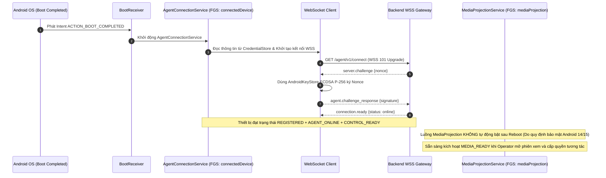

# CLOUDPHONERENTAL V2 — ANDROID AGENT ARCHITECTURE V2

> **Tài liệu:** Bản thiết kế Kiến trúc Agent Android V2 (CloudPhoneRental Agent V2 Blueprint)  
> **Package mục tiêu:** `com.cloudphonerental.agent` *(Lưu ý chiến lược chuyển đổi: Trong Phase 0-2, mã nguồn giữ `applicationId` hiện hành `com.tcandt.cloudphone.agent` để tránh phá vỡ test suite và thiết bị đã cài đặt; Phase 3 sẽ thực hiện tái cấu trúc package/applicationId theo lộ trình nâng cấp sạch).*  
> **Hệ điều hành hỗ trợ:** Android 8.0 (API Level 26) $\rightarrow$ Android 15+ (API Level 35+)  
> **Trạng thái phần cứng:** Stock ROM / ROM gốc, Non-root 100%

---

## 1. TỔNG QUAN KIẾN TRÚC AGENT V2

**CloudPhoneRental Agent V2** là ứng dụng Android bản địa (Native Kotlin) được thiết kế lại hoàn toàn theo tiêu chuẩn phần mềm doanh nghiệp thương mại. Agent kế thừa những điểm mạnh về điều khiển cử chỉ Accessibility từ `socmtool` (reference implementation) nhưng tái cấu trúc toàn diện hệ thống mạng, xác thực, vòng đời dịch vụ và bảo vệ dữ liệu.


---

## 2. CHUẨN MẬT MÃ ĐỊNH DANH THIẾT BỊ (ECDSA P-256 SECURITY)

Để tương thích 100% trên toàn bộ các phiên bản Android từ 8.0 (API 26) đến 15+ (API 35+), Agent V2 sử dụng thuật toán **ECDSA P-256 (`secp256r1`)** với chữ ký **`SHA256withECDSA`** lưu trữ an toàn trong phần cứng bảo mật `AndroidKeyStore`.

### 2.1. Cấu hình Khởi tạo Cặp Khóa trong Kotlin (`AgentKeyStore.kt`)
```kotlin
val keyPairGenerator = KeyPairGenerator.getInstance(
    KeyProperties.KEY_ALGORITHM_EC,
    "AndroidKeyStore"
)

val parameterSpec = KeyGenParameterSpec.Builder(
    "cpr_device_identity_key",
    KeyProperties.PURPOSE_SIGN or KeyProperties.PURPOSE_VERIFY
)
    .setAlgorithmParameterSpec(ECGenParameterSpec("secp256r1"))
    .setDigests(KeyProperties.DIGEST_SHA256)
    .build()

keyPairGenerator.initialize(parameterSpec)
val keyPair = keyPairGenerator.generateKeyPair()
```

### 2.2. Ký Số Xác thực Thử thách (`ChallengeSigner.kt`)
```kotlin
val privateKey = keyStore.getKey("cpr_device_identity_key", null) as PrivateKey
val signature = Signature.getInstance("SHA256withECDSA").run {
    initSign(privateKey)
    update(challengeNonce.toByteArray(Charsets.UTF_8))
    sign()
}
// Chữ ký ASN.1 DER (r, s) được mã hóa Base64 và gửi về Backend trong agent.challenge_response
val signatureBase64 = Base64.encodeToString(signature, Base64.NO_WRAP)
```

---

## 3. CẤU TRÚC THƯ MỤC NGUỒN MỤC TIÊU (PACKAGE STRUCTURE)

```text
android-agent/app/src/main/java/com/cloudphonerental/agent/
├── ui/                             # Giao diện người dùng
│   ├── ConnectActivity.kt          # Màn hình nhập thông tin kết nối lần đầu (Enrollment)
│   ├── MainActivity.kt             # Dashboard hiển thị trạng thái và tiến độ cấp quyền (86%)
│   ├── LogsActivity.kt             # Màn hình xem nhật ký cục bộ
│   └── SettingsActivity.kt         # Màn hình cài đặt và xác nhận Đăng xuất (Logout Confirm)
├── enrollment/                     # Xử lý quy trình đăng ký thiết bị
│   ├── EnrollmentManager.kt        # Điều phối Enrollment API và lưu trữ danh tính
│   └── EnrollmentApi.kt            # HTTP REST Client gọi /api/v2/agents/enroll
├── security/                       # Mật mã học & Khóa định danh
│   ├── AgentKeyStore.kt            # Tạo và quản lý cặp khóa ECDSA P-256 trong AndroidKeyStore
│   ├── CredentialStore.kt          # Lưu trữ an toàn agent_id, device_id, base_url
│   └── ChallengeSigner.kt          # Ký chuỗi Nonce xác thực SHA256withECDSA
├── connection/                     # Quản lý kết nối mạng và giám sát trạng thái
│   ├── AgentConnectionService.kt   # Foreground Service (connectedDevice) chạy độc lập với UI
│   ├── ConnectionSupervisor.kt     # Trái tim điều phối máy trạng thái kết nối FSM
│   ├── AgentWebSocket.kt           # OkHttp WebSocket Client
│   ├── NetworkMonitor.kt           # Theo dõi trạng thái Wi-Fi, Ethernet, Cellular
│   ├── BackoffPolicy.kt            # Thuật toán tính toán thời gian retry có Jitter ±20%
│   └── ConnectionState.kt          # Định nghĩa các trạng thái của Agent
├── protocol/                       # Định dạng gói tin và chuẩn giao tiếp
│   ├── WSEnvelope.kt               # Lớp thực thể JSON Envelope v2
│   ├── MessageTypes.kt             # Danh mục các loại thông điệp
│   └── CommandPayload.kt           # Cấu trúc dữ liệu lệnh
├── control/                        # Điều khiển phần cứng và cử chỉ
│   ├── DeviceControlService.kt     # AccessibilityService inject cử chỉ vào hệ điều hành
│   ├── GestureController.kt        # Bộ tạo DispatchGesture (Tap, Swipe, Drag, Long Press)
│   ├── CoordinateMapper.kt         # Chuyển đổi normalized_display_v1 sang Pixel thực tế
│   └── GlobalActionController.kt   # Back, Home, Recents, Notifications, Quick Settings
├── automation/                     # Tự động hóa native không cần Appium
│   ├── UiSelectorEngine.kt         # Quét AccessibilityNodeInfo theo ResourceID, Text, Class
│   ├── UiSnapshotProvider.kt       # Chụp cây giao diện UI dạng JSON
│   ├── WaitEngine.kt               # Chờ phần tử UI xuất hiện có timeout
│   └── AutomationExecutor.kt       # Thực thi kịch bản chuỗi hành động
├── ime/                            # Nhập liệu văn bản từ xa
│   └── CloudPhoneInputMethodService.kt # Custom InputMethodService gõ trực tiếp UTF-8
├── media/                          # Truyền dẫn hình ảnh WebRTC
│   ├── MediaProjectionService.kt   # Quản lý FGS type mediaProjection
│   ├── ScreenCapturer.kt           # Lấy frame từ VirtualDisplay
│   ├── HardwareEncoder.kt          # Cấu hình phần cứng MediaCodec H.264
│   └── WebRtcPublisher.kt          # Đóng gói RTP Stream gửi lên SFU / Browser
├── permission/                     # Giám sát và hướng dẫn cấp quyền
│   ├── PermissionCoordinator.kt    # Kiểm tra trạng thái 6 quyền cốt lõi và tính % Readiness
│   └── PermissionState.kt          # Enum trạng thái từng quyền
├── boot/                           # Khởi động cùng hệ thống
│   └── BootReceiver.kt             # Tự khởi chạy AgentConnectionService khi máy bật nguồn
└── logging/                        # Nhật ký hoạt động
    └── AgentLogger.kt              # Ghi log vào file và SQLite nội bộ
```

---

## 4. PHÂN TÁCH VÒNG ĐỜI KẾT NỐI VÀ MEDIA SAU REBOOT



---

## 5. BẢN ĐỒ GIAO DIỆN AGENT (APK UI/UX)

```text
┌──────────────────────────────────────┐     ┌──────────────────────────────────────┐
│          [ LOGO MARK ONLY ]          │     │          CloudPhoneRental            │
│           CloudPhoneRental           │     │          ● ĐÃ KẾT NỐI                │
│         Android Device Agent         │     ├──────────────────────────────────────┤
│                                      │     │ Samsung Galaxy S10 (CPR-000021)      │
│ Base URL                             │     │                                      │
│ [ https://cp.domain.com            ] │     │ Quyền thiết bị (Readiness): 86%      │
│                                      │     │ ████████████████████░░░░             │
│ User                                 │     │ ⚠ Còn thiếu 2 quyền phụ              │
│ [ customer01                       ] │     │                                      │
│                                      │     │ [✓] Trợ năng (Accessibility)        │
│ Token Key                            │     │ [✓] Màn hình (MediaProjection)      │
│ [ CPRK-A1B2-C3D4-E5F6-7890         ] │     │ [✓] Bàn phím (Remote IME)            │
│                                      │     │ [✓] Thông báo (Notification)         │
│          [   KẾT NỐI   ]             │     │ [!] Ghi âm (Microphone)              │
│                                      │     │ [!] Cài đặt ứng dụng ngoài           │
│                                      │     │                                      │
│                                      │     │ [ MỞ CÀI ĐẶT QUYỀN ]                │
└──────────────────────────────────────┘     └──────────────────────────────────────┘
         (Màn hình ConnectActivity)                   (Màn hình MainActivity)
```

---

## 6. CHIẾN LƯỢC CHUYỂN ĐỔI APPLICATION ID & PACKAGE (MIGRATION STRATEGY)

- **Giai đoạn Hiện tại (Phase 0 $\rightarrow$ Phase 2):** Tiếp tục sử dụng `applicationId "com.tcandt.cloudphone.agent"` để đảm bảo tính liên tục của các script test E2E và các file build hiện có.
- **Giai đoạn Phase 3 (APK Agent Foundation):**
  - Xây dựng cấu trúc module mới với namespace `com.cloudphonerental.agent`.
  - Cung cấp tài liệu hướng dẫn gỡ bỏ APK cũ hoặc cấu hình Flavor chuyển tiếp mượt mà.
  - Tuyệt đối không thay đổi mã nguồn trước khi có quyết định phê duyệt tại Owner Gate Phase 3.
