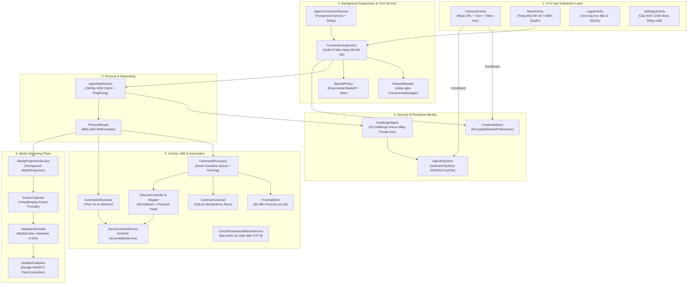
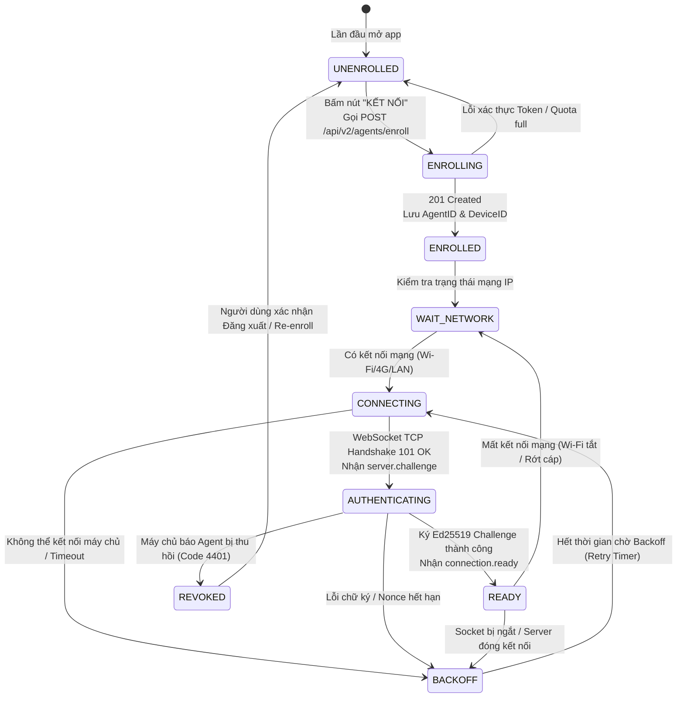

# CLOUDPHONERENTAL V2 — ANDROID AGENT ARCHITECTURE V2

> **Tài liệu:** Bản thiết kế Kiến trúc Agent Android V2 (CloudPhoneRental Agent V2 Blueprint)  
> **Package mục tiêu:** `com.cloudphonerental.agent`  
> **Hệ điều hành hỗ trợ:** Android 8.0 (API Level 26) $\rightarrow$ Android 15+ (API Level 35+)  
> **Trạng thái phần cứng:** Stock ROM / ROM gốc, Non-root 100%

---

## 1. TỔNG QUAN KIẾN TRÚC AGENT V2

**CloudPhoneRental Agent V2** là ứng dụng Android bản địa (Native Kotlin) được thiết kế lại hoàn toàn theo tiêu chuẩn phần mềm doanh nghiệp thương mại. Agent kế thừa những điểm mạnh về điều khiển cử chỉ Accessibility từ `socmtool` (reference implementation) nhưng tái cấu trúc toàn diện hệ thống mạng, xác thực, vòng đời dịch vụ và bảo vệ dữ liệu.



---

## 2. CẤU TRÚC THƯ MỤC NGUỒN (PACKAGE STRUCTURE)

```text
android-agent/app/src/main/java/com/cloudphonerental/agent/
├── ui/                             # Giao diện người dùng
│   ├── ConnectActivity.kt          # Màn hình nhập thông tin kết nối lần đầu (Enrollment)
│   ├── MainActivity.kt             # Dashboard hiển thị trạng thái và tiến độ cấp quyền (86%)
│   ├── LogsActivity.kt             # Màn hình xem nhật ký cục bộ
│   └── SettingsActivity.kt         # Màn hình cài đặt và xác nhận Đăng xuất (Logout Confirm)
├── enrollment/                     # Xử lý quy trình đăng ký thiết bị
│   ├── EnrollmentManager.kt        # Điều phối Enrollment API và lưu trữ danh tính
│   └── EnrollmentApi.kt            # HTTP REST Client gọi /api/v2/agents/enroll
├── security/                       # Mật mã học & Khóa định danh
│   ├── AgentKeyStore.kt            # Tạo và quản lý cặp khóa Ed25519 trong Android KeyStore
│   ├── CredentialStore.kt          # Lưu trữ an toàn agent_id, device_id, base_url
│   └── ChallengeSigner.kt          # Ký chuỗi Nonce xác thực Challenge-Response
├── connection/                     # Quản lý kết nối mạng và giám sát trạng thái
│   ├── AgentConnectionService.kt   # Foreground Service chạy độc lập với UI
│   ├── ConnectionSupervisor.kt     # Trái tim điều phối máy trạng thái kết nối
│   ├── AgentWebSocket.kt           # OkHttp WebSocket Client
│   ├── NetworkMonitor.kt           # Theo dõi trạng thái Wi-Fi, Ethernet, Cellular
│   ├── BackoffPolicy.kt            # Thuật toán tính toán thời gian retry có Jitter
│   └── ConnectionState.kt          # Định nghĩa các trạng thái của Agent
├── protocol/                       # Định dạng gói tin và chuẩn giao tiếp
│   ├── WSEnvelope.kt               # Lớp thực thể JSON Envelope v2
│   ├── MessageTypes.kt             # Danh mục các loại thông điệp
│   └── CommandPayload.kt           # Cấu trúc dữ liệu lệnh
├── control/                        # Điều khiển phần cứng và cử chỉ
│   ├── DeviceControlService.kt     # AccessibilityService inject cử chỉ vào hệ điều hành
│   ├── GestureController.kt        # Bộ tạo DispatchGesture (Tap, Swipe, Drag, Long Press)
│   ├── CoordinateMapper.kt         # Chuyển đổi normalized_display_v1 sang Pixel thực tế
│   └── GlobalActionController.kt   # Back, Home, Recents, Notifications, Quick Settings
├── automation/                     # Tự động hóa native không cần Appium
│   ├── UiSelectorEngine.kt         # Quét AccessibilityNodeInfo theo ResourceID, Text, Class
│   ├── UiSnapshotProvider.kt       # Chụp cây giao diện UI dạng JSON
│   ├── WaitEngine.kt               # Chờ phần tử UI xuất hiện với timeout
│   └── AutomationExecutor.kt       # Thực thi kịch bản chuỗi hành động
├── ime/                            # Nhập liệu văn bản từ xa
│   └── CloudPhoneInputMethodService.kt # Custom InputMethodService gõ trực tiếp UTF-8
├── media/                          # Truyền dẫn hình ảnh WebRTC
│   ├── MediaProjectionService.kt   # Quản lý quyền và Service Screen Capture
│   ├── ScreenCapturer.kt           # Lấy frame từ VirtualDisplay
│   ├── HardwareEncoder.kt          # Cấu hình phần cứng MediaCodec H.264
│   └── WebRtcPublisher.kt          # Đóng gói RTP Stream gửi lên SFU / Browser
├── permission/                     # Giám sát và hướng dẫn cấp quyền
│   ├── PermissionCoordinator.kt    # Kiểm tra trạng thái 6 quyền cốt lõi và tính % Readiness
│   └── PermissionState.kt          # Enum trạng thái từng quyền
├── boot/                           # Khởi động cùng hệ thống
│   └── BootReceiver.kt             # Tự khởi chạy AgentConnectionService khi máy bật nguồn
└── logging/                        # Nhật ký hoạt động
    └── AgentLogger.kt              # Ghi log vào file và SQLite nội bộ
```

---

## 3. MÁY TRẠNG THÁI KẾT NỐI (CONNECTION STATE MACHINE)

Agent V2 hoạt động theo máy trạng thái hữu hạn (FSM) chặt chẽ, loại bỏ hoàn toàn tình trạng mất kết nối làm mất dữ liệu đăng ký:



### Quy tắc Vàng về Lỗi Mạng:
- $\text{NETWORK\_LOST} \neq \text{AUTH\_FAILURE}$: Mất mạng chỉ đưa Agent về `WAIT_NETWORK`, không bao giờ đưa về `UNENROLLED`.
- $\text{SOCKET\_CLOSED} \neq \text{CREDENTIAL\_REVOKED}$: Socket bị đứt chỉ kích hoạt `BackoffPolicy`, giữ nguyên toàn bộ cặp khóa và định danh thiết bị.

---

## 4. CHÍNH SÁCH RECONNECT VÔ HẠN CÓ JITTER (EXPONENTIAL BACKOFF)

Agent áp dụng thuật toán tăng thời gian chờ có hệ số ngẫu nhiên (Jitter $\pm 20\%$) để chống hiện tượng nghẽn mạng đồng loạt (Thundering Herd Problem) khi toàn bộ farm 500 máy cùng kết nối lại:

$$T_{\text{wait}} = \min\left(T_{\text{max}}, T_{\text{base}} \times 2^{\text{attempt}}\right) \times (1 + \text{uniform}(-0.2, 0.2))$$

- Chuỗi thời gian: $1\text{s} \rightarrow 2\text{s} \rightarrow 4\text{s} \rightarrow 8\text{s} \rightarrow 15\text{s} \rightarrow 30\text{s} \rightarrow 30\text{s} \dots$ (Vô hạn lần, không bao giờ dừng lại).

---

## 5. BẢN ĐỒ GIAO DIỆN AGENT (APK UI/UX)

```text
┌──────────────────────────────────────┐     ┌──────────────────────────────────────┐
│          [ LOGO MARK ONLY ]          │     │          CloudPhoneRental            │
│           CloudPhoneRental           │     │          ● ĐÃ KẾT NỐI                │
│         Android Device Agent         │     ├──────────────────────────────────────┤
│                                      │     │ Samsung Galaxy S10 (CPR-000021)      │
│ Base URL                             │     │                                      │
│ [ https://cp.domain.com            ] │     │ Quyền thiết bị (Readiness): 86%      │
│                                      │     │ ████████████████████░░░░             │
│ User                                 │     │ ⚠ Còn thiếu 2 quyền phụ              │
│ [ customer01                       ] │     │                                      │
│                                      │     │ [✓] Trợ năng (Accessibility)        │
│ Token Key                            │     │ [✓] Màn hình (MediaProjection)      │
│ [ CPRK-A1B2-C3D4-E5F6-7890         ] │     │ [✓] Bàn phím (Remote IME)            │
│                                      │     │ [✓] Thông báo (Notification)         │
│          [   KẾT NỐI   ]             │     │ [!] Ghi âm (Microphone)              │
│                                      │     │ [!] Cài đặt ứng dụng ngoài           │
│                                      │     │                                      │
│                                      │     │ [ MỞ CÀI ĐẶT QUYỀN ]                │
└──────────────────────────────────────┘     └──────────────────────────────────────┘
         (Màn hình ConnectActivity)                   (Màn hình MainActivity)
```

---

## 6. DANH MỤC LỆNH ĐIỀU KHIỂN & AUTOMATION V2

| Lệnh | Phân nhóm | Mô tả & Cách thức thực thi trên Android |
| :--- | :--- | :--- |
| `gesture.tap` | Control | Chạm tại tọa độ chuẩn hóa (`NormalizedCoordinateMapper` $\rightarrow$ `GestureDescription`) |
| `gesture.swipe` | Control | Vuốt màn hình từ $(x_1, y_1)$ đến $(x_2, y_2)$ theo thời gian $t$ ms |
| `gesture.drag` | Control | Giữ chạm tại $(x_1, y_1)$ trong $500\text{ms}$ rồi kéo đến $(x_2, y_2)$ |
| `gesture.long_press`| Control | Nhấn giữ tại $(x, y)$ trong $1000\text{ms}$ |
| `key.global_action` | Control | Gọi `performGlobalAction(GLOBAL_ACTION_BACK / HOME / RECENTS)` |
| `key.press` | Control | Gửi mã phím cứng (`KEYCODE_POWER`, `KEYCODE_VOLUME_UP/DOWN`) |
| `ime.text_input` | IME | Truyền chuỗi văn bản UTF-8 vào trường đang focus qua `InputConnection` |
| `ui.snapshot` | Automation | Đọc toàn bộ cây `AccessibilityNodeInfo` và xuất ra cấu trúc JSON |
| `ui.find` | Automation | Tìm phần tử theo `resource_id`, `text`, `text_contains`, `class_name` |
| `ui.click` | Automation | Tìm phần tử thỏa điều kiện và thực hiện click trực tiếp vào Node |
| `ui.set_text` | Automation | Gán trực tiếp giá trị vào `EditText` thông qua Accessibility Action |
| `app.launch` | Automation | Khởi chạy ứng dụng theo `package_name` qua Android `PackageManager` |
| `screenshot.capture`| Media | Chụp 1 khung hình tĩnh từ `VirtualDisplay` chuyển thành ảnh JPEG/PNG |
