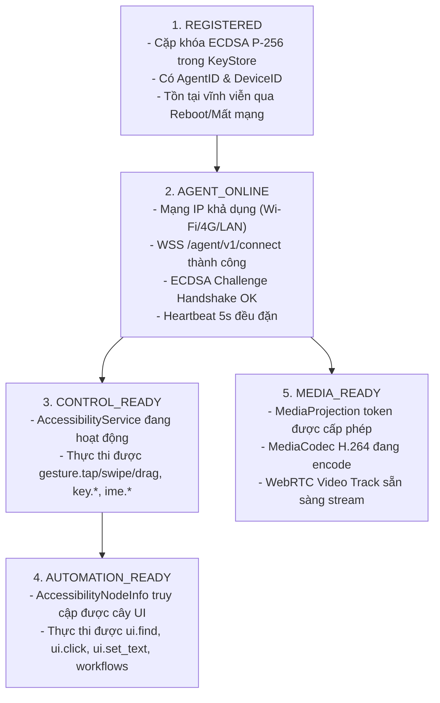

# CLOUDPHONERENTAL V2 — ANDROID CAPABILITY & COMPATIBILITY MATRIX

> **Tài liệu:** Ma trận Tương thích & Khả năng Hoạt động của Android Agent V2 (Android Capability Matrix)  
> **Dải phiên bản:** Android 8.0 (API 26) $\rightarrow$ Android 15+ (API 35+)  
> **Loại ROM:** Stock ROM / ROM gốc của nhà sản xuất (Samsung, Xiaomi, Pixel, Oppo, Realme, Vivo...), Không Root (Non-Root)

---

## 1. MA TRẬN TƯƠNG THÍCH THEO PHIÊN BẢN ANDROID (API 26 $\rightarrow$ API 35+)

| Tính năng / Phân hệ | Android 8.0 - 8.1 (API 26-27, Oreo) | Android 9.0 (API 28, Pie) | Android 10 - 11 (API 29-30, Q/R) | Android 12 - 12L (API 31-32, S) | Android 13 (API 33, Tiramisu) | Android 14 (API 34, UpsideDownCake) | Android 15+ (API 35+, VanillaIceCream) |
| :--- | :--- | :--- | :--- | :--- | :--- | :--- | :--- |
| **Android Keystore Crypto** | ✅ **ECDSA P-256** (Hardware TEE)<br/>❌ *Ed25519 không hỗ trợ* | ✅ **ECDSA P-256** (Hardware TEE)<br/>❌ *Ed25519 không hỗ trợ* | ✅ **ECDSA P-256** (StrongBox/TEE)<br/>❌ *Ed25519 không hỗ trợ* | ✅ **ECDSA P-256** (StrongBox/TEE)<br/>❌ *Ed25519 không hỗ trợ* | ✅ **ECDSA P-256** (Khuyên dùng)<br/>⚠️ *Ed25519 có trong Signature, Keystore hạn chế* | ✅ **ECDSA P-256** (Chuẩn hóa toàn hệ thống) | ✅ **ECDSA P-256** (Chuẩn hóa toàn hệ thống) |
| **Foreground Service (FGS)** | ✅ `startForegroundService` cơ bản | ✅ Yêu cầu `FOREGROUND_SERVICE` permission | ✅ Hỗ trợ FGS type `mediaProjection` | ✅ Hạn chế khởi chạy FGS từ background | ✅ Yêu cầu `POST_NOTIFICATIONS` runtime | ⚠️ Bắt buộc khai báo FGS types (`connectedDevice` / `specialUse`, `mediaProjection`) | 🛑 Bắt buộc FGS prerequisites, cấm background start `mediaProjection` |
| **Khởi động `BOOT_COMPLETED`** | ✅ Tự khởi chạy FGS kết nối WSS | ✅ Tự khởi chạy FGS kết nối WSS | ✅ Tự khởi chạy FGS kết nối WSS | ✅ Tự khởi chạy FGS kết nối WSS | ✅ Tự khởi chạy FGS kết nối WSS | ✅ Khởi chạy `AgentConnectionService` (`connectedDevice`) | ✅ Khởi chạy `AgentConnectionService` (`connectedDevice` có prereq) |
| **Accessibility (Trợ năng)** | ✅ Giữ trạng thái qua Reboot | ✅ Giữ trạng thái qua Reboot | ✅ Giữ trạng thái qua Reboot | ✅ Giữ trạng thái qua Reboot | ✅ Cảnh báo Restricted Settings nếu tải sideload | ⚠️ Bắt buộc mở Restricted Settings nếu sideload APK | ⚠️ Bắt buộc mở Restricted Settings nếu sideload APK |
| **Bàn phím ảo Remote IME** | ✅ Kích hoạt 1 lần, tồn tại vĩnh viễn | ✅ Kích hoạt 1 lần, tồn tại vĩnh viễn | ✅ Kích hoạt 1 lần, tồn tại vĩnh viễn | ✅ Kích hoạt 1 lần, tồn tại vĩnh viễn | ✅ Kích hoạt 1 lần, tồn tại vĩnh viễn | ✅ Kích hoạt 1 lần, tồn tại vĩnh viễn | ✅ Kích hoạt 1 lần, tồn tại vĩnh viễn |
| **MediaProjection (Capture)** | ✅ Consent 1 lần / phiên | ✅ Consent 1 lần / phiên | ✅ Yêu cầu FGS type `mediaProjection` | ✅ Yêu cầu FGS type `mediaProjection` | ✅ Hộp thoại Consent cải tiến | ⚠️ Consent Dialog kèm cảnh báo ghi hình toàn màn hình | 🛑 Token MediaProjection gắn chặt phiên tương tác người dùng |
| **Stream Tự động sau Reboot** | ⚠️ Cần token lưu hoặc consent | ⚠️ Cần token lưu hoặc consent | ⚠️ Cần token lưu hoặc consent | ⚠️ Cần token lưu hoặc consent | ⚠️ Cần cấp lại quyền MediaProjection | ❌ **KHÔNG THỂ tự động stream** nếu không có tương tác người dùng | ❌ **KHÔNG THỂ tự động stream** (OS cấm background capture) |
| **Quản lý Pin & Doze Mode** | ⚠️ Yêu cầu Ignore Battery Opt | ⚠️ Yêu cầu Ignore Battery Opt | ⚠️ Yêu cầu Ignore Battery Opt | ⚠️ App Standby Buckets áp dụng | ⚠️ Yêu cầu cấu hình "Unrestricted" | ⚠️ Yêu cầu cấu hình "Unrestricted" | ⚠️ Yêu cầu cấu hình "Unrestricted" |

---

## 2. PHÂN TÁCH ĐỘC LẬP 5 TRẠNG THÁI KHẢ NĂNG (5 READINESS TIERS)

Để phản ánh chính xác trạng thái thực tế của thiết bị vật lý trong môi trường sản xuất, Backend và UI áp dụng 5 cấp độ trạng thái rõ ràng:



### Chi tiết Ý nghĩa Vận hành:
1. **`REGISTERED`:** Trạng thái nền tảng. Khi mất mạng, mất điện, máy tắt nguồn $\rightarrow$ Vẫn giữ nguyên `REGISTERED`. Tuyệt đối không xóa credentials.
2. **`AGENT_ONLINE`:** Trạng thái kết nối máy chủ. Máy có thể nhận lệnh Ping, kiểm tra sức khỏe, nhận lệnh khởi động ứng dụng (`app.launch`), hoặc nhận lệnh mở cài đặt để người dùng cấp quyền.
3. **`CONTROL_READY`:** Trạng thái điều khiển cảm ứng/phím. Nếu người dùng vô tình tắt Trợ năng trong Settings $\rightarrow$ Máy chuyển về `AGENT_ONLINE` nhưng mất `CONTROL_READY`.
4. **`AUTOMATION_READY`:** Trạng thái tự động hóa UI. Phụ thuộc vào `CONTROL_READY` và khả năng đọc cây giao diện của màn hình hiện tại (Ví dụ: một số màn hình bảo mật thanh toán hoặc nhập PIN hệ điều hành có thể cấm đọc AccessibilityNodeInfo).
5. **`MEDIA_READY`:** Trạng thái truyền hình ảnh. Độc lập hoàn toàn với `CONTROL_READY`. (Một thiết bị có thể đang điều khiển được nhưng chưa bật stream để tiết kiệm băng thông).

---

## 3. RÀNG BUỘC KỸ THUẬT FOREGROUND SERVICE TRÊN ANDROID 14 & 15

### 3.1. Phân chia Service Types trong `AndroidManifest.xml`
Từ Android 14+ (API 34), mọi Foreground Service bắt buộc phải khai báo thuộc tính `android:foregroundServiceType`:
```xml
<!-- 1. Service duy trì kết nối WSS và Heartbeat -->
<service
    android:name=".connection.AgentConnectionService"
    android:exported="false"
    android:foregroundServiceType="connectedDevice|specialUse" />

<!-- 2. Service chụp màn hình và encode Video WebRTC -->
<service
    android:name=".media.MediaProjectionService"
    android:exported="false"
    android:foregroundServiceType="mediaProjection" />

<!-- 3. Service điều khiển cảm ứng Trợ năng -->
<service
    android:name=".control.DeviceControlService"
    android:permission="android.permission.BIND_ACCESSIBILITY_SERVICE"
    android:exported="true">
    <intent-filter>
        <action android:name="android.accessibilityservice.AccessibilityService" />
    </intent-filter>
</service>
```

### 3.2. Ràng buộc Khởi động sau Reboot (`BOOT_COMPLETED`)
- **Android 8.0 $\rightarrow$ 13:** `BootReceiver` có thể gọi `startForegroundService()` để bật `AgentConnectionService`.
- **Android 14 $\rightarrow$ 15+:**
  - `AgentConnectionService` được phép khởi chạy từ `BOOT_COMPLETED` vì thuộc loại `connectedDevice` / `specialUse` (kết nối máy chủ điều khiển).
  - `MediaProjectionService` (**loại `mediaProjection`**) **BỊ HỆ ĐIỀU HÀNH CHẶN TUYỆT ĐỐI** không cho khởi chạy từ background receiver nếu chưa có Intent kết quả từ hộp thoại `MediaProjectionManager.createScreenCaptureIntent()`.
- **Hệ quả Kiến trúc:**
  - Sau khi Reboot trên Android 14/15, Agent sẽ ngay lập tức đạt trạng thái `REGISTERED`, `AGENT_ONLINE`, và `CONTROL_READY`.
  - Luồng truyền hình ảnh WebRTC (`MEDIA_READY`) chỉ được kích hoạt khi có người dùng hoặc kỹ thuật viên bấm chấp thuận hộp thoại cấp quyền ghi hình trên màn hình điện thoại (hoặc qua cấu hình thiết bị doanh nghiệp).

---

## 4. TỐI ƯU HÓA THEO NHÀ SẢN XUẤT PHẦN CỨNG (OEM-SPECIFIC HARDENING)

Các dòng điện thoại Android thương mại có các trình quản lý pin tùy biến rất hung hãn (Aggressive Task Killers). Agent V2 áp dụng cấu hình hướng dẫn chuyên biệt cho từng hãng:

### 4.1. Xiaomi / Redmi / Poco (MIUI & HyperOS)
- **Tự khởi chạy (Autostart):** Bắt buộc bật quyền `Autostart` cho app trong Cài đặt ứng dụng.
- **Tiết kiệm pin (Battery Saver):** Chuyển từ "Khuyên dùng (MIUI Battery Saver)" sang **"Không hạn chế (No restrictions)"**.
- **Khóa App trong Recent:** Khóa biểu tượng ổ khóa (Lock app) trong giao diện đa nhiệm để tránh bị dọn dẹp RAM.
- **Restricted Settings (Android 13+):** Vào Cài đặt ứng dụng $\rightarrow$ Bật "Cho phép cài đặt bị hạn chế" để kích hoạt Accessibility cho app cài từ file APK.

### 4.2. Samsung Galaxy (OneUI)
- **Ứng dụng ở chế độ ngủ (Sleeping Apps):** Đưa CloudPhoneRental Agent vào danh sách **"Ứng dụng không bao giờ ở chế độ ngủ (Never sleeping apps)"**.
- **Tự động tối ưu hóa (Auto-optimization / Device Care):** Tắt tính năng tự khởi động lại định kỳ hoặc tự đóng ứng dụng nền không sử dụng.

### 4.3. Oppo / Realme / OnePlus (ColorOS / RealmeUI / OxygenOS)
- **Cho phép hoạt động nền (Allow background activity):** Bật quyền chạy ngầm không giới hạn.
- **Quản lý khởi động:** Cho phép ứng dụng tự khởi động cùng hệ thống và cho phép các ứng dụng liên kết khởi chạy.

### 4.4. Google Pixel & Android One / Stock Android
- **Tối ưu hóa Pin:** Yêu cầu người dùng cấp quyền `android.settings.REQUEST_IGNORE_BATTERY_OPTIMIZATIONS` (Bỏ qua tối ưu hóa pin).
- **Thông báo:** Cấp quyền `POST_NOTIFICATIONS` để Foreground Service Notification luôn hiển thị, bảo vệ tiến trình không bị OOM Killer thu hồi.
