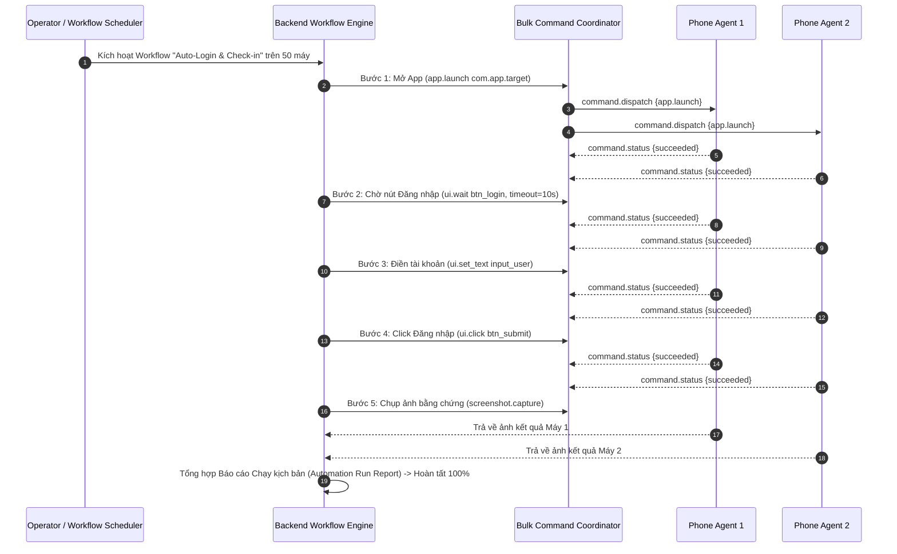

# CLOUDPHONERENTAL V2 — AUTOMATION ENGINE ARCHITECTURE V2

> **Tài liệu:** Bản thiết kế Kiến trúc Tự động hóa Native V2 (Native UI Selector & Workflow Engine Blueprint)  
> **Cốt lõi:** Native Android AccessibilityNodeInfo Inspection & UI Selector Engine  
> **Vị trí của Appium:** Appium / UIAutomator2 chỉ là Lab Adapter phụ trợ tùy chọn, KHÔNG PHẢI là runtime engine sản phẩm.

---

## 1. TỔNG QUAN KIẾN TRÚC TỰ ĐỘNG HÓA NATIVE

Thay vì phụ thuộc vào các công cụ cồng kềnh như Appium Server (vốn chậm chạp, dễ sập socket và yêu cầu cài đặt UIAutomator2 server nặng nề lên từng máy điện thoại), **CloudPhoneRental Automation Engine V2** hoạt động trực tiếp thông qua **Accessibility Service bản địa** bên trong Agent APK.

```mermaid
graph TD
    subgraph BACKEND_AUTOMATION ["Backend Workflow Plane"]
        WF_Editor["Visual Workflow Builder<br/>(Admin / Client Web)"]
        WF_Service["Workflow Service<br/>(Quản lý Kịch bản & Phiên bản)"]
        WF_Scheduler["Workflow Scheduler<br/>(Lên lịch chạy định kỳ / chạy hàng loạt)"]
        Step_Executor["Step Executor<br/>(Bộ điều phối từng bước)"]
        Evidence_Store["Evidence & Audit Store<br/>(Lưu kết quả & Ảnh chụp màn hình)"]
    end

    subgraph AGENT_AUTOMATION ["Android Agent Native Automation Engine"]
        Auto_Executor["AutomationExecutor<br/>(Nhận lệnh 'automation.*' qua WSS)"]
        UI_Selector["UiSelectorEngine<br/>(Quét cây giao diện AccessibilityNodeInfo)"]
        UI_Snapshot["UiSnapshotProvider<br/>(Xuất cây UI dạng JSON)"]
        Wait_Engine["WaitEngine<br/>(Polling chờ phần tử xuất hiện có Timeout)"]
        Dev_Control["DeviceControlService<br/>(Thực thi Click, Nhập text, Scroll)"]
    end

    WF_Editor --> WF_Service
    WF_Service --> WF_Scheduler
    WF_Scheduler --> Step_Executor
    Step_Executor -->|WSEnvelope 'command.dispatch'| Auto_Executor
    
    Auto_Executor --> UI_Selector & Wait_Engine & Dev_Control
    UI_Selector --> UI_Snapshot
    UI_Selector --> Dev_Control
    
    Auto_Executor -->>|Báo cáo kết quả + Evidence Screenshot| Step_Executor
    Step_Executor --> Evidence_Store
```

---

## 2. MÔ HÌNH SELECTOR CHI TIẾT (SELECTOR STRATEGIES)

Agent hỗ trợ định vị các phần tử giao diện trên mọi ứng dụng Android thông qua cấu trúc JSON linh hoạt:

### 2.1. Selector Đơn lẻ (Single Strategy)
```json
{
  "strategy": "resource_id",
  "value": "com.zing.zalo:id/btn_login"
}
```
```json
{
  "strategy": "text",
  "value": "Đăng nhập"
}
```
```json
{
  "strategy": "text_contains",
  "value": "Tiếp tục"
}
```
```json
{
  "strategy": "content_desc",
  "value": "Nút quay lại"
}
```

### 2.2. Selector Kết hợp Đa điều kiện (Compound Selectors)
```json
{
  "all": [
    { "strategy": "class_name", "value": "android.widget.Button" },
    { "strategy": "text_contains", "value": "Xác nhận" },
    { "strategy": "enabled", "value": true }
  ]
}
```

---

## 3. DANH MỤC HÀNH ĐỘNG NATIVE AUTOMATION

| Thao tác | Payload cấu hình | Hành vi thực tế trên Android Agent |
| :--- | :--- | :--- |
| `ui.snapshot` | `{ "maxDepth": 10 }` | Quét toàn bộ cây giao diện và trả về JSON hierarchy kèm tọa độ bounds |
| `ui.find` | `{ "selector": {...}, "timeoutMs": 5000 }` | Tìm kiếm phần tử, trả về vị trí $(x, y, w, h)$ hoặc báo lỗi nếu quá timeout |
| `ui.click` | `{ "selector": {...}, "timeoutMs": 5000 }` | Tìm phần tử và gọi `node.performAction(ACTION_CLICK)` hoặc tap vào tâm |
| `ui.long_click` | `{ "selector": {...}, "durationMs": 1000 }` | Nhấn giữ vào phần tử thỏa điều kiện |
| `ui.set_text` | `{ "selector": {...}, "text": "user@email.com" }` | Đưa con trỏ vào ô nhập và điền chuỗi ký tự UTF-8 |
| `ui.scroll` | `{ "direction": "down", "distance": 0.5 }` | Cuộn màn hình để tìm kiếm các phần tử đang bị ẩn phía dưới |
| `ui.wait` | `{ "selector": {...}, "state": "visible", "timeoutMs": 10000 }` | Tạm dừng kịch bản cho đến khi phần tử xuất hiện |
| `ui.assert` | `{ "selector": {...}, "expectedText": "Thành công" }` | Kiểm tra tính đúng đắn của giao diện, ném lỗi nếu không khớp |
| `app.launch` | `{ "packageName": "com.facebook.katana" }` | Mở ứng dụng từ xa |
| `screenshot.capture`| `{ "quality": 80 }` | Chụp ảnh bằng chứng bước chạy phục vụ nhật ký kiểm toán |

---

## 4. QUY TRÌNH THỰC THI WORKFLOW TRÊN CỤM THIẾT BỊ


