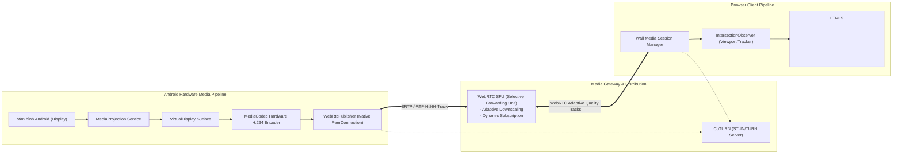

# CLOUDPHONERENTAL V2 — MEDIA PLANE ARCHITECTURE V2

> **Tài liệu:** Bản thiết kế Kiến trúc Mặt phẳng Truyền dẫn Hình ảnh Thời gian thực V2 (Media Plane Blueprint)  
> **Công nghệ lõi:** Android MediaProjection, Hardware H.264 MediaCodec, Google WebRTC Native, WebRTC SFU, CoTURN  
> **Mục tiêu năng lực:** Vận hành mượt mà Bức tường 30–50 thiết bị hiển thị đồng thời trên một trình duyệt duy nhất

---

## 1. TỔNG QUAN KIẾN TRÚC MEDIA PLANE

Khác biệt hoàn toàn với các giải pháp cũ (như `socmtool` chụp ảnh Bitmap $\rightarrow$ nén JPEG $\rightarrow$ mã hóa Base64 $\rightarrow$ gửi qua JSON WebSocket gây quá tải CPU và lag nghẽn), **CloudPhoneRental Media Plane V2** được xây dựng 100% trên nền tảng **WebRTC Native Video Streaming** chuẩn công nghiệp.



---

## 2. NGUYÊN TẮC CÁCH LY MEDIA PLANE VỚI CONTROL PLANE

$$\text{MEDIA PLANE} \perp \text{CONTROL PLANE}$$

1. **Không can thiệp trạng thái Agent:** Việc khởi tạo WebRTC session, đàm phán lại SDP (Renegotiation) hoặc lỗi luồng hình ảnh tuyệt đối không được phép làm đứt socket điều khiển WSS (`/agent/v1/connect`) hay đổi trạng thái thiết bị thành Offline.
2. **Kênh Tín hiệu (Signaling Channel):**
   - Agent nhận yêu cầu mở stream và gửi SDP Offer qua WSEnvelope trên kênh WSS sẵn có.
   - Trình duyệt trao đổi SDP/ICE thông qua Endpoint chuyên biệt: `/api/v1/devices/{id}/media/ws`.
   - Backend đóng vai trò Gateway chuyển tiếp tín hiệu trong suốt (Signaling Relay).

---

## 3. CÁC HẠNG MỤC CHẤT LƯỢNG HÌNH ẢNH THÍCH ỨNG (QUALITY PROFILES)

Để đảm bảo trình duyệt máy tính của khách hàng không bị tràn bộ nhớ RAM hay sập card đồ họa khi mở cùng lúc 50 màn hình điện thoại, luồng truyền tải được chia làm 3 cấu hình chuẩn:

| Cấu hình | Độ phân giải | Tốc độ khung hình (FPS) | Băng thông (Bitrate) | Mục đích sử dụng |
| :--- | :--- | :--- | :--- | :--- |
| **1. PREVIEW** | $240 \times 480$ (hoặc 180p) | $2 - 5\text{ FPS}$ | $50 - 150\text{ Kbps}$ | Hiển thị thumbnail trên lưới 30–50 máy |
| **2. FOCUS** | $360 \times 720$ (hoặc 480p) | $10 - 15\text{ FPS}$ | $250 - 500\text{ Kbps}$ | Theo dõi nhóm 4–8 máy đang chạy kịch bản |
| **3. CONTROL** | $720 \times 1280$ (HD 720p) | $20 - 30\text{ FPS}$ | $800 - 1500\text{ Kbps}$ | Tương tác tay trực tiếp với độ trễ $< 100\text{ms}$ |

---

## 4. BẢN THIẾT KẾ BỨC TƯỜNG 30–50 MÁY (WALL VIEW OPTIMIZATION)

Khi hiển thị 30–50 thiết bị trên màn hình Dashboard:

```text
┌──────────────┬──────────────┬──────────────┬──────────────┬──────────────┐
│ Tile 01      │ Tile 02      │ Tile 03      │ Tile 04      │ Tile 05      │
│ [PREVIEW 3fps│ [PREVIEW 3fps│ [PREVIEW 3fps│ [PREVIEW 3fps│ [PREVIEW 3fps│
├──────────────┼──────────────┼──────────────┼──────────────┼──────────────┤
│ Tile 06      │ Tile 07      │ Tile 08      │ Tile 09      │ Tile 10      │
│ [PREVIEW 3fps│ [PREVIEW 3fps│ [PREVIEW 3fps│ [PREVIEW 3fps│ [PREVIEW 3fps│
├──────────────┼──────────────┼──────────────┼──────────────┼──────────────┤
│ ...                                                                        │
└────────────────────────────────────────────────────────────────────────────┘
```

### Các Giải pháp Kỹ thuật Chống Sập Trình Duyệt:
1. **IntersectionObserver Viewport Management:**
   - Các Tile đang nằm trong tầm nhìn (In Viewport) $\rightarrow$ Đăng ký nhận luồng **PREVIEW**.
   - Các Tile cuộn ra ngoài màn hình (Offscreen) $\rightarrow$ Tự động gửi lệnh `UNSUBSCRIBE / PAUSE`, ngắt giải mã Video để giải phóng GPU/RAM.
2. **On-Demand Quality Upgrade:**
   - Khi Operator click chuột vào bất kỳ Tile nào để mở Modal điều khiển $\rightarrow$ Hệ thống tự động nâng cấp luồng riêng của máy đó từ **PREVIEW** lên **CONTROL (720p / 30 FPS)**.
   - Khi đóng Modal $\rightarrow$ Hạ cấp trở lại **PREVIEW**.
3. **Chống bão Rerender trong React:**
   - Mỗi thẻ `<video>` được quản lý độc lập bên trong Component tự quản (Self-contained VideoSurface).
   - Dữ liệu WebRTC Stats (FPS, Bitrate, RTT) được cập nhật qua Direct DOM mutation hoặc Ref, không đưa vào React Root State gây giật lag giao diện.

---

## 5. HẠ TẦNG XUYÊN NAT & RELAY (COTURN & SFU ARCHITECTURE)

- **STUN (Session Traversal Utilities for NAT):** Phát hiện địa chỉ IP công khai khi Agent và Client nằm sau các lớp NAT khác nhau.
- **TURN (Traversal Using Relays around NAT):** Chuyển tiếp luồng Media có mã hóa (DTLS-SRTP) qua cổng UDP/TCP 3478 / 5349 khi mạng chặn Direct P2P (như mạng 4G/5G hoặc tường lửa doanh nghiệp nghiêm ngặt).
- **SFU (Selective Forwarding Unit):** Phân phối 1 luồng video từ Agent tới nhiều người xem hoặc chuyển đổi bitrate linh hoạt mà không bắt chip điện thoại Android phải encode nhiều lần.
