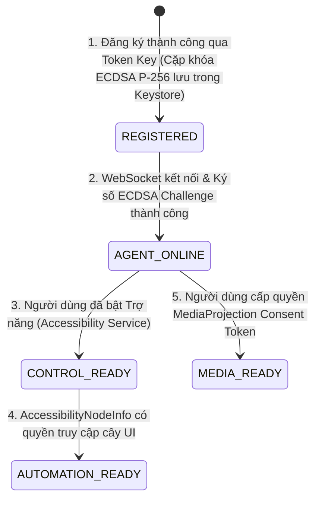

# CLOUDPHONERENTAL V2 — PRODUCT CONSTITUTION

> **Trạng thái:** PENDING OWNER GATE #0 APPROVAL  
> **Phiên bản:** 2.1.0 (Audit Resolution V2.1)  
> **Ngày phê duyệt:** (Chờ phê duyệt)  
> **Phạm vi áp dụng:** Toàn bộ thành phần hệ thống (Control Plane, Media Plane, Agent APK, Web Client, Admin Console, Database & Infra)

---

## 1. TUYÊN NGÔN NGUYÊN TẮC BẤT BIẾN

Các quy tắc dưới đây là **Hiến pháp Dự án (Project Constitution)**. Mọi quyết định kỹ thuật, mã nguồn (Go, Kotlin, TypeScript, SQL), kiến trúc và luồng dữ liệu đều phải tuân thủ nghiêm ngặt, không được tự ý sửa đổi hoặc thoả hiệp trong bất kỳ hoàn cảnh nào.

```text
+-------------------------------------------------------------------------------+
|                             PRODUCT CONSTITUTION                              |
+-------------------------------------------------------------------------------+
| PRODUCT            | CloudPhoneRental V2 (Nền tảng thương mại Cloud Phone)    |
| DEVICE TARGET      | Android vật lý 8.0 -> 15+ (Stock ROM / ROM gốc, Non-root)|
| CLIENT TIER        | Web-first (Desktop, Tablet, Mobile)                      |
| CONNECTION         | APK Agent -> Internet/LAN -> CloudPhoneRental Cluster    |
| RUNTIME DEV        | KHÔNG phụ thuộc ADB trong môi trường Production          |
| AUTHENTICATION     | Token Key CHỈ dùng 1 lần để Enrollment (Đăng ký ban đầu) |
| SOCKET AUTH        | Token Key TUYỆT ĐỐI KHÔNG dùng để duy trì WebSocket     |
| IDENTITY CRYPTO    | ECDSA P-256 (SHA256withECDSA) qua AndroidKeyStore API 26+|
| KEYSTORE SECURITY  | Đo lường tại Runtime (Software / TEE / StrongBox)        |
| CONTROL ENGINE     | AccessibilityService + Normalized Coordinates + Fencing  |
| COMMAND PIPELINE   | Transactional Outbox + Monotonic Fencing Token           |
| AUTOMATION         | Native Accessibility/UI Selector là engine chính thức    |
| APPIUM ROLE        | Appium/UIAutomator2 chỉ là Lab Adapter tùy chọn          |
| MEDIA ENGINE       | MediaProjection + Hardware H.264 Encoder + WebRTC SFU    |
| TARGET WALL        | 30–50 thiết bị hiển thị đồng thời / 1 trình duyệt        |
| STREAM QUALITY     | Multi-layer Simulcast / SFU Adaptive (Preview vs Control)|
| SECURITY BOUNDARY  | HTTPS/WSS Only, No raw ADB/Shell cho Client, Zero-Trust  |
| AUDIT & ISOLATION  | Multi-Tenant tuyệt đối, ghi log toàn bộ giao dịch & lệnh |
+-------------------------------------------------------------------------------+
```

---

## 2. RÀNG BUỘC MẬT MÃ HỌC THIẾT BỊ (CRYPTOGRAPHIC BASELINE)

1. **Chuẩn Mật mã Duy nhất cho Toàn bộ Android 8–15+ (API 26–35+):**
   - **Thuật toán Khóa:** `KeyProperties.KEY_ALGORITHM_EC` (Elliptic Curve), đường cong NIST P-256 (`secp256r1` / `prime256v1`).
   - **Thuật toán Ký số:** `SHA256withECDSA`.
   - **Kho lưu trữ Khóa:** `AndroidKeyStore`.
   - **Mức độ Bảo mật Phần cứng (Keystore Security Level):** Hardware-backed security là một *khả năng (capability)* của thiết bị, KHÔNG PHẢI là một điều kiện giả định (universal assumption) cho toàn bộ Android 8-15+. Hệ thống phải kiểm tra (runtime inspect) và lưu trữ trạng thái thực tế: `SOFTWARE`, `TRUSTED_ENVIRONMENT`, `STRONGBOX`, hoặc `UNKNOWN`. Backend/device inventory phải lưu thêm `keystore_security_level` và `attestation_status`.
   - **Lý do kỹ thuật bắt buộc:** Android Keystore hỗ trợ chính thức EC P-256 từ API 23 (Android 6.0+), đảm bảo tương thích 100% trên toàn bộ dải thiết bị từ Android 8.0 (API 26) đến Android 15+ (API 35+).
2. **Xác thực Phía Backend Go:**
   - Sử dụng thư viện chuẩn của Go (`crypto/ecdsa`, `crypto/x509`, `crypto/sha256`) để parse Public Key ANSI X9.62 / PKIX và xác thực chữ ký ASN.1 DER `(r, s)` đối với chuỗi Challenge Nonce từ Agent.

---

## 3. PHÂN TÁCH 5 TRẠNG THÁI SẴN SÀNG CỦA THIẾT BỊ (5-TIER READINESS SEPARATION)

Hệ thống bắt buộc phải phân biệt rạch ròi 5 trạng thái độc lập, không được gộp chung:

$$\text{REGISTERED} \neq \text{AGENT\_ONLINE} \neq \text{CONTROL\_READY} \neq \text{AUTOMATION\_READY} \neq \text{MEDIA\_READY}$$



### Chi tiết 5 Trạng thái:
1. **`REGISTERED` (Đã ghi danh):** Thiết bị đã hoàn tất Enrollment, sở hữu `agent_id`, `device_id` và cặp khóa ECDSA P-256 trong `AndroidKeyStore`. Trạng thái này là vĩnh viễn, không bị mất khi mất mạng hoặc khởi động lại máy.
2. **`AGENT_ONLINE` (Đang kết nối):** `AgentConnectionService` duy trì kết nối WSS `/agent/v1/connect`, gửi Heartbeat định kỳ 5s và sẵn sàng nhận lệnh điều phối.
3. **`CONTROL_READY` (Sẵn sàng Điều khiển):** `DeviceControlService` (Accessibility) đang kích hoạt, sẵn sàng thực thi cử chỉ cảm ứng (`gesture.*`) và phím điều hướng (`key.*`).
4. **`AUTOMATION_READY` (Sẵn sàng Tự động hóa):** Quyền quét cây phân cấp giao diện khả dụng, sẵn sàng thực thi kịch bản `ui.*`.
5. **`MEDIA_READY` (Sẵn sàng Truyền hình ảnh):** Quyền `MediaProjection` đã được cấp phép và `MediaCodec` đang phát luồng WebRTC video.

---

## 4. NGUYÊN TẮC RÀNG BUỘC KHI THIẾT BỊ REBOOT (BOOT & RECOVERY CONSTRAINTS)

Khả năng sẵn sàng (Readiness) của thiết bị phải được **đo lường độc lập (measured)**, tuyệt đối KHÔNG ĐƯỢC giả định từ cấu hình đã lưu.
Sau khi điện thoại khởi động lại (Reboot / Power Cycle):
- **REGISTERED:** Danh tính thiết bị được bảo toàn vĩnh viễn trong KeyStore.
- **BOOT_COMPLETED:** Hành động này chỉ kích hoạt (trigger) một nỗ lực khôi phục (recovery attempt).
- **AGENT_ONLINE** chỉ đạt được khi và chỉ khi:
  - Mạng khả dụng (Network available).
  - `AgentConnectionService` đang chạy.
  - WebSocket kết nối và xác thực WSS thành công.
- **CONTROL_READY** chỉ đạt được khi và chỉ khi:
  - `AccessibilityService` thực sự được bound và đang khỏe mạnh (healthy) báo cáo về hệ thống.
- **AUTOMATION_READY** và **MEDIA_READY**: Phải được đo lường độc lập, không giả định sẵn sàng. Đặc biệt với MediaProjection, trên ROM gốc Android 14+ (API 34+) và Android 15+ (API 35+), hệ điều hành Android **CẤM** khởi chạy Foreground Service loại `mediaProjection` từ các background receivers nếu không có tương tác người dùng. Trạng thái `MEDIA_READY` sẽ ở dạng chờ cấp quyền (PERMISSION_REQUIRED / SERVICE_NOT_READY).

---

## 5. CHUẨN MỰC CHẤT LƯỢNG TRUYỀN THÔNG BỨC TƯỜNG (MEDIA WALL SLA)

Để đảm bảo vận hành ổn định **30–50 thiết bị trên 1 màn hình trình duyệt (Device Wall)**:
- **Đa tầng Simulcast (Multi-layer Simulcast SFU):**
  - **WALL (30–50 máy):** Sub layer thấp (180p / 2–5 FPS, 50–100 Kbps/máy, tổng băng thông $< 5\text{ Mbps}$).
  - **FOCUS (4–8 máy):** Sub layer trung bình (360–480p / 10–15 FPS, 250–400 Kbps/máy).
  - **ACTIVE CONTROL (1 máy):** Sub layer cao (720p / 20–30 FPS, 800–1500 Kbps, độ trễ $< 100\text{ms}$).
  - **OFFSCREEN:** Tạm dừng nhận gói tin (Pause / Unsubscribe) tại cấp độ SFU.
- **Mục tiêu Benchmark Đặc tả (TARGET BENCHMARKS):**
  *(Lưu ý: Đây là các mục tiêu (Targets), CHƯA PHẢI là cam kết SLA (Not Guaranteed SLA) cho đến khi Phase 7-11 có bằng chứng thực tế trên thiết bị vật lý. Độ trễ <100ms không phải là một invariant cho toàn sản phẩm).*
  - CPU trình duyệt mục tiêu $< 30\%$ (Desktop 8-core tiêu chuẩn).
  - RAM Heap trình duyệt mục tiêu $< 600\text{ MB}$.
  - Tỷ lệ rớt khung hình (Dropped frames) mục tiêu $< 2\%$.
  - Tải CPU Phần cứng Điện thoại (Encoder CPU Load) mục tiêu $< 15\%$.
  - Độ trễ điều khiển trực tiếp mục tiêu $< 100\text{ms}$.

---

## 6. QUY TẮC PHÁT TRIỂN & CHẤP THUẬN (DEFINITION OF DONE & OWNER GATES)

1. **Chỉ 1 Slice duy nhất được ACTIVE tại một thời điểm.**
2. **Không bao giờ coi việc "biên dịch thành công" (compile pass) là hoàn thành.**
3. **Mỗi Slice bắt buộc:**
   - Mã nguồn chuẩn theo CodeGraph V2.
   - Unit Tests & Integration Tests Green 100%.
   - Bằng chứng thực nghiệm (Logs, Metrics, Test Outputs) lưu tại `docs/evidence/`.
   - Phê duyệt chính thức tại **Owner Gate**.
