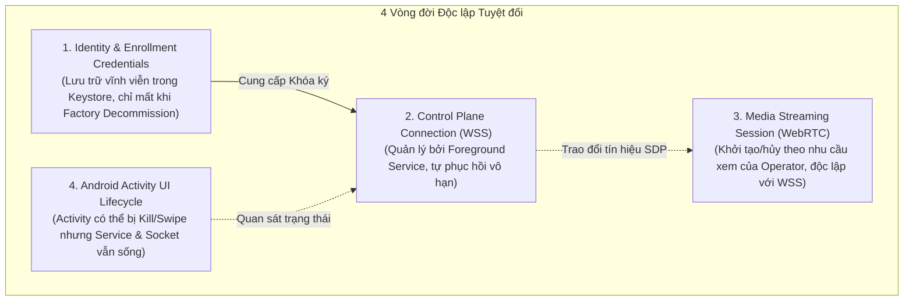

# CLOUDPHONERENTAL V2 — PRODUCT CONSTITUTION

> **Trạng thái:** BẮT BUỘC TUÂN THỦ TUYỆT ĐỐI (IMMUTABLE SYSTEM CONSTITUTION)  
> **Phiên bản:** 2.0.0  
> **Ngày phê duyệt:** 2026-08-19  
> **Phạm vi áp dụng:** Toàn bộ thành phần hệ thống (Control Plane, Media Plane, Agent APK, Web Client, Admin Console, Database & Infra)

---

## 1. TUYÊN NGÔN NGUYÊN TẮC BẤT BIẾN

Các quy tắc dưới đây là **Hiến pháp Dự án (Project Constitution)**. Mọi quyết định kỹ thuật, mã nguồn (Go, Kotlin, TypeScript, SQL), kiến trúc và luồng dữ liệu đều phải tuân thủ nghiêm ngặt, không được tự ý sửa đổi hoặc thoả hiệp trong bất kỳ hoàn cảnh nào.

```text
+-------------------------------------------------------------------------------+
|                             PRODUCT CONSTITUTION                              |
+-------------------------------------------------------------------------------+
| PRODUCT            | CloudPhoneRental V2 (Nền tảng thương mại Cloud Phone)    |
| DEVICE TARGET      | Android vật lý 8.0 -> 15+ (Stock ROM / ROM gốc, Non-root)|
| CLIENT TIER        | Web-first (Desktop, Tablet, Mobile)                      |
| CONNECTION         | APK Agent -> Internet/LAN -> CloudPhoneRental Cluster    |
| RUNTIME DEV        | KHÔNG phụ thuộc ADB trong môi trường Production          |
| AUTHENTICATION     | Token Key CHỈ dùng 1 lần để Enrollment (Đăng ký ban đầu) |
| SOCKET AUTH        | Token Key TUYỆT ĐỐI KHÔNG dùng để duy trì WebSocket     |
| IDENTITY           | Mỗi thiết bị sở hữu Khóa định danh mật mã Ed25519 riêng  |
| CONTROL ENGINE     | AccessibilityService + Normalized Coordinates + Fencing  |
| COMMAND PIPELINE   | Transactional Outbox + Monotonic Fencing Token           |
| AUTOMATION         | Native Accessibility/UI Selector là engine chính thức    |
| APPIUM ROLE        | Appium/UIAutomator2 chỉ là Lab Adapter tùy chọn          |
| MEDIA ENGINE       | MediaProjection + Hardware H.264 Encoder + WebRTC SFU    |
| TARGET WALL        | 30–50 thiết bị hiển thị đồng thời / 1 trình duyệt        |
| STREAMING QUALITY  | Adaptive theo Tile Viewport (Preview vs Control)         |
| SECURITY BOUNDARY  | HTTPS/WSS Only, No raw ADB/Shell cho Client, Zero-Trust  |
| AUDIT & ISOLATION  | Multi-Tenant tuyệt đối, ghi log toàn bộ giao dịch & lệnh |
+-------------------------------------------------------------------------------+
```

---

## 2. RÀNH BUỘC THIẾT BỊ VẬT LÝ & HỆ ĐIỀU HÀNH (DEVICE & OS BOUNDARIES)

1. **Phạm vi phần cứng:** Hỗ trợ điện thoại Android vật lý phổ thông (Samsung, Xiaomi, Oppo, Pixel, Realme, Vivo, LG, Sony...) từ Android 8.0 (API Level 26) đến Android 15+ (API Level 35+).
2. **Không Root (Non-Root):** Toàn bộ chức năng (Điều khiển cảm ứng, nhập liệu phím, streaming màn hình, kiểm tra phần cứng, tự động hóa UI) phải hoạt động 100% trên ROM gốc xuất xưởng (Stock ROM) mà không yêu cầu quyền Root (`su`) hoặc mở khóa bootloader.
3. **Cắt đứt phụ thuộc ADB:** Sau khi hoàn tất cài đặt APK và cấp quyền ban đầu qua Setup UI (hoặc script provisioning nội bộ farm), Agent phải vận hành độc lập qua kết nối mạng IP (LAN / Wi-Fi / 4G / WAN). Không được giả định hoặc yêu cầu máy chủ duy trì `adb server` hay cáp USB kết nối máy tính.

---

## 3. PHÂN TÁCH ĐỘC LẬP GIỮA CÁC VÒNG ĐỜI (LIFECYCLE SEPARATION)

Hệ thống bắt buộc phải tách biệt hoàn toàn 4 vòng đời sau đây:

$$\text{CONTROL PLANE LIFECYCLE} \neq \text{MEDIA PLANE LIFECYCLE} \neq \text{ACTIVITY UI LIFECYCLE} \neq \text{IDENTITY CREDENTIALS}$$



### Các nguyên tắc phân tách cụ thể:
- **Nguyên tắc 1: Socket chết $\neq$ Mất Enrollment.** Khi mất kết nối mạng, router khởi động lại hoặc backend bảo trì, Agent phải chuyển sang trạng thái chờ/backoff. **Tuyệt đối không được xóa `agent_id`, `device_id` hoặc bắt người dùng nhập lại Token Key.**
- **Nguyên tắc 2: Media chết $\neq$ Device Offline.** Khi WebRTC bị nghẽn mạng, lỗi MediaProjection hoặc người xem đóng trình duyệt, Agent chỉ giải phóng luồng Video Track. Kết nối WSS điều khiển và trạng thái Online của thiết bị vẫn phải được bảo toàn 100%.
- **Nguyên tắc 3: UI bị kill $\neq$ Agent ngắt kết nối.** Người dùng tại farm vuốt tắt app khỏi danh sách ứng dụng gần đây (Swipe from Recents) hoặc hệ điều hành Android dọn dẹp Activity UI không được phép làm ngắt `AgentConnectionService`.
- **Nguyên tắc 4: Token Key dùng 1 lần duy nhất.** Token Key (`CPRK-XXXX-...`) chỉ có giá trị xác thực tại thời điểm gọi API `POST /api/v2/agents/enroll`. Sau khi đăng ký thành công, Token Key không bao giờ được lưu vào SharedPreferences, không bao giờ gửi lại qua WSS, và không dùng để refresh socket.

---

## 4. BẢO MẬT & PHÂN QUYỀN (SECURITY, ISOLATION & ZERO-TRUST)

1. **Cách ly Đa khách hàng (Tenant Isolation):** Toàn bộ truy vấn Database, kênh Redis Pub/Sub, Control Lease và Device Listing bắt buộc phải có điều kiện `organization_id`. Tuyệt đối không để lộ dữ liệu xuyên tenant (IDOR Prevention).
2. **Không cấp quyền Raw Shell / ADB cho Client:** Khách hàng thuê máy (Client Web) chỉ được tương tác qua giao thức chuẩn hóa (`gesture.*`, `key.*`, `ime.*`, `ui.*`, `app.launch`). Nghiêm cấm cung cấp Endpoint thực thi lệnh shell tùy ý (`adb shell`, `exec_cmd`, `sh`) cho tài khoản Client.
3. **Cơ chế Monotonic Fencing Token:** Mọi quyền điều khiển máy phải gắn liền với Control Lease và Fencing Token tăng đơn điệu. Bất kỳ lệnh nào mang Token cũ hơn Token hiện hành của Agent đều bị loại bỏ ngay lập tức (Fail-closed).
4. **Audit Trail 100%:** Toàn bộ hành vi đăng nhập, chiếm quyền điều khiển thiết bị, giao dịch ví tiền, và dispatch lệnh điều khiển đều phải ghi nhật ký kiểm toán không thể xóa sửa.

---

## 5. CHUẨN MỰC CHẤT LƯỢNG TRUYỀN THÔNG (MEDIA QUALITY SLA)

Để đáp ứng vận hành mượt mà **30–50 thiết bị đồng thời trên 1 màn hình trình duyệt (Device Wall)** mà không gây sập RAM hay nghẽn băng thông mạng, luồng Media phải áp dụng Adaptive Streaming:

| Profile Chất lượng | Độ phân giải mục tiêu | Tốc độ khung hình (FPS) | Băng thông / Máy | Kịch bản sử dụng |
| :--- | :--- | :--- | :--- | :--- |
| **PREVIEW** | 180p – 360p | 2 – 5 FPS | 50 – 150 Kbps | Hiển thị thumbnail trên bức tường 30–50 máy |
| **FOCUS** | 360p – 540p | 10 – 15 FPS | 250 – 500 Kbps | Giám sát nhóm máy đang chạy tự động hóa |
| **CONTROL** | 720p (HD) | 20 – 30 FPS | 800 – 1500 Kbps | Tương tác điều khiển tay trực tiếp (Độ trễ < 100ms) |

*Quy tắc cấm:* Không bao giờ stream 50 luồng chất lượng cao 720p/30fps cùng lúc vào 1 trình duyệt. Tile nào nằm ngoài vùng hiển thị (Viewport) phải tự động tạm dừng (Pause / Unsubscribe).

---

## 6. QUY TẮC PHÁT TRIỂN & CHẤP THUẬN (DEFINITION OF DONE & OWNER GATES)

Mọi công việc kỹ thuật phải thực hiện theo mô hình phân phối 3 cấp độ (Three-Level Delivery) với các tiêu chí:
1. **Chỉ 1 Slice duy nhất được ACTIVE tại một thời điểm.**
2. **Không bao giờ coi việc "biên dịch thành công" (compile pass) là hoàn thành.**
3. **Một Slice chỉ được đóng khi:**
   - Mã nguồn hoàn thiện, tuân thủ đúng CodeGraph.
   - Toàn bộ Unit Tests & Integration Tests chạy thành công (Green).
   - Kiểm tra Lint & Typecheck không có lỗi.
   - Bằng chứng thực nghiệm (Evidence: logs, metrics, test outputs) được lưu trữ tại `docs/evidence/`.
   - Cập nhật CodeGraph tương ứng.
   - Được Owner phê duyệt tại **Owner Gate**.
