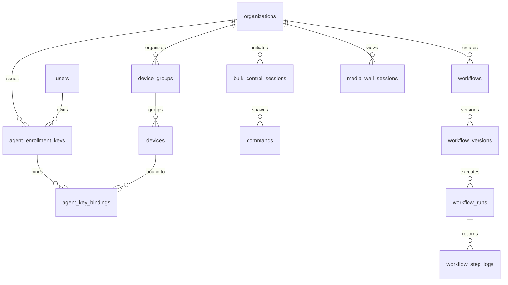
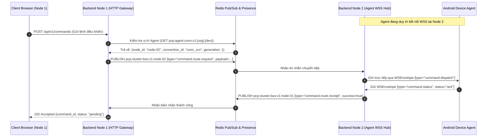

# CLOUDPHONERENTAL V2 — SYSTEM ARCHITECTURE V2

> **Tài liệu:** Bản thiết kế Kiến trúc Tổng thể Hệ thống V2 (System Architecture Blueprint)  
> **Phiên bản:** 2.0.0  
> **Phạm vi:** Toàn bộ Backend Go, Data Layer, Clustering, Media Plane, Edge Ingress & Client Integration

---

## 1. TỔNG QUAN HỆ THỐNG V2

Hệ thống **CloudPhoneRental V2** được kiến trúc theo mô hình phân tầng module hóa cao độ, phân tách triệt để giữa **Control Plane** (Mặt phẳng Điều khiển & Lệnh giao dịch) và **Media Plane** (Mặt phẳng Truyền dẫn Hình ảnh Thời gian thực), vận hành trên hạ tầng Backend phân tán đa node (Distributed Multi-node Go Cluster).


---

## 2. NỀN TẢNG KIẾN TRÚC ĐƯỢC BẢO TOÀN (PRESERVED FOUNDATIONS)

CloudPhoneRental V2 kế thừa trọn vẹn và củng cố 10 trụ cột kỹ thuật cốt lõi đã được kiểm chứng của nền tảng:

1. **Go 1.22+ Backend Engine:** Hiệu năng cao, Goroutine nhẹ nhàng, bộ nhớ tối ưu, phục vụ hàng chục ngàn kết nối đồng thời.
2. **PostgreSQL 16 Cơ sở Dữ liệu Quan hệ:** Đảm bảo tính toàn vẹn dữ liệu chuẩn ACID với các ràng buộc khóa ngoại và khóa hàng nguyên tử (`FOR UPDATE SKIP LOCKED`).
3. **Redis 7 State & Bus:** Quản lý phiên làm việc tức thời, hiện diện thiết bị (Presence) và làm Message Bus phân tán.
4. **Hệ thống Phân quyền Đa tầng RBAC:** Kiểm tra quyền hạn chi tiết (`RequirePermission`, `RequireAnyPermission`) cho mọi Endpoint.
5. **Cách ly Đa tổ chức (Tenant Isolation):** Mỗi yêu cầu nghiệp vụ đều được gắn chặt với `organization_id`.
6. **Mô hình Giao dịch Lệnh Outbox (Transactional Outbox Pattern):** Ghi nhận lệnh điều khiển và hàng đợi outbox trong 1 Transaction SQL duy nhất, loại bỏ rủi ro thất lạc lệnh khi mất kết nối.
7. **Bộ đếm Fencing Token Tăng Đơn Điệu:** Loại bỏ hoàn toàn lỗi Split-Brain và xung đột lệnh từ các phiên điều khiển cũ.
8. **Cơ chế Idempotency Tuyệt đối:** Xử lý trùng lặp lệnh thông qua `idempotency_key` ở Backend và SQLite Journal ở Agent.
9. **Bộ Định tuyến Cluster Đa Node (`ClusterRouter`):** Cho phép Client kết nối vào Node A điều khiển trong suốt một thiết bị đang kết nối WSS tại Node B.
10. **Hệ Tọa độ Chuẩn hóa (`normalized_display_v1`):** Mọi cử chỉ vuốt chạm được tính toán theo tỷ lệ $0.0 \rightarrow 1.0$, độc lập với độ phân giải màn hình Client hay góc xoay vật lý của thiết bị.

---

## 3. CÁC PHÂN HỆ CHỨC NĂNG BACKEND V2

```text
backend/internal/
├── auth/           # Xác thực người dùng, băm Argon2id, quản lý JWT/Session Cookie
├── tenant/         # Middleware & Service cách ly dữ liệu Organization
├── user/           # Quản lý hồ sơ người dùng, phân quyền RBAC
├── device/         # Quản lý hồ sơ phần cứng thiết bị, trạng thái kết hợp (Presence + Lifecycle)
├── agent/          # Xác thực Agent Ed25519, quản lý định danh & decommission
├── enrollment/     # Xử lý Token Key V2 (CPRK-XXXX), kiểm soát hạn ngạch Quota & Expiry
├── connection/     # Quản lý Socket Hub, Connection Generation, Ping/Pong Heartbeat
├── command/        # Transactional Outbox Worker, Dispatcher, Retry Backoff
├── bulkcontrol/    # Bộ điều phối lệnh hàng loạt (Fan-out 1-to-N Devices)
├── media/          # Điều phối phiên WebRTC Media Session, phân bổ ICE Servers & Quota
├── workflow/       # Công cụ lập trình kịch bản tự động hóa, thực thi bước UI Selector
├── rental/         # Quản lý gói thuê thiết bị, thời hạn sử dụng, kích hoạt/thu hồi quyền
├── billing/        # Quản lý ví tiền khách hàng, trừ tiền theo giờ/ngày, nạp tiền tự động
├── alert/          # Giám sát sức khỏe farm, phát hiện máy quá nhiệt/mất nguồn/offline
├── audit/          # Ghi vết toàn bộ hành động người dùng và sự kiện hệ thống
├── cluster/        # Node Registry, Redis Pub/Sub Bus, Cross-node Envelope Routing
├── telemetry/      # Prometheus Metrics Exporter & Runtime Telemetry Aggregator
└── transport/      # Chi HTTP Handlers, Web Handlers, Agent WSS Handlers
```

---

## 4. MÔ HÌNH DỮ LIỆU BỔ SUNG CHO V2 (DATABASE SCHEMA V2)

Để phục vụ các tính năng V2 mà không phá vỡ tính toàn vẹn của các Migration trước đó (`000001` $\rightarrow$ `000009`), hệ thống bổ sung các migration nối tiếp:



### Chi tiết các Bảng Mới:
1. `agent_enrollment_keys` (Migration `000010`): Quản lý Token Key cấp cho khách hàng/farm.
   - `id (UUID PK)`, `organization_id`, `user_id`, `key_prefix (VARCHAR 12)`, `key_hash (VARCHAR 64)`, `label`, `max_devices (INT)`, `expires_at (TIMESTAMPTZ, Nullable)`, `status (active/exhausted/revoked)`, `created_at`, `last_used_at`.
2. `agent_key_bindings` (Migration `000011`): Ghi nhận máy nào đang chiếm slot của Token Key nào.
   - `id (UUID PK)`, `enrollment_key_id`, `device_id`, `agent_id`, `bound_at`, `released_at`, `status (active/released)`.
3. `device_groups` (Migration `000012`): Nhóm thiết bị logic theo mục đích sử dụng.
4. `bulk_control_sessions` (Migration `000013`): Phiên điều khiển đồng thời nhiều máy.
5. `workflows`, `workflow_versions`, `workflow_runs`, `workflow_step_logs` (Migration `000014`): Công cụ tự động hóa UI Selector không cần Appium.
6. `media_wall_sessions` (Migration `000015`): Quản lý phiên xem bức tường 30–50 máy.
7. `agent_releases` (Migration `000016`): Quản lý các phiên bản APK phát hành và cập nhật OTA.

---

## 5. CƠ CHẾ ĐIỀU PHỐI CỤM (CLUSTER ORCHESTRATION & ROUTING)

Hệ thống hỗ trợ chạy mở rộng ngang (Horizontal Scaling) không giới hạn số lượng Backend Node:



Kiến trúc này đảm bảo:
- Client có thể gửi lệnh qua bất kỳ Backend Node nào mà không cần biết Agent đang nằm ở Node nào.
- Nếu Agent chuyển dịch sang Node khác (do reconnect), Redis Connection Repository sẽ tự cập nhật và lệnh tiếp theo sẽ tự động hướng sang Node mới.
