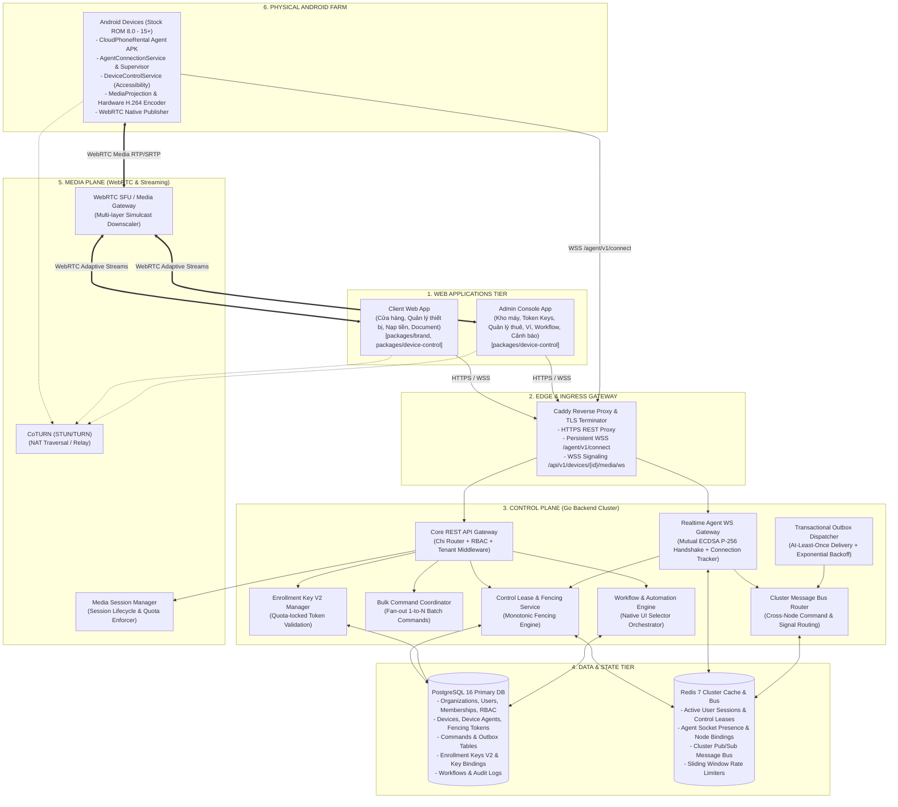
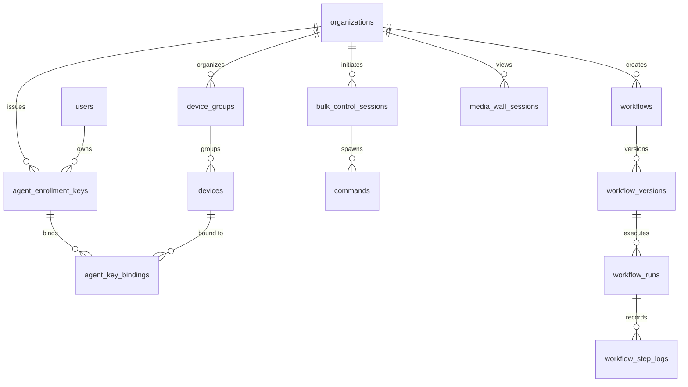

# CLOUDPHONERENTAL V2 — SYSTEM ARCHITECTURE V2

> **Tài liệu:** Bản thiết kế Kiến trúc Tổng thể Hệ thống V2 (System Architecture Blueprint)  
> **Phiên bản:** 2.1.0 (Audit Resolution V2)  
> **Phạm vi:** Toàn bộ Backend Go, Data Layer, Clustering, Media Plane, Edge Ingress & Client Integration

---

## 1. TỔNG QUAN KIẾN TRÚC HỆ THỐNG V2

Hệ thống **CloudPhoneRental V2** được kiến trúc theo mô hình phân tầng module hóa cao độ, phân tách triệt để giữa **Control Plane** (Mặt phẳng Điều khiển & Lệnh giao dịch) và **Media Plane** (Mặt phẳng Truyền dẫn Hình ảnh Thời gian thực), vận hành trên hạ tầng Backend phân tán đa node (Distributed Multi-node Go Cluster).



---

## 2. NỀN TẢNG KIẾN TRÚC ĐƯỢC BẢO TOÀN (PRESERVED FOUNDATIONS)

CloudPhoneRental V2 kế thừa trọn vẹn và củng cố 10 trụ cột kỹ thuật cốt lõi đã được kiểm chứng của nền tảng:

1. **Go 1.22+ Backend Engine:** Hiệu năng cao, Goroutine nhẹ nhàng, bộ nhớ tối ưu, phục vụ hàng chục ngàn kết nối đồng thời.
2. **PostgreSQL 16 Cơ sở Dữ liệu Quan hệ:** Đảm bảo tính toàn vẹn dữ liệu chuẩn ACID với các ràng buộc khóa ngoại và khóa hàng nguyên tử (`FOR UPDATE SKIP LOCKED`).
3. **Redis 7 State & Bus:** Quản lý phiên làm việc tức thời, hiện diện thiết bị (Presence) và làm Message Bus phân tán.
4. **Hệ thống Phân quyền Đa tầng RBAC:** Kiểm tra quyền hạn chi tiết (`RequirePermission`, `RequireAnyPermission`) cho mọi Endpoint.
5. **Cách ly Đa tổ chức (Tenant Isolation):** Mỗi yêu cầu nghiệp vụ đều được gắn chặt với `organization_id`.
6. **Mô hình Giao dịch Lệnh Outbox (Transactional Outbox Pattern):** Ghi nhận lệnh điều khiển và hàng đợi outbox trong 1 Transaction SQL duy nhất, loại bỏ rủi ro thất lạc lệnh khi mất kết nối.
7. **Bộ đếm Fencing Token Tăng Đơn Điệu:** Loại bỏ hoàn toàn lỗi Split-Brain và xung đột lệnh từ các phiên điều khiển cũ.
8. **Cơ chế Idempotency Tuyệt đối:** Xử lý trùng lặp lệnh thông qua `idempotency_key` ở Backend và SQLite Journal ở Agent.
9. **Bộ Định tuyến Cluster Đa Node (`ClusterRouter`):** Cho phép Client kết nối vào Node A điều khiển trong suốt một thiết bị đang kết nối WSS tại Node B.
10. **Hệ Tọa độ Chuẩn hóa (`normalized_display_v1`):** Mọi cử chỉ vuốt chạm được tính toán theo tỷ lệ $0.0 \rightarrow 1.0$, độc lập với độ phân giải màn hình Client hay góc xoay vật lý của thiết bị.

---

## 3. MÔ HÌNH XÁC THỰC MẬT MÃ TOÀN HỆ THỐNG (ECDSA P-256 M2M AUTH)

Toàn bộ quá trình định danh và xác thực Agent được chuẩn hóa theo chuẩn **ECDSA P-256 (`SHA256withECDSA`)**:
1. **Tại Android Agent:**
   - Cặp khóa bất đối xứng được tạo và bảo vệ bên trong `AndroidKeyStore`.
   - Public Key (ANSI X9.62 uncompressed 65-byte point hoặc PKIX DER) được gửi lên Backend trong quá trình Enrollment `POST /api/v2/agents/enroll`.
2. **Tại Go Backend (`pkg/crypto` & `internal/transport/http/middleware/agent_auth.go`):**
   - Backend lưu trữ Public Key vào PostgreSQL `device_agents.public_key`.
   - Đồng thời lưu trữ cấu hình bảo mật được đo lường tại runtime: `keystore_security_level` (SOFTWARE/TEE/STRONGBOX/UNKNOWN) và `attestation_status`.
   - Khi Agent kết nối WSS `/agent/v1/connect`, Backend gửi chuỗi `challenge_nonce` (32 bytes Hex ngẫu nhiên).
   - Agent dùng Private Key ký lên chuỗi Nonce, gửi về qua `agent.challenge_response`.
   - Backend sử dụng Go standard library:
     ```go
     // Parse ECDSA P-256 Public Key
     pub, err := x509.ParsePKIXPublicKey(agentPublicKeyBytes)
     ecdsaPub := pub.(*ecdsa.PublicKey)
     
     // Hash chuỗi nonce bằng SHA-256
     hash := sha256.Sum256([]byte(nonce))
     
     // Xác thực chữ ký ASN.1 DER (r, s)
     valid := ecdsa.VerifyASN1(ecdsaPub, hash[:], signatureBytes)
     ```
   - Cơ chế này hoạt động chính xác 100% trên toàn bộ các phiên bản Android từ 8.0 đến 15+ mà không cần phụ thuộc thư viện ngoài.

---

## 4. MÔ HÌNH DỮ LIỆU BỔ SUNG CHO V2 (DATABASE SCHEMA V2)

Để phục vụ các tính năng V2 mà không phá vỡ tính toàn vẹn của các Migration trước đó (`000001` $\rightarrow$ `000009`), hệ thống bổ sung các migration nối tiếp:



### Chi tiết các Bảng Mới:
1. `agent_enrollment_keys` (Migration `000010`): Quản lý Token Key cấp cho khách hàng/farm.
   - `id (UUID PK)`, `organization_id`, `user_id`, `key_prefix (VARCHAR 12)`, `key_hash (VARCHAR 64)`, `label`, `max_devices (INT)`, `expires_at (TIMESTAMPTZ, Nullable)`, `status (active/exhausted/revoked)`, `created_at`, `last_used_at`.
2. `agent_key_bindings` (Migration `000011`): Ghi nhận máy nào đang chiếm slot của Token Key nào.
   - `id (UUID PK)`, `enrollment_key_id`, `device_id`, `agent_id`, `bound_at`, `released_at`, `status (active/released)`.
3. `device_groups` (Migration `000012`): Nhóm thiết bị logic theo mục đích sử dụng.
4. `bulk_control_sessions` (Migration `000013`): Phiên điều khiển đồng thời nhiều máy.
5. `workflows`, `workflow_versions`, `workflow_runs`, `workflow_step_logs` (Migration `000014`): Công cụ tự động hóa UI Selector không cần Appium.
6. `media_wall_sessions` (Migration `000015`): Quản lý phiên xem bức tường 30–50 máy.
7. `agent_releases` (Migration `000016`): Quản lý các phiên bản APK phát hành và cập nhật OTA.
