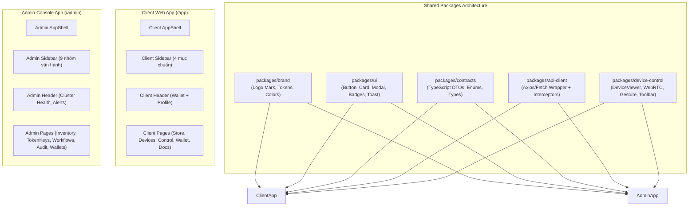

# CLOUDPHONERENTAL V2 — WEB ARCHITECTURE V2

> **Tài liệu:** Bản thiết kế Kiến trúc Ứng dụng Web V2 (Client Web & Admin Console Blueprint)  
> **Công nghệ:** React 18, TypeScript, TailwindCSS, Vite, WebRTC API, Zustand, React Router v6  
> **Mô hình triển khai:** Monorepo Package Shared Component Architecture

---

## 1. TỔNG QUAN KIẾN TRÚC WEB TIER

Hệ thống Web được tổ chức thành **2 Ứng dụng độc lập** chia sẻ chung một hệ thống **Shared Packages** để tái sử dụng toàn bộ thành phần đồ họa thương hiệu, bộ điều khiển thiết bị, giao thức WebRTC và API Client.



---

## 2. HỆ THỐNG GÓI CHIA SẺ (SHARED PACKAGES)

### 2.1. `packages/brand/` — Single Source of Truth về Nhận diện Thương hiệu
- **Tài nguyên ảnh:** Logo Mark hình **Đám mây + Điện thoại màu xanh lá cây** trên nền vòng tròn xanh mint nhạt (`cloudphonerental-mark.png`).
- **Thành phần React:** `<BrandLogo variant="full" | "mark_only" | "white" />`. Chữ "CloudPhoneRental" luôn được render bằng HTML/CSS font chuẩn hiện đại, không nhúng chữ chết vào ảnh bitmap.

### 2.2. `packages/device-control/` — Bộ Điều khiển Thiết bị Độc lập
```text
packages/device-control/
├── viewer/
│   ├── DeviceViewer.tsx          # Container chính chứa khung hình và lớp bắt sự kiện
│   ├── VideoSurface.tsx          # Thẻ HTML5 <video> render luồng WebRTC
│   └── ViewerOverlay.tsx         # Hiển thị loading, rớt mạng, watermark, FPS/Bitrate
├── gesture/
│   ├── PointerGestureEngine.ts   # Bắt PointerDown, PointerMove, PointerUp
│   ├── CoordinateNormalizer.ts   # Chuyển đổi tọa độ HTML sang normalized_display_v1 (0..1)
│   └── GestureTypes.ts           # Định nghĩa cấu trúc TouchEvent, SwipeEvent
├── media/
│   ├── MediaSessionClient.ts     # Quản lý vòng đời phiên Media WebSocket
│   └── WebRTCClient.ts           # RTCPeerConnection, ICE Candidate, SDP Offer/Answer
├── commands/
│   ├── CommandClient.ts          # Gửi lệnh đơn lẻ (Optimistic UI + Idempotency Key)
│   └── BatchCommandClient.ts     # Gửi lệnh hàng loạt (POST /api/v1/commands/batch)
└── controls/
    └── RemoteToolbar.tsx         # Thanh nút bấm Back, Home, Recents, Power, Vol, Text IME
```
*Lưu ý cốt lõi:* Cả Client Web và Admin Console đều sử dụng chung `packages/device-control`, tuyệt đối không viết riêng hai engine điều khiển khác nhau.

---

## 3. CLIENT WEB APP (TRẢI NGHIỆM KHÁCH HÀNG THUÊ MÁY)

### 3.1. Cấu trúc Điều hướng Chuẩn (Navigation & Header)
- **Sidebar Khách hàng (Chỉ giữ đúng 4 mục thiết yếu):**
  1. 🛒 **Cửa hàng cho thuê** (`/store`): Xem danh mục gói máy, thông số, chọn thuê và kích hoạt.
  2. 📱 **Quản lý thiết bị** (`/devices`): Quản lý danh sách máy đang thuê, xem live preview, mở điều khiển.
  3. 💳 **Nạp tiền** (`/wallet`): Nạp tiền vào tài khoản, lịch sử giao dịch, hóa đơn thuê máy.
  4. 📖 **Document** (`/docs`): Hướng dẫn sử dụng, tích hợp API, tải APK Agent.
- **Header Khách hàng:**
  `[Logo CloudPhoneRental] [Thu gọn/Mở rộng Sidebar] --------- [Ngôn ngữ: VI/EN] [Ví tiền: 1.500.000 đ] [Hồ sơ / Đăng xuất]`

### 3.2. Màn hình Trọng tâm: Quản lý Thiết bị (`/devices`)

```text
Quản lý thiết bị (Tổng: 50 thiết bị)

[ Tất cả (50) ]  [ Online (48) ]  [ Offline (2) ]  [ Thiếu quyền (1) ]  [ Sắp hết hạn (4) ]

Tìm kiếm: [ Nhập tên máy... ]      Nhóm: [ Tất cả nhóm ▼ ]         Chế độ xem: [ 4 cột ] [ 6 cột ] [ 8 cột ]

☐ Chọn tất cả 50 thiết bị
┌────────────────────────┐  ┌────────────────────────┐  ┌────────────────────────┐
│ CPR-001       ● Online │  │ CPR-002       ● Online │  │ CPR-003       ● Online │
│                        │  │                        │  │                        │
│     [ LIVE PREVIEW ]   │  │     [ LIVE PREVIEW ]   │  │     [ LIVE PREVIEW ]   │
│      (2 - 5 FPS)       │  │      (2 - 5 FPS)       │  │      (2 - 5 FPS)       │
│                        │  │                        │  │                        │
│ Samsung Galaxy S10     │  │ Google Pixel 6         │  │ Xiaomi Redmi Note 11   │
│ Android 12             │  │ Android 13             │  │ Android 11             │
│ Còn hạn: 18 ngày       │  │ Còn hạn: 25 ngày       │  │ Còn hạn: 2 ngày        │
│                        │  │                        │  │                        │
│   [ MỞ ĐIỀU KHIỂN ]    │  │   [ MỞ ĐIỀU KHIỂN ]    │  │   [ MỞ ĐIỀU KHIỂN ]    │
└────────────────────────┘  └────────────────────────┘  └────────────────────────┘
```

> **Nguyên tắc UI Client:** Tuyệt đối **KHÔNG** hiển thị thông số nội bộ phần cứng như % CPU, RAM heap, Nhiệt độ Chip, Socket Generation lên thẻ máy của Client. Chỉ hiển thị thông tin thân thiện: Trạng thái Online, Mẫu máy, Phiên bản Android, Số ngày thuê còn lại.

### 3.3. Thanh Thao tác Đa Thiết bị (Multi-Device Batch Toolbar)
Khi khách hàng chọn nhiều thiết bị cùng lúc:
`[ Đã chọn 42 thiết bị ] ---> [ Xem Bức tường (Wall View) ] [ Điều khiển Đồng bộ ] [ Chạy Workflow ] [ Mở App ] [ Chụp ảnh ]`
- **Cơ chế truyền tin:** Trình duyệt chỉ gửi **1 Request duy nhất** `POST /api/v1/commands/batch`, Backend sẽ chịu trách nhiệm phân tách và điều phối (fan-out) tới từng máy để tránh làm nghẽn trình duyệt.

---

## 4. ADMIN CONSOLE APP (BÀN ĐIỀU KHIỂN VẬN HÀNH TOÀN DIỆN)

Admin Console là ứng dụng chuyên biệt phục vụ quản trị viên hạ tầng và kỹ thuật viên vận hành farm:

```text
TỔNG QUAN
  └── Tổng quan hệ thống (/admin/overview)
KHÁCH HÀNG
  └── Danh sách khách hàng (/admin/customers)
THIẾT BỊ
  ├── Kho thiết bị vật lý (/admin/devices)
  ├── Phân nhóm thiết bị (/admin/device-groups)
  └── Bức tường giám sát Wall Monitor (/admin/devices/wall)
AGENT
  ├── Quản lý Android Agent (/admin/agent)
  ├── Khởi tạo Token Keys (/admin/agent/token-keys)
  └── Phát hành bản build APK (/admin/agent/releases)
AUTOMATION
  ├── Trình soạn thảo Workflow (/admin/workflows)
  └── Lịch sử chạy tự động hóa (/admin/automation-runs)
CHO THUÊ
  ├── Quản lý đơn thuê (/admin/rentals)
  └── Cấu hình gói dịch vụ (/admin/plans)
TÀI CHÍNH
  ├── Quản lý giao dịch nạp tiền (/admin/transactions)
  └── Số dư ví khách hàng (/admin/wallets)
VẬN HÀNH & AN NINH
  ├── Cảnh báo phần cứng & mạng (/admin/alerts)
  └── Nhật ký kiểm toán Audit Logs (/admin/audit)
HỆ THỐNG
  ├── Tài khoản Quản trị viên (/admin/users)
  ├── Phân quyền RBAC (/admin/roles)
  └── Cài đặt máy chủ & Cluster (/admin/settings)
```

- **Quyền hạn kỹ thuật cao cấp:** Hiển thị chi tiết toàn bộ Telemetry kỹ thuật (Nhiệt độ Pin, Điện áp, RAM thực tế, Phiên bản APK, Socket Generation, NodeID kết nối, Lịch sử lỗi kết nối) bên trong Drawer chi tiết máy `DeviceDetailDrawer`.
