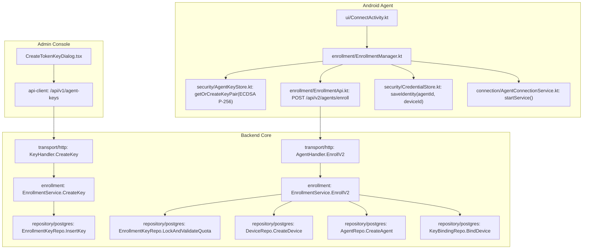
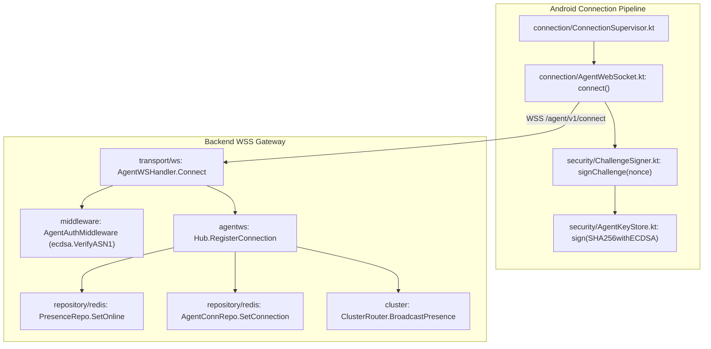
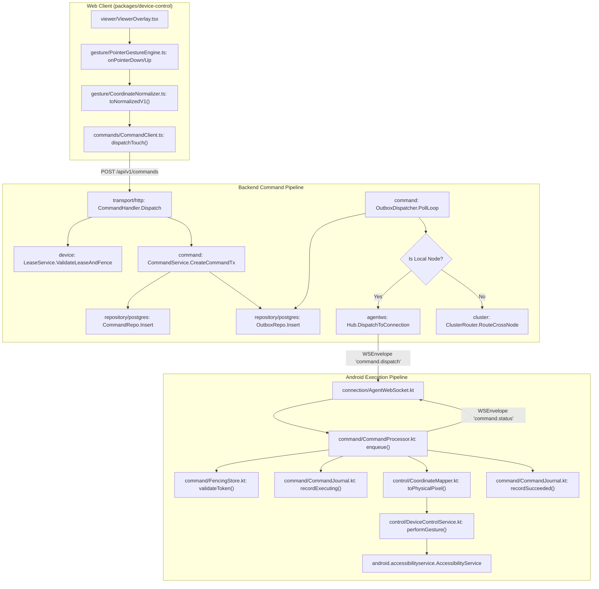
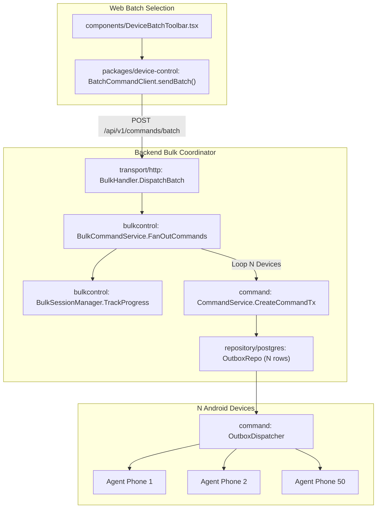

# CLOUDPHONERENTAL V2 — CODEGRAPH V2

> **Tài liệu:** Bản đồ CodeGraph Tổng thể & Ma trận Điểm chạm Toàn hệ thống V2 (Authoritative Master CodeGraph & Dependency Matrix)  
> **Trạng thái:** TÀI LIỆU DUY NHẤT VÀ CHUẨN MỰC TỐI CAO CỦA HỆ THỐNG CODEGRAPH (CANONICAL)  
> **Phiên bản:** 2.1.0 (Audit Resolution V2)

---

## 1. NGUYÊN TẮC 10 BƯỚC CODEGRAPH BẮT BUỘC TRƯỚC MỌI TASK

Mọi lập trình viên / Agent trước khi sửa đổi hoặc viết thêm bất kỳ dòng code nào đều bắt buộc phải đi qua quy trình 10 bước:

```text
[1. Search CodeGraph] ──> [2. Identify Existing Code] ──> [3. Map Inbound Calls] ──> [4. Map Outbound Calls]
                                                                                            │
[8. Map Web Impact] <── [7. Map Android Impact] <── [6. Check API Contract] <── [5. Map DB Touchpoints]
        │
        └──> [9. Define Test Plan & Evidence] ──> [10. THEN WRITE CODE]
```

---

## 2. BẢN ĐỒ TỔNG THỂ CÁC LUỒNG GỌI HÀM (MASTER CALL GRAPHS)

### 2.1. Luồng 1: Khởi tạo Token Key & Đăng ký Thiết bị (Enrollment Key V2)



---

### 2.2. Luồng 2: Kết nối WebSocket & Xác thực Mật mã Challenge-Response (ECDSA P-256)



---

### 2.3. Luồng 3: Điều khiển Cử chỉ Đơn lẻ & Fencing Token



---

### 2.4. Luồng 4: Điều phối Lệnh Hàng loạt (Bulk Command Fan-Out)



---

## 3. MA TRẬN ĐIỂM CHẠM THAY ĐỔI THEO TỪNG TÍNH NĂNG (TOUCHPOINT MATRIX)

| Tính năng yêu cầu | API Contract (`api/`) | Backend Domain / Services (`backend/internal/`) | Database Migrations (`backend/db/`) | Android Agent (`android-agent/`) | Web Applications (`src/`, `packages/`) | Tests Bắt buộc |
| :--- | :--- | :--- | :--- | :--- | :--- | :--- |
| **Thêm loại Lệnh Mới** | `openapi.yaml` | `domain/command.go`<br/>`agentws/protocol.go`<br/>`command/command_service.go` | Không bắt buộc | `command/CommandProcessor.kt`<br/>`control/DeviceControlService.kt` | `packages/contracts/`<br/>`packages/device-control/commands/` | Unit test CommandProcessor<br/>E2E Dispatch test |
| **Nâng cấp Enrollment Key V2** | `openapi.yaml` | `enrollment/service.go`<br/>`transport/http/agent_handler.go` | `000010_agent_enrollment_keys.up.sql`<br/>`000011_agent_key_bindings.up.sql` | `enrollment/EnrollmentManager.kt`<br/>`ui/ConnectActivity.kt` | `pages/admin/TokenKeysPage.tsx`<br/>`packages/api-client/` | Concurrency enrollment test<br/>Quota exhaustion test |
| **Thêm Native UI Selector** | `openapi.yaml` | `domain/automation.go`<br/>`agentws/protocol.go`<br/>`workflow/service.go` | `000014_workflow_engine.up.sql` | `automation/UiSelectorEngine.kt`<br/>`automation/AutomationExecutor.kt` | `pages/admin/WorkflowsPage.tsx`<br/>`packages/device-control/` | Hierarchy snapshot test<br/>Selector resolution test |
| **Nâng cấp Media Adaptive SFU** | `openapi.yaml` | `media/session_service.go`<br/>`transport/ws/media_handler.go` | `000015_media_wall_sessions.up.sql` | `media/ScreenCapturer.kt`<br/>`media/WebRtcPublisher.kt` | `packages/device-control/media/`<br/>`pages/client/DeviceManagementPage.tsx` | 2-hour soak test<br/>Wall 30-tile memory test |
| **Thêm Gói Thuê & Nạp tiền Ví** | `openapi.yaml` | `rental/service.go`<br/>`billing/service.go`<br/>`transport/http/billing_handler.go` | `000017_rental_and_billing.up.sql` | Không chạm | `pages/client/RentalStorePage.tsx`<br/>`pages/client/WalletPage.tsx` | Transaction balance test<br/>Auto-expiry test |
