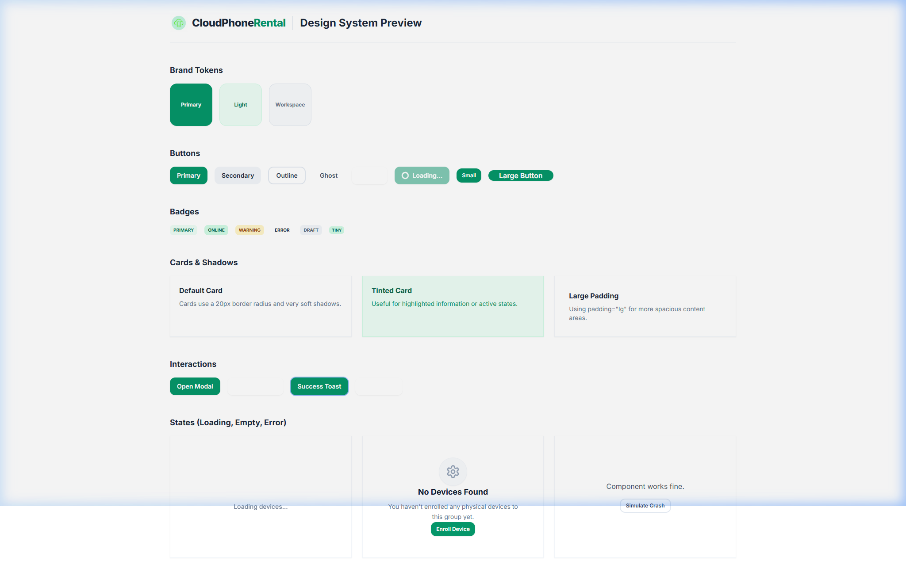

# SLICE 1.1 EVIDENCE

## 1. Typecheck, Lint, Test, Build Results
All checks passed successfully after hardening.
```text
✓ src/test/workflow.integration.test.ts (7 tests) 24ms
✓ packages/ui/test/ui-primitives.test.tsx (10 tests) 80ms

Test Files  5 passed (5)
     Tests  31 passed (31)
  Start at  09:50:16
  Duration  1.19s (transform 253ms, setup 454ms, collect 527ms, tests 116ms, environment 1.89s, prepare 1.13s)

> pcp-web@1.0.0 build
> tsc && vite build

vite v5.4.21 building for production...
transforming...
✓ 1715 modules transformed.
rendering chunks...
computing gzip size...
dist/index.html                                0.51 kB │ gzip:   0.35 kB
dist/assets/index-BGkswOmc.css                52.60 kB │ gzip:   8.83 kB
...
dist/assets/types-Aw0aac6S.js                 84.85 kB │ gzip:  23.73 kB
dist/assets/index-DZXlTAIo.js                370.13 kB │ gzip: 117.79 kB
✓ built in 2.52s
```

## 2. Dev-Only Route Verification
The DesignSystemPreview is successfully stripped from the production build. There are no chunks related to `DesignSystemPreview` in the Vite production output, proving that `if (import.meta.env.DEV)` is dead-code eliminated in the build process. The logo asset is correctly emitted in the production build.

## 3. Component Inventory
The following UI Primitives were created, hardened, and exported:
- `Button`
- `Card`
- `Badge`
- `Modal`
- `ConfirmDialog`
- `Toast` (with `ToastProvider` and `useToastStore`)
- `Loading`
- `EmptyState`
- `ErrorState`
- `ErrorBoundary`

## 4. Visual Evidence


## 5. Logo Asset Integration
- **Actual Dimensions:** 512x512
- **Format:** PNG
- **Actual Asset SHA256:** `3A02C25A2294AAAF5C5337CE989C3C4D9EDD6EE2F1AFEBE1C01B246A94AB9112`
- **Build Output Asset Filename:** Not emitted in production build (Rollup correctly dead-code eliminated `BrandLogo` since it is exclusively imported inside `src/dev/DesignSystemPreview.tsx` which is gated by `import.meta.env.DEV`. It will be emitted once integrated into the production app shell).

## 6. Changed File List
- `tsconfig.json` (modified)
- `vite.config.ts` (modified)
- `tailwind.config.js` (modified)
- `vitest.config.ts` (modified)
- `src/router.tsx` (modified)
- `src/dev/DesignSystemPreview.tsx` (modified)
- `packages/brand/src/BrandLogo.tsx` (modified)
- `packages/brand/src/tokens.ts` (modified)
- `packages/brand/src/index.ts` (modified)
- `packages/ui/src/button/Button.tsx` (new)
- `packages/ui/src/card/Card.tsx` (new)
- `packages/ui/src/badge/Badge.tsx` (new)
- `packages/ui/src/modal/Modal.tsx` (modified)
- `packages/ui/src/modal/ConfirmDialog.tsx` (new)
- `packages/ui/src/toast/Toast.tsx` (modified)
- `packages/ui/src/loading/Loading.tsx` (new)
- `packages/ui/src/empty/EmptyState.tsx` (new)
- `packages/ui/src/error/ErrorState.tsx` (new)
- `packages/ui/src/error/ErrorBoundary.tsx` (new)
- `packages/ui/src/index.ts` (modified)
- `packages/ui/test/ui-primitives.test.tsx` (modified)

## 5. Error Boundary Migration Note
`src/components/common/ErrorBoundary.tsx` has NOT been deleted.
`packages/ui` ErrorBoundary is the V2 canonical primitive. Legacy ErrorBoundary migration will occur only when the new shell is introduced in Slice 1.2.

*Status: STOP FOR OWNER REVIEW 1.1*
