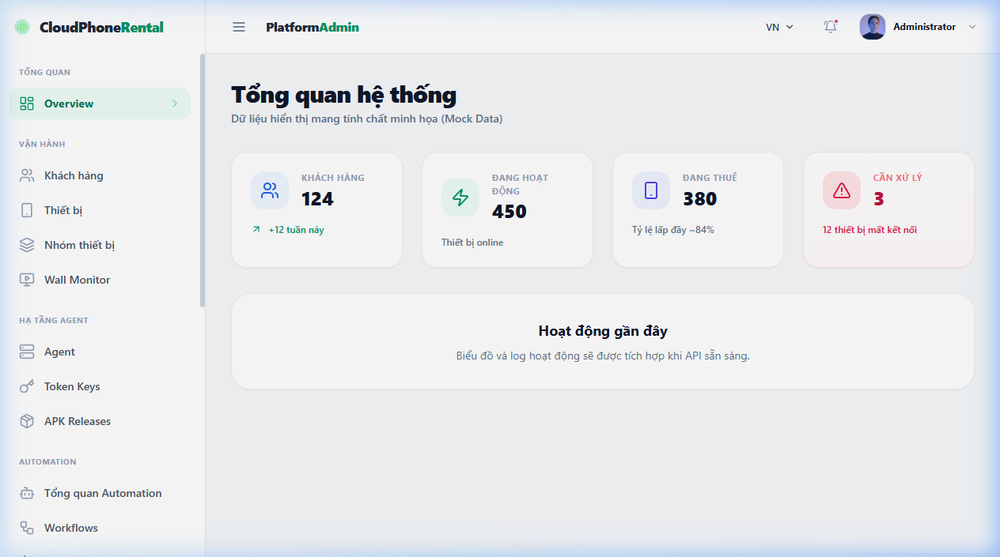
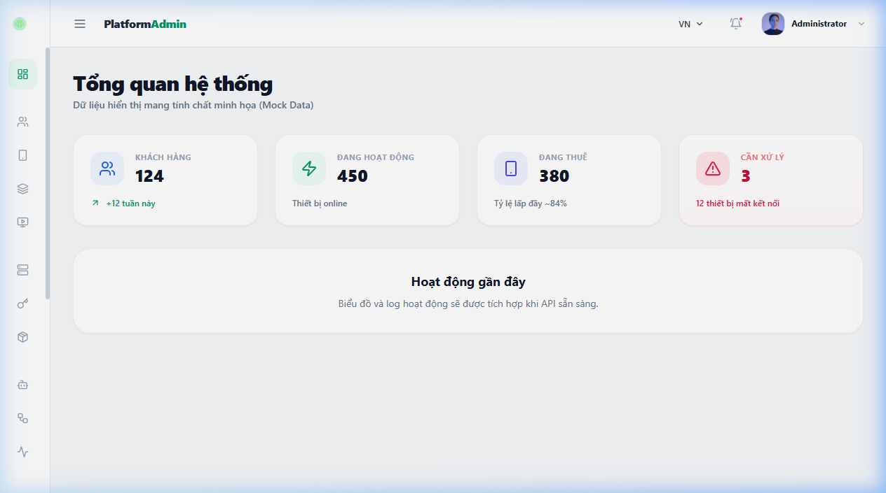
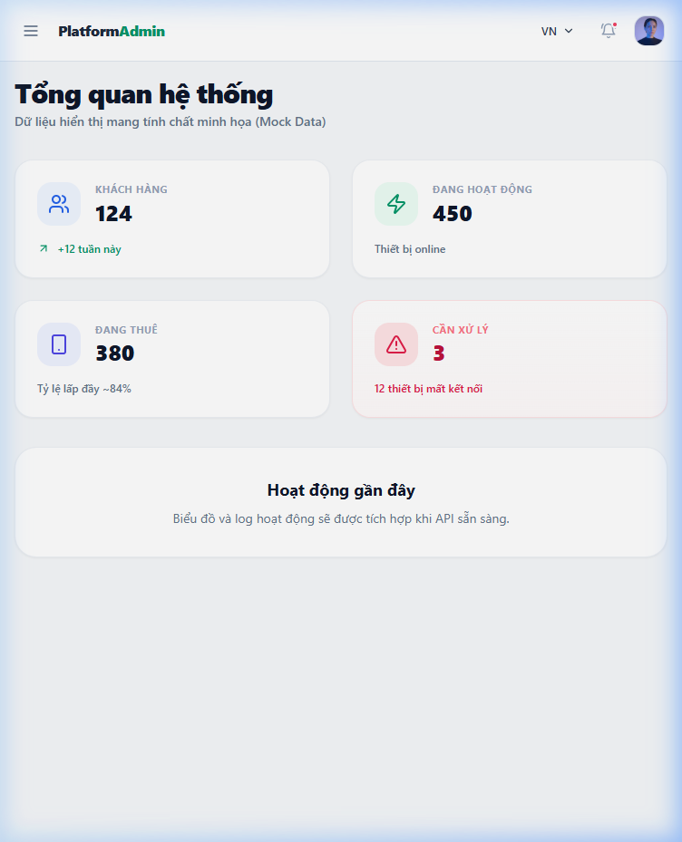
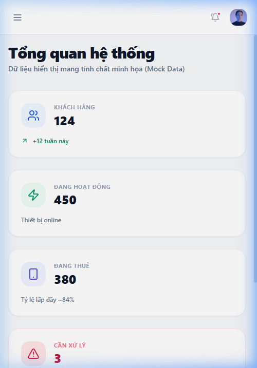
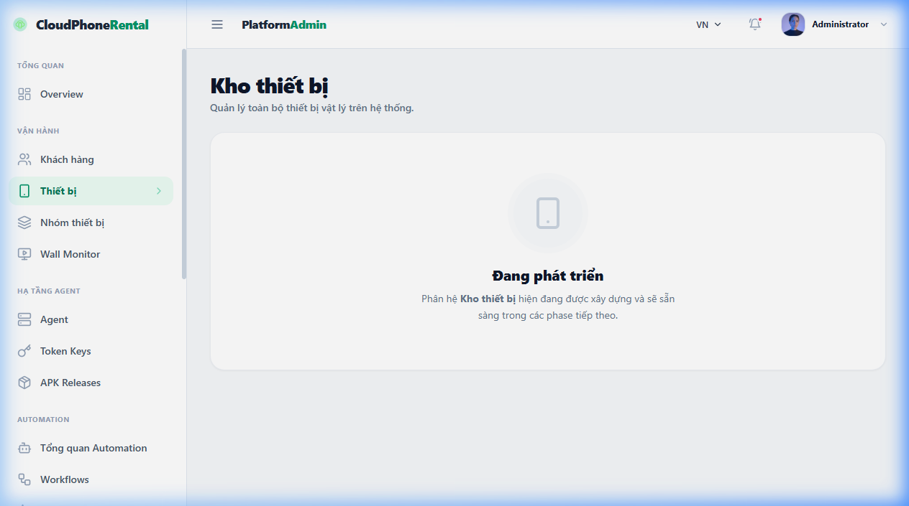
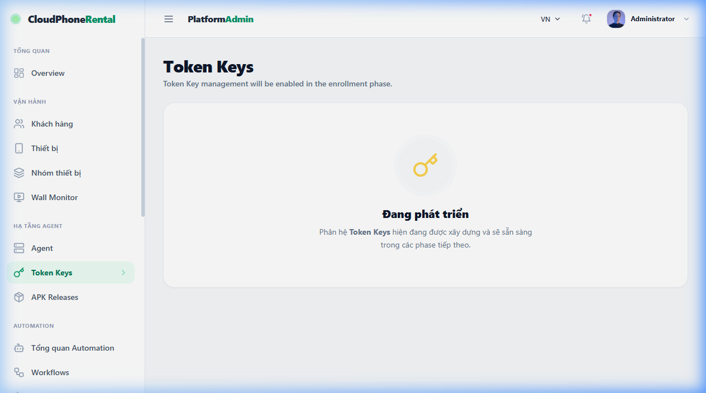
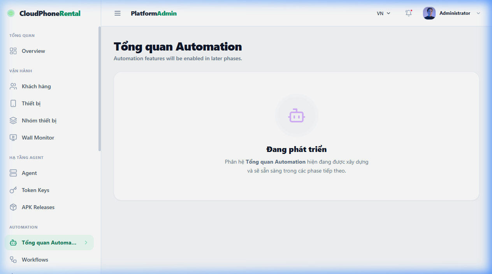
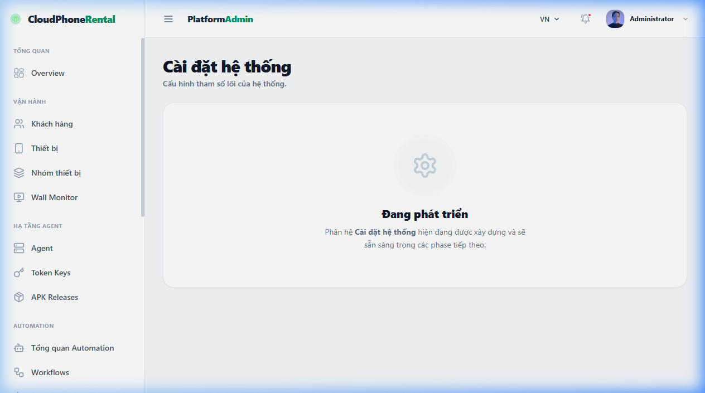
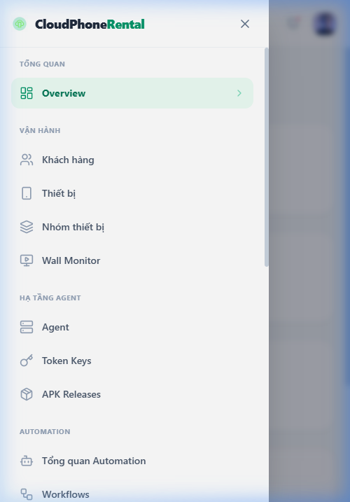

# Slice 1.4 Admin AppShell Evidence

**Scope:** Dedicated Admin Console shell completely separated from the Client shell. Includes persistent Desktop Sidebar, tablet/mobile Drawer, and responsive empty page shells. 
**Design:** Platform Pro (dense, premium, data-heavy Admin).

NO backend changes
NO Android changes
NO DB migrations
NO OpenAPI changes
NO Agent enrollment implementation
NO Token Key backend
NO WebRTC / SFU runtime
NO automation runtime
NO rental/payment backend changes

## 1. Test Verification
Exact file count: 8 test files
Exact test count: 51 tests passed

## 2. Gate Status
Desktop: 1280x800
Tablet: 768x1024
Mobile: 375x812
Typecheck: PASS
Lint: PASS — 0 errors / 0 warnings
Tests: 8 files / 51 tests passed
Build: PASS
Console errors: 0
Horizontal overflow: PASS

## 3. Exact Changed Source Files

### Admin AppShell Implementation
- `src/components/admin/layout/AdminHeader.tsx`
- `src/components/admin/layout/AdminLayout.tsx`
- `src/components/admin/layout/AdminMobileDrawer.tsx`
- `src/components/admin/layout/AdminSidebar.tsx`
- `src/components/admin/navigation/adminNav.ts`
- `src/pages/admin/AdminEmptyShell.tsx`
- `src/pages/admin/OverviewPage.tsx`
- `src/pages/admin/PlaceholderPages.tsx`
- `src/router.tsx`
- `src/stores/useAdminUiStore.ts`
- `src/test/admin-shell.integration.test.tsx`

### Phase 1 Final Lint-Gate Hygiene / Behavior-Preserving
- `src/components/layout/Sidebar.tsx`
- `src/pages/DeviceListPage.tsx`
- `src/pages/RentalStorePage.tsx`
- `src/test/client-shell.integration.test.tsx`
- `src/test/page-shells.integration.test.tsx`

## 4. Visual Verification

### Overview

### Empty Shells

### Mobile Navigation

