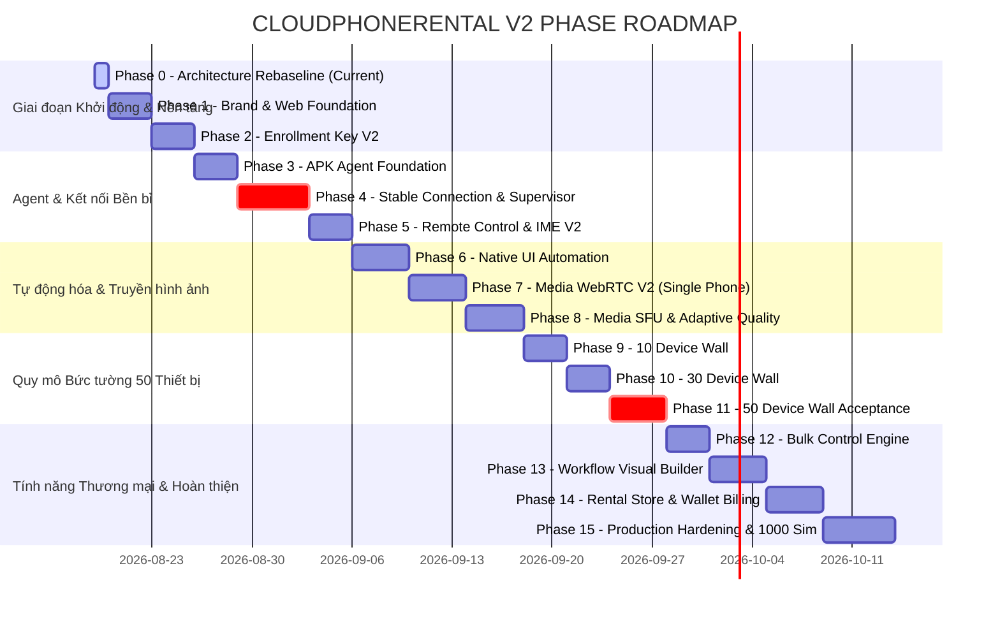

# CLOUDPHONERENTAL V2 — PHASE ROADMAP V2 (0 $\rightarrow$ 15)

> **Tài liệu:** Lộ trình Triển khai Phân kỳ Toàn diện V2 (Master Phased Roadmap & Owner Gates)  
> **Quy tắc vận hành:** Mô hình Three-Level Delivery — Chỉ duy nhất 1 Phase / Slice được ACTIVE tại một thời điểm.  
> **Tiêu chí nghiệm thu:** Mọi Phase bắt buộc phải có đầy đủ Code, Tests, Evidence, CodeGraph và phê duyệt chính thức tại **Owner Gate**.

---

## BẢNG TỔNG QUAN LỘ TRÌNH 16 GIAI ĐOẠN

---

## CHI TIẾT TỪNG GIAI ĐOẠN & TIÊU CHÍ OWNER GATE

### 🟡 PHASE 0 — Architecture Rebaseline (ĐANG THỰC HIỆN)
- **Mục tiêu:** Tái cấu trúc tư duy kiến trúc, bảo toàn nền tảng Go Backend/Postgres/Redis/Fencing, định hình chuẩn thương mại CloudPhoneRental V2, lập tài liệu chuẩn hóa trước khi code.
- **Sản phẩm bàn giao (Artifacts):**
  1. `docs/architecture/PRODUCT-CONSTITUTION.md`
  2. `docs/architecture/SYSTEM-ARCHITECTURE-V2.md`
  3. `docs/architecture/ANDROID-AGENT-V2.md`
  4. `docs/architecture/WEB-ARCHITECTURE-V2.md`
  5. `docs/architecture/MEDIA-PLANE-V2.md`
  6. `docs/architecture/AUTOMATION-V2.md`
  7. `docs/codegraph/CODEGRAPH-V2.md`
  8. `docs/phases/PHASE-ROADMAP-V2.md`
- **🛑 OWNER GATE #0:** Dừng lại, báo cáo toàn bộ 8 tài liệu cho Owner duyệt trước khi viết bất kỳ dòng mã nguồn sản phẩm nào.

---

### PHASE 1 — Brand Package & Web Foundation
- **Mục tiêu:** Xây dựng Design System, Tokens, Logo Mark và khung vỏ AppShell cho cả Client Web và Admin Console.
- **Nội dung thực hiện:**
  - Tạo package `packages/brand/` chứa Logo Mark (Đám mây + Điện thoại xanh trên nền mint).
  - Tạo `packages/ui/` (Button, Card, Modal, Badges, Toast, ErrorBoundary, EmptyState).
  - Cấu hình Responsive Layout cho Desktop, Tablet, Mobile (Không vỡ layout, Sidebar collapse mượt mà).
  - Tách bạch Navigation: Client (4 mục: Cửa hàng, Quản lý thiết bị, Nạp tiền, Document) và Admin (9 nhóm vận hành).
- **🛑 OWNER GATE #1:** Demo giao diện Responsive trên 3 kích thước màn hình, không có lỗi Layout hay leak dữ liệu mock.

---

### PHASE 2 — Enrollment Key V2 & Quota Locking
- **Mục tiêu:** Triển khai cơ chế cấp Token Key (`CPRK-XXXX-...`) có hạn ngạch máy và hạn sử dụng.
- **Nội dung thực hiện:**
  - Tạo Migration `000010_create_agent_enrollment_keys` và `000011_create_agent_key_bindings`.
  - Backend API: `POST/GET/DELETE /api/v1/agent-keys` và `POST /api/v2/agents/enroll`.
  - Giao diện Admin Quản lý Token Keys và Modal tạo Token (Chỉ hiện mã đầy đủ 1 lần duy nhất).
  - Kiểm tra tranh chấp đồng thời (Concurrency lock `SELECT ... FOR UPDATE`).
- **🛑 OWNER GATE #2:** Test suite tự động xác nhận hạn ngạch (Ví dụ: Limit=5 $\rightarrow$ Máy 1-5 thành công, Máy 6 bị từ chối `DEVICE_LIMIT_REACHED`).

---

### PHASE 3 — APK Agent Foundation & Keystore
- **Mục tiêu:** Khởi tạo cấu trúc Android Agent V2 với giao diện kết nối và quản lý khóa mật mã phần cứng.
- **Nội dung thực hiện:**
  - Thiết kế `ConnectActivity` (Nhập BaseURL, User, Token Key).
  - Khởi tạo `AgentKeyStore` tạo cặp khóa Ed25519 bằng Android KeyStore.
  - Tích hợp `EnrollmentApi` gọi Backend V2 và lưu trữ định danh vào `CredentialStore`.
- **🛑 OWNER GATE #3:** Đăng ký thành công thiết bị thật với Backend V2, nhận `agent_id` và `device_id` bền vững.

---

### 🔴 PHASE 4 — Stable Connection & Supervisor (GATE QUAN TRỌNG NHẤT)
- **Mục tiêu:** Đạt độ ổn định kết nối tuyệt đối $99.99\%$, tự phục hồi vô hạn khi có sự cố mạng.
- **Nội dung thực hiện:**
  - Triển khai `AgentConnectionService` (Foreground Service) độc lập hoàn toàn với Activity UI.
  - Triển khai `ConnectionSupervisor` và máy trạng thái FSM (UNENROLLED $\rightarrow$ READY $\rightarrow$ BACKOFF).
  - Thuật toán Exponential Backoff + Jitter ($\pm 20\%$).
  - Xác thực Challenge-Response bằng chữ ký Ed25519 qua WSS.
  - Khởi động cùng hệ thống `BootReceiver`.
- **Thử nghiệm Đánh giá (Fault Injection Suite trên thiết bị thật 24–72 giờ):**
  - Tắt/Bật Wi-Fi $\rightarrow$ Tự kết nối lại, giữ nguyên `agent_id`.
  - Khởi động lại Router / Backend Server / Redis $\rightarrow$ Tự phục hồi.
  - Vuốt tắt app khỏi Recent / Tắt màn hình $\rightarrow$ Socket vẫn online.
  - Bật/Tắt Chế độ máy bay $\rightarrow$ Tự động kết nối lại khi có mạng.
- **🛑 CRITICAL OWNER GATE #4:** Bằng chứng 24h Soak Test không rớt phiên, không bao giờ reset Token Key, không duplicate socket.

---

### PHASE 5 — Remote Control V2 & Remote IME
- **Mục tiêu:** Hoàn thiện điều khiển cử chỉ cảm ứng độ trễ thấp và bàn phím gõ tiếng Việt.
- **Nội dung thực hiện:**
  - Tích hợp Accessibility `GestureController` (Tap, Swipe, Drag, Long Press) dựa trên `normalized_display_v1`.
  - Tích hợp phím điều hướng hệ thống (Back, Home, Recents, Power).
  - Triển khai `CloudPhoneInputMethodService` gõ trực tiếp văn bản UTF-8 không làm bật bàn phím ảo chiếm màn hình.
  - Bảo vệ vùng crash bằng Transactional Outbox và SQLite Journal.
- **🛑 OWNER GATE #5:** Thao tác mượt mà trên thiết bị thật, độ trễ cảm ứng $< 80\text{ms}$, gõ văn bản tiếng Việt chính xác 100%.

---

### PHASE 6 — Native UI Automation Engine
- **Mục tiêu:** Bộ tự động hóa giao diện trực tiếp qua Accessibility không cần Appium.
- **Nội dung thực hiện:**
  - Xây dựng `UiSelectorEngine` và `UiSnapshotProvider` quét cây `AccessibilityNodeInfo`.
  - Hỗ trợ đầy đủ selector: `resource_id`, `text`, `text_contains`, `class_name`, `compound`.
  - Thực thi các nguyên hàm: `ui.find`, `ui.click`, `ui.set_text`, `ui.wait`, `ui.assert`, `app.launch`.
- **🛑 OWNER GATE #6:** Chạy tự động kịch bản mở app, tìm ô đăng nhập, điền tài khoản và click nút thành công trên máy thật.

---

### PHASE 7 — Media Plane V2 (Single Phone WebRTC)
- **Mục tiêu:** Luồng stream WebRTC trực tiếp từ phần cứng điện thoại đạt chuẩn HD.
- **Nội dung thực hiện:**
  - Triển khai `MediaProjectionService` và `HardwareEncoder` (H.264 Hardware MediaCodec).
  - Tích hợp WebRTC Native `WebRtcPublisher` và kênh Signaling chuyển tiếp qua WSS.
  - Hiển thị luồng video trên Web `DeviceViewer` với độ trễ $< 100\text{ms}$.
  - Phân tách tuyệt đối: Đóng mở video stream không ảnh hưởng đến socket điều khiển WSS.
- **🛑 OWNER GATE #7:** Thử nghiệm stream liên tục 2 giờ không rò rỉ bộ nhớ (Memory leak), FPS ổn định 25–30 FPS.

---

### PHASE 8 — Media SFU & Adaptive Quality Profiles
- **Mục tiêu:** Phân phối luồng video thích ứng qua SFU với 3 mức chất lượng (Preview / Focus / Control).
- **Nội dung thực hiện:**
  - Tích hợp SFU Gateway và máy chủ CoTURN xuyên NAT.
  - Cấu hình hạ cấp bitrate linh hoạt (Preview: 180p/3fps $\rightarrow$ Control: 720p/30fps).
- **🛑 OWNER GATE #8:** Chuyển đổi mượt mà giữa Preview và Control khi click chọn máy.

---

### PHASE 9 — Bức tường Giám sát 10 Thiết bị (10 Device Wall)
- **Mục tiêu:** Kiểm thử thực tế bức tường 10 điện thoại vật lý đồng thời.
- **🛑 OWNER GATE #9:** 10 luồng Preview chạy song song, CPU trình duyệt $< 15\%$, RAM ổn định.

---

### PHASE 10 — Bức tường Giám sát 30 Thiết bị (30 Device Wall)
- **Mục tiêu:** Mở rộng lên 30 điện thoại vật lý, kiểm tra băng thông mạng và hạ tầng SFU.
- **🛑 OWNER GATE #10:** 30 thiết bị online, mạng không bị nghẽn, cơ chế IntersectionObserver ngắt stream khi cuộn trang hoạt động hoàn hảo.

---

### 🔴 PHASE 11 — Bức tường Giám sát 50 Thiết bị (50 Device Wall Acceptance)
- **Mục tiêu:** Đạt tiêu chuẩn tối cao của sản phẩm: 50 thiết bị hiển thị đồng thời trên 1 trình duyệt.
- **Tiêu chuẩn nghiệm thu:**
  - 50 máy online, 50 preview tiles mượt mà.
  - Chọn 1 máy mở modal điều khiển $\rightarrow$ luồng máy đó nâng lên HD 720p/30fps tức thì.
  - Không xảy ra bão React Rerender, bộ nhớ trình duyệt ổn định $< 500\text{MB}$.
- **🛑 CRITICAL OWNER GATE #11:** Phê duyệt Bức tường 50 Thiết bị thương mại.

---

### PHASE 12 — Bulk Control Engine (Điều khiển Hàng loạt)
- **Mục tiêu:** Đồng bộ thao tác cảm ứng/phím/mở app trên hàng chục máy cùng lúc.
- **Nội dung thực hiện:**
  - Multi-select thiết bị trên Dashboard.
  - API `POST /api/v1/commands/batch` phân phối lệnh tức thời tới $N$ máy.
  - Đồng bộ chạm (Sync Touch), vuốt (Sync Swipe), gõ văn bản hàng loạt.
- **🛑 OWNER GATE #12:** Thực hiện 1 thao tác vuốt trên Web $\rightarrow$ 50 máy thật phản hồi đồng thời trong vòng 100ms.

---

### PHASE 13 — Visual Workflow Builder & Scheduler
- **Mục tiêu:** Trình soạn thảo kịch bản kéo thả trực quan trên Web Admin/Client.
- **Nội dung thực hiện:**
  - Giao diện Visual Builder: Start $\rightarrow$ Open App $\rightarrow$ Wait $\rightarrow$ Click $\rightarrow$ Input $\rightarrow$ Condition $\rightarrow$ Screenshot.
  - Lập lịch tự động hóa và lưu trữ bằng chứng bước chạy (Evidence Store).
- **🛑 OWNER GATE #13:** Tạo kịch bản trên Web và chạy tự động thành công trên nhóm máy được chọn.

---

### PHASE 14 — Cửa hàng Cho thuê & Ví tiền (Rental & Wallet Commercial)
- **Mục tiêu:** Hoàn thiện trải nghiệm thương mại cho khách hàng.
- **Nội dung thực hiện:**
  - Màn hình Cửa hàng cho thuê (`/store`), chọn gói ngày/tháng và thanh toán.
  - Màn hình Ví tiền (`/wallet`), nạp tiền, xem lịch sử giao dịch và trừ tiền tự động khi gia hạn.
  - Tự động thu hồi quyền điều khiển khi hết hạn thuê.
- **🛑 OWNER GATE #14:** Quy trình Thuê máy $\rightarrow$ Trừ tiền $\rightarrow$ Kích hoạt quyền điều khiển $\rightarrow$ Hết hạn hoạt động chính xác $100\%$.

---

### 🏁 PHASE 15 — Production Hardening & Scale Testing
- **Mục tiêu:** Kiểm toán an ninh toàn diện và kiểm thử tải quy mô lớn.
- **Nội dung thực hiện:**
  - Kiểm tra bảo mật OWASP: Tenant Isolation, IDOR, Replay Attack, WSS Auth, CSRF, Rate Limiting.
  - 72 giờ Soak Test toàn hệ thống.
  - Chạy mô phỏng tải: 50 thiết bị vật lý + 1000 Simulated Agents đồng thời.
- **🛑 FINAL OWNER GATE #15:** Ký duyệt phát hành chính thức phiên bản thương mại **CloudPhoneRental V2**.
