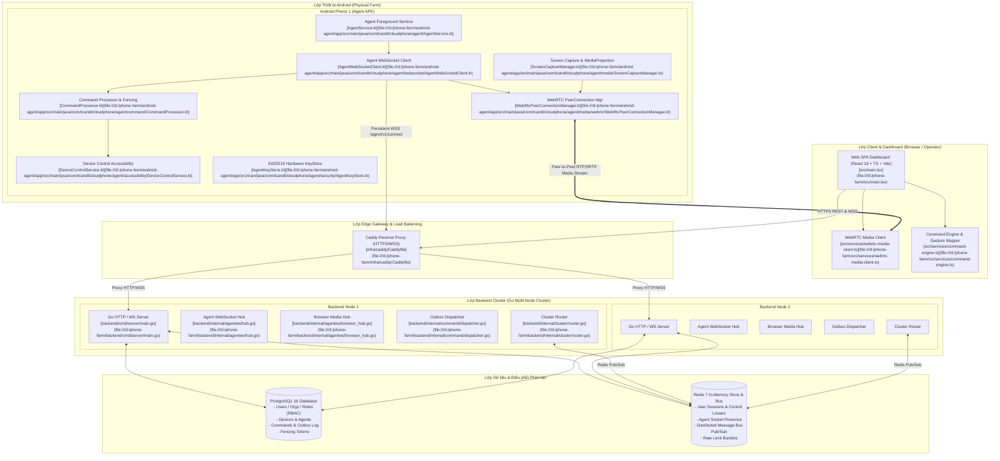
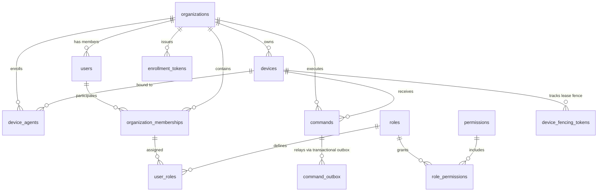
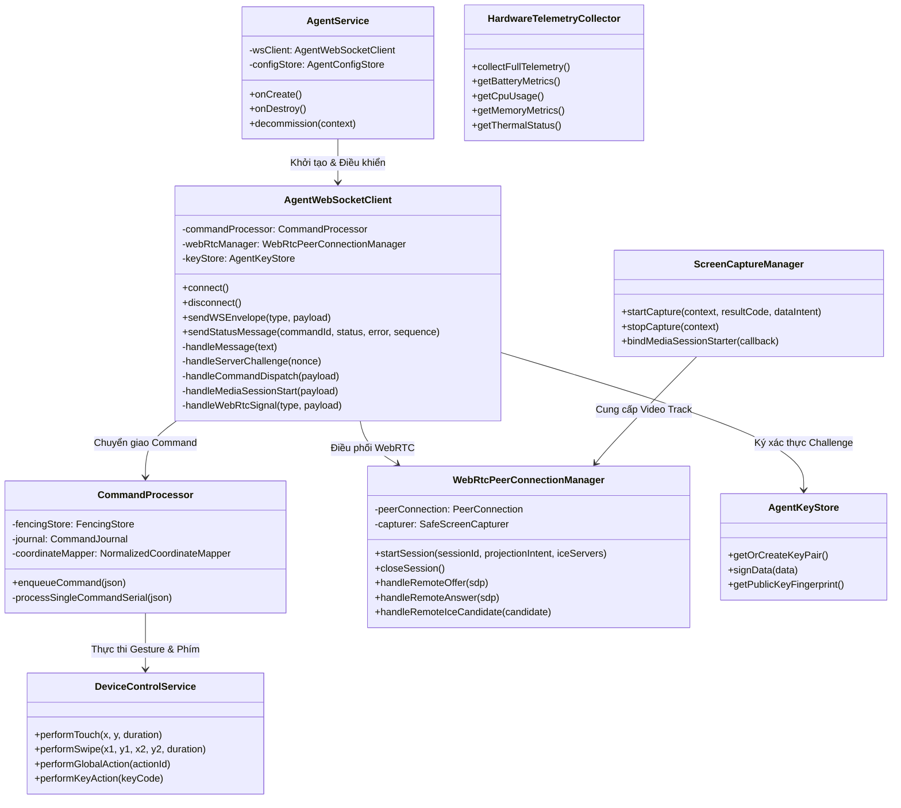
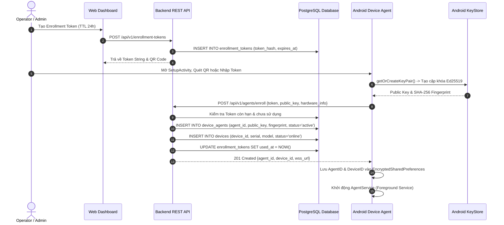
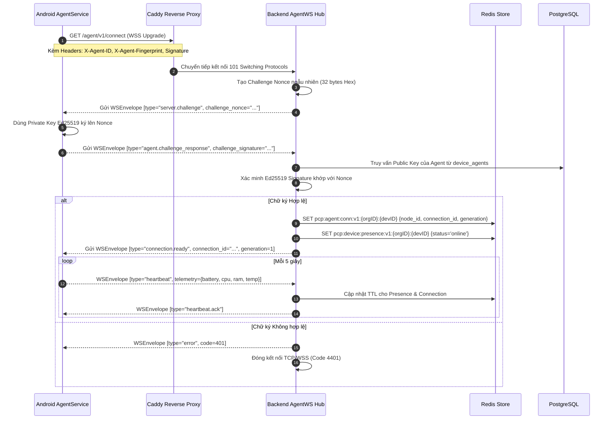
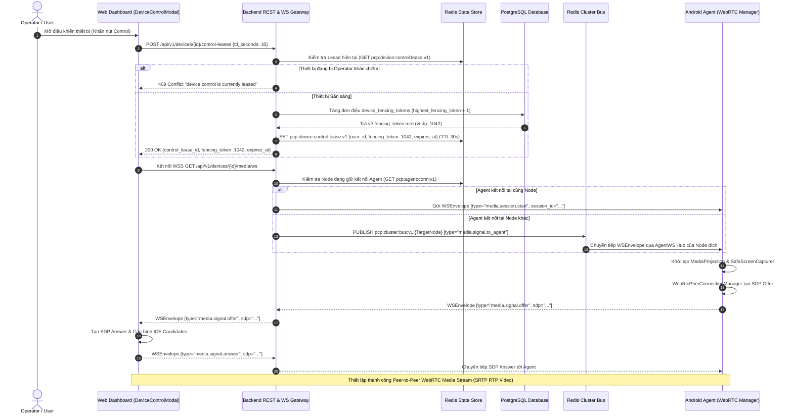
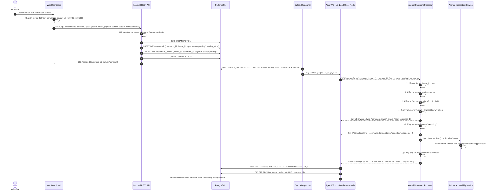
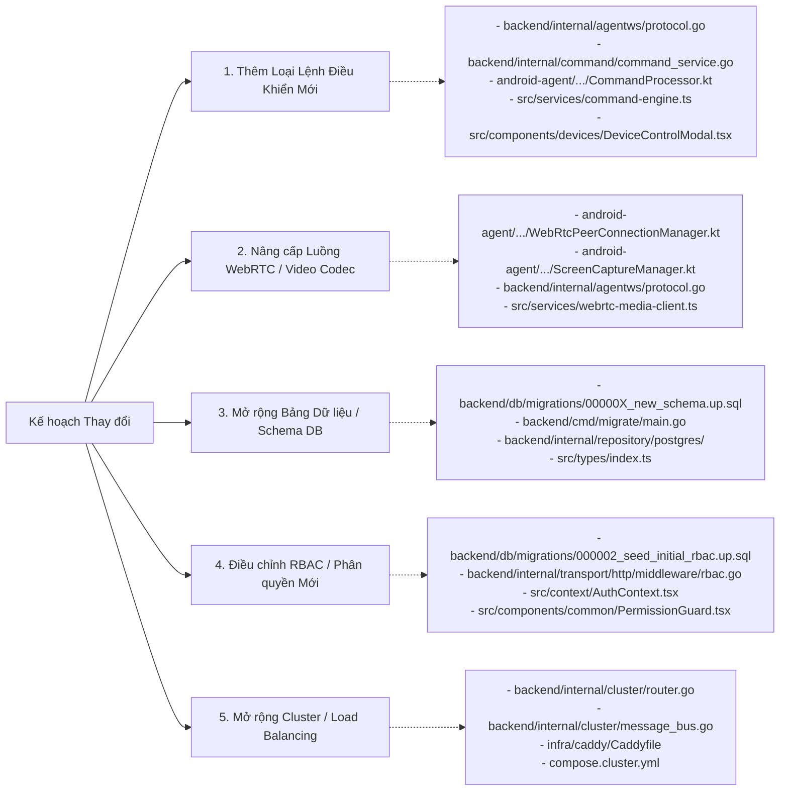

# BẢN ĐỒ KIẾN TRÚC & CODEGRAPH TOÀN DIỆN HỆ THỐNG CLOUD PHONE CONTROL PLATFORM (PCP)

> **Tài liệu chuẩn hóa cấu trúc CodeGraph, Data Flow, Sequence Diagrams, Call Graphs & System Blueprint**  
> *Được biên soạn để phục vụ việc nắm bắt toàn diện dự án, phân tích tác động và điều chỉnh kế hoạch kiến trúc / tính năng.*

---

## MỤC LỤC

1. [Tổng quan Hệ thống & Topology Kiến trúc](#1-tổng-quan-hệ-thống--topology-kiến-trúc)
2. [Cây Thư mục & Bản đồ Thành phần Chi tiết](#2-cây-thư-mục--bản-đồ-thành-phần-chi-tiết)
3. [Mô hình Dữ liệu, Cơ sở Dữ liệu & State Store](#3-mô-hình-dữ-liệu-cơ-sở-dữ-liệu--state-store)
4. [CodeGraph Chi tiết Theo Từng Tầng (Layer-by-Layer)](#4-codegraph-chi-tiết-theo-từng-tầng-layer-by-layer)
   - [4.1. Android Device Agent (`android-agent/`)](#41-android-device-agent-android-agent)
   - [4.2. Backend Core & Multi-Node Cluster (`backend/`)](#42-backend-core--multi-node-cluster-backend)
   - [4.3. Web Dashboard & Remote Control Client (`src/`)](#43-web-dashboard--remote-control-client-src)
   - [4.4. Hạ tầng Mạng, Reverse Proxy & Cluster Ingress (`infra/`)](#44-hạ-tầng-mạng-reverse-proxy--cluster-ingress-infra)
5. [Sơ đồ Luồng Tuần tự End-to-End (Sequence Diagrams)](#5-sơ-đồ-luồng-tuần-tự-end-to-end-sequence-diagrams)
6. [Đặc tả Giao thức, Message Envelopes & REST APIs](#6-đặc-tả-giao-thức-message-envelopes--rest-apis)
7. [Playbook Hướng dẫn Thay đổi & Phân tích Tác động (Impact Analysis)](#7-playbook-hướng-dẫn-thay-đổi--phân-tích-tác-động-impact-analysis)

---

## 1. TỔNG QUAN HỆ THỐNG & TOPOLOGY KIẾN TRÚC

Hệ thống **Phone Control Platform (PCP) / CloudPhone Farm** là nền tảng quản lý, giám sát và điều khiển thiết bị Android vật lý từ xa với độ trễ siêu thấp (< 100ms), hỗ trợ streaming WebRTC thời gian thực, truyền lệnh điều khiển cảm ứng/phím/hệ thống có cơ chế bảo vệ Fencing Token đơn điệu, hỗ trợ mở rộng Cluster đa node (Distributed Multi-node Go Backend) thông qua Redis Pub/Sub và lưu trữ trạng thái bền vững trên PostgreSQL.



---

## 2. CÂY THƯ MỤC & BẢN ĐỒ THÀNH PHẦN CHI TIẾT

```
d:\phone-farm\
├── api/                                        # Định nghĩa API specs
│   └── openapi.yaml                            # Authoritative OpenAPI 3.0.3 specification
├── backend/                                    # Go Backend Engine (Go 1.22+)
│   ├── cmd/                                    # Các điểm vào thực thi (Binaries / CLI tools)
│   │   ├── devseed/main.go                     # Database seeder cho môi trường phát triển
│   │   ├── migrate/main.go                     # Atomic migration runner với SHA-256 checksum audit
│   │   ├── phase16_release_gate/main.go        # Production release gate automated test suite
│   │   ├── server/main.go                      # Server HTTP Gateway, WebSocket Gateways & Cluster Core
│   │   ├── e2esmoke/                           # End-to-end smoke tester CLI
│   │   ├── loadharness/                        # Command throughput & load testing harness
│   │   └── serviceharness/                     # Cluster mock service harness
│   ├── db/migrations/                          # 000001 -> 000009 Up/Down SQL Schemas
│   ├── internal/
│   │   ├── agent/                              # Agent lifecycle, verification, journal, fencing
│   │   ├── agentws/                            # Agent WebSocket Hub, Protocol parser, Connection tracker
│   │   ├── auth/                               # Principal, Argon2id & Session Authentication Service
│   │   ├── cluster/                            # Multi-node Router, Redis Message Bus, Node Registry
│   │   ├── command/                            # Command Service, Transactional Outbox & Dispatcher
│   │   ├── config/                             # Cấu hình hệ thống & Fail-fast security validation
│   │   ├── device/                             # Device Registry Service & Control Lease Service
│   │   ├── domain/                             # Core Domain Models (Device, Command, Lease, Agent)
│   │   ├── repository/
│   │   │   ├── postgres/                       # pgx/v5 Repositories (Device, Command, Outbox, User, Fence)
│   │   │   └── redis/                          # go-redis/v9 Repositories (Session, Presence, Lease, Connection)
│   │   ├── telemetry/                          # Prometheus metrics & runtime telemetry collectors
│   │   └── transport/
│   │       ├── http/                           # Chi HTTP Handlers (Auth, Device, Command, Lease, Health, Agent)
│   │       │   └── middleware/                 # RBAC, Tenant, CSRF, RateLimit, Security Headers, AgentAuth
│   │       └── ws/                             # WebSocket Handlers (Agent WSS, Browser Media & Event WSS)
│   └── pkg/crypto/                             # Ed25519 signature validation & Argon2id hashing
├── android-agent/                              # Native Android Application (Kotlin, MinSDK 26, TargetSDK 35)
│   └── app/src/main/java/com/tcandt/cloudphone/agent/
│       ├── AgentService.kt                     # Foreground Service duy trì kết nối WSS liên tục
│       ├── SetupActivity.kt                    # UI Cài đặt, QR Code Scan, Enrollment, Permissions Check
│       ├── LogsActivity.kt                     # UI xem trực tiếp logs của Agent
│       ├── BootReceiver.kt                     # Tự động khởi động AgentService khi điện thoại reboot
│       ├── accessibility/                      # Android AccessibilityService cho thao tác cảm ứng & phím
│       ├── command/                            # Command Processor, SQLite Idempotency Journal, Fencing Store
│       ├── config/                             # EncryptedSharedPreferences cho AgentConfig & Tokens
│       ├── control/                            # Normalized coordinate mapper & Display geometry calculations
│       ├── ime/                                # Custom InputMethodService (IME) cho gõ text tiếng Việt/Unicode
│       ├── logging/                            # SQLite local log storage
│       ├── media/                              # ScreenCaptureManager, MediaProjection & Video Encoder
│       │   └── webrtc/                         # WebRtcPeerConnectionManager & SafeScreenCapturer
│       ├── provisioning/                       # ADB / Manual permission provisioning & Readiness coordinator
│       ├── security/                           # Android KeyStore Ed25519 KeyPair generator & Signer
│       ├── telemetry/                          # HardwareTelemetryCollector (CPU, RAM, Battery, Thermal)
│       └── websocket/                          # AgentWebSocketClient (Mutual Auth Handshake, Ping/Pong, Router)
├── src/                                        # Frontend SPA (React 18, TypeScript, TailwindCSS, Vite)
│   ├── components/                             # UI Components tái sử dụng
│   │   ├── auth/                               # Login, Register, Auth Layouts
│   │   ├── common/                             # ErrorBoundary, RouteGuard, PermissionGuard, Badges
│   │   ├── devices/                            # DeviceControlModal (Interactive Streaming & Remote Controls)
│   │   ├── layout/                             # AppShell, Header, Sidebar, NavConfigs
│   │   ├── support/                            # SupportAccessModal
│   │   └── ui/                                 # Button, Card, StatusBadge, States
│   ├── context/AuthContext.tsx                 # Authentication Context & Permissions Provider
│   ├── lib/                                    # Gesture calculation & Video geometry transformers
│   ├── pages/                                  # Toàn bộ màn hình chức năng của Dashboard
│   ├── router.tsx                              # React Router v6 Configuration & Lazy Loading
│   ├── services/                               # Client API Services, WebRTC Media Client & Command Engine
│   ├── stores/useUiStore.ts                    # Zustand UI State Store
│   └── types/index.ts                          # TypeScript Definitions & Enums
├── infra/                                      # Cấu hình Triển khai & Container
│   ├── caddy/                                  # Caddyfile (Reverse Proxy, SSL, WSS Upgrades)
│   ├── docker/                                 # Dockerfiles cho Backend & Agent Build
│   └── postgres/                               # Postgres initialization scripts
├── compose.yaml / compose.production.yaml      # Multi-container Compose Orchestration
└── tests/                                      # E2E & Soak Tests (Playwright, Node Cluster tests)
```

---

## 3. MÔ HÌNH DỮ LIỆU, CƠ SỞ DỮ LIỆU & STATE STORE

### 3.1. Sơ đồ Thực thể Quan hệ (PostgreSQL ERD)



### 3.2. Bảng Cơ sở Dữ liệu PostgreSQL Authoritative

| Bảng | File Migration | Mô tả chức năng |
| :--- | :--- | :--- |
| [`organizations`](file:///d:/phone-farm/backend/db/migrations/000001_create_core_tables.up.sql#L5) | `000001` | Tenant cấp cao nhất, cách ly hoàn toàn dữ liệu giữa các tổ chức |
| [`users`](file:///d:/phone-farm/backend/db/migrations/000001_create_core_tables.up.sql#L13) | `000001` | Người dùng hệ thống, lưu mật khẩu băm Argon2id |
| [`roles`](file:///d:/phone-farm/backend/db/migrations/000001_create_core_tables.up.sql#L25) | `000001` | Vai trò hệ thống: `role_sys_owner`, `admin`, `operator`, `viewer` |
| [`permissions`](file:///d:/phone-farm/backend/db/migrations/000001_create_core_tables.up.sql#L33) | `000001` | Quyền hạn chi tiết (`device.read`, `device.control.acquire`, `device.control.input`, `agent.enroll`, ...) |
| [`role_permissions`](file:///d:/phone-farm/backend/db/migrations/000001_create_core_tables.up.sql#L41) | `000001` | Bảng liên kết Role - Permission |
| [`organization_memberships`](file:///d:/phone-farm/backend/db/migrations/000001_create_core_tables.up.sql#L50) | `000001` | Liên kết User vào Organization kèm trạng thái `active`, `suspended` |
| [`user_roles`](file:///d:/phone-farm/backend/db/migrations/000001_create_core_tables.up.sql#L61) | `000001` | Gán Role cho từng Membership |
| [`devices`](file:///d:/phone-farm/backend/db/migrations/000001_create_core_tables.up.sql#L70) | `000001`, `000008` | Hồ sơ thiết bị: `serial_number`, `model`, `platform_version`, `status`, `capabilities_json`, `telemetry_json` |
| [`enrollment_tokens`](file:///d:/phone-farm/backend/db/migrations/000001_create_core_tables.up.sql#L87) | `000001`, `000003`, `000009` | Token đăng ký thiết bị 1 lần (TTL 24h), hash SHA-256 |
| [`device_agents`](file:///d:/phone-farm/backend/db/migrations/000001_create_core_tables.up.sql#L100) | `000001`, `000003` | Định danh Agent vật lý, lưu Ed25519 Public Key & SHA-256 Key Fingerprint |
| [`commands`](file:///d:/phone-farm/backend/db/migrations/000001_create_core_tables.up.sql#L116) | `000001`, `000006`, `000007` | Lịch sử lệnh điều khiển: `command_type`, `payload_json`, `status`, `fencing_token`, `expires_at` |
| [`command_outbox`](file:///d:/phone-farm/backend/db/migrations/000004_harden_command_outbox.up.sql) | `000004`, `000007` | Hàng đợi Outbox nguyên tử (Transactional Outbox Pattern) đảm bảo giao lệnh `At-Least-Once` |
| [`device_fencing_tokens`](file:///d:/phone-farm/backend/db/migrations/000006_control_lease_and_command_contract.up.sql) | `000006` | Bộ đếm Fencing Token tăng đơn điệu (`highest_fencing_token`) chống Split-brain và Stale Operator |
| [`pcp_schema_migrations`](file:///d:/phone-farm/backend/cmd/migrate/main.go#L73) | `migrate` | Quản lý phiên bản migration và mã băm Checksum chống trôi cấu trúc DB |

### 3.3. Cấu trúc Trạng thái Nhanh trên Redis 7

| Redis Key Pattern | Kiểu Dữ liệu | TTL | Mục đích & Mô tả |
| :--- | :--- | :--- | :--- |
| `pcp:session:v1:{sha256(token)}` | JSON String | 24 Hours | Lưu phiên đăng nhập người dùng (UserID, OrgID, Roles, Permissions) |
| `pcp:device:presence:v1:{orgID}:{devID}` | Hash / JSON | 30-45 Sec | Heartbeat tức thời từ Agent (Health, MediaState, ControlState, ImeState) |
| `pcp:device:control:lease:v1:{orgID}:{devID}` | JSON String | 30 Sec (Renewable) | Độc quyền quyền điều khiển (Exclusive Lease) của Operator trên thiết bị |
| `pcp:agent:conn:v1:{orgID}:{devID}` | JSON String | 45 Sec | Định tuyến Socket Agent: NodeID kết nối, ConnectionID, Generation |
| `pcp:media:session:v1:{sessionID}` | JSON String | 15 Mins | Thông tin WebRTC Session: DeviceID, OrgID, OperatorUserID, TargetNodeID |
| `pcp:viewer:count:v1:{orgID}:{devID}` | Integer / Set | 10 Mins | Đếm số lượng Viewer đang xem màn hình trực tiếp (Enforce Quota Max 1) |
| `pcp:ratelimit:v1:{scope}:{identifier}` | Sliding Int | 1 Min | Rate limiting theo từng phạm vi (Login, REST API, WebSocket Upgrade, Enrollment) |
| `pcp:cluster:nodes:v1` | Hash | 20 Sec Heartbeat | Danh sách các Backend Node đang hoạt động trong cụm Cluster |
| `pcp:cluster:bus:v1:{nodeID}` | Pub/Sub Channel | N/A | Kênh nhận tin nhắn điều phối liên node (Cross-node commands, WebRTC signaling) |

---

## 4. CODEGRAPH CHI TIẾT THEO TỪNG TẦNG (LAYER-BY-LAYER)

### 4.1. Android Device Agent (`android-agent/`)



#### Chi tiết các File nòng cốt của Android Agent:
- [`AgentService.kt`](file:///d:/phone-farm/android-agent/app/src/main/java/com/tcandt/cloudphone/agent/AgentService.kt): Chạy dưới dạng Foreground Service với Notification ưu tiên thấp, duy trì vòng đời Agent không bị Android OS dọn dẹp bộ nhớ (OOM Killer).
- [`AgentWebSocketClient.kt`](file:///d:/phone-farm/android-agent/app/src/main/java/com/tcandt/cloudphone/agent/websocket/AgentWebSocketClient.kt): Triển khai giao thức WebSocket Client (OkHttp). Tự động thực hiện Handshake Challenge-Response sử dụng chữ ký Ed25519, duy trì Ping/Pong và Heartbeat chu kỳ 5 giây, điều hướng các loại tin nhắn đến `CommandProcessor` và `WebRtcPeerConnectionManager`.
- [`CommandProcessor.kt`](file:///d:/phone-farm/android-agent/app/src/main/java/com/tcandt/cloudphone/agent/command/CommandProcessor.kt): Bộ xử lý lệnh tuần tự (Serial Coroutine Channel) với 8 bước kiểm duyệt nghiêm ngặt:
  1. Kiểm tra Target `device_id` khớp với thiết bị.
  2. Kiểm tra `expires_at` (Fail-closed TTL).
  3. Kiểm tra trùng lặp qua SQLite [`CommandJournal.kt`](file:///d:/phone-farm/android-agent/app/src/main/java/com/tcandt/cloudphone/agent/command/CommandJournal.kt) để tránh lặp lại lệnh khi reconnect.
  4. Xác thực số thứ tự Fencing Token tăng đơn điệu qua [`FencingStore.kt`](file:///d:/phone-farm/android-agent/app/src/main/java/com/tcandt/cloudphone/agent/command/FencingStore.kt).
  5. Chuyển đổi tọa độ chuẩn hóa `normalized_display_v1` (0.0 -> 1.0) sang Pixel vật lý qua [`NormalizedCoordinateMapper.kt`](file:///d:/phone-farm/android-agent/app/src/main/java/com/tcandt/cloudphone/agent/control/NormalizedCoordinateMapper.kt) dựa trên góc xoay màn hình thực tế [`DisplayGeometryProvider.kt`](file:///d:/phone-farm/android-agent/app/src/main/java/com/tcandt/cloudphone/agent/control/DisplayGeometryProvider.kt).
  6. Báo cáo trạng thái `ack` (Sequence 1).
  7. Lưu trạng thái `executing` trước khi chạm màn hình để bảo vệ vùng crash.
  8. Gọi [`DeviceControlService.kt`](file:///d:/phone-farm/android-agent/app/src/main/java/com/tcandt/cloudphone/agent/accessibility/DeviceControlService.kt) để inject cử chỉ vào hệ điều hành Android.
- [`WebRtcPeerConnectionManager.kt`](file:///d:/phone-farm/android-agent/app/src/main/java/com/tcandt/cloudphone/agent/media/webrtc/WebRtcPeerConnectionManager.kt): Quản lý vòng đời WebRTC PeerConnection gốc, cấu hình H.264 Hardware Codec / VP8 Software fallback, quản lý ICE candidate và đính kèm Video Stream từ [`SafeScreenCapturer.kt`](file:///d:/phone-farm/android-agent/app/src/main/java/com/tcandt/cloudphone/agent/media/webrtc/SafeScreenCapturer.kt).
- [`PcpRemoteInputMethodService.kt`](file:///d:/phone-farm/android-agent/app/src/main/java/com/tcandt/cloudphone/agent/ime/PcpRemoteInputMethodService.kt): Bàn phím ảo đặc chế cho phép nhập trực tiếp văn bản UTF-8 tiếng Việt, ký tự đặc biệt mà không cần bật bàn phím ảo hiển thị trên màn hình.
- [`AgentKeyStore.kt`](file:///d:/phone-farm/android-agent/app/src/main/java/com/tcandt/cloudphone/agent/security/AgentKeyStore.kt): Tạo và lưu trữ cặp khóa Ed25519 trong phần cứng bảo mật Android KeyStore / BouncyCastle.
- [`HardwareTelemetryCollector.kt`](file:///d:/phone-farm/android-agent/app/src/main/java/com/tcandt/cloudphone/agent/telemetry/HardwareTelemetryCollector.kt): Đo đạc phần cứng: Mức pin, trạng thái sạc, nhiệt độ pin, RAM sử dụng, % CPU thực tế, loại kết nối mạng (WiFi/4G).

---

### 4.2. Backend Core & Multi-Node Cluster (`backend/`)

```mermaid
flowchart TD
    subgraph HTTP_Gateway ["HTTP REST & WS Ingress Gateway"]
        Main["Server Entry Point<br/>[cmd/server/main.go](file:///d:/phone-farm/backend/cmd/server/main.go)"]
        Router["Chi Mux Router & Global Middlewares"]
        MW_Auth["Auth Middleware<br/>[middleware/auth.go](file:///d:/phone-farm/backend/internal/transport/http/middleware/auth.go)"]
        MW_Tenant["Tenant Isolation<br/>[middleware/tenant.go](file:///d:/phone-farm/backend/internal/transport/http/middleware/tenant.go)"]
        MW_RBAC["RBAC Permission Guard<br/>[middleware/rbac.go](file:///d:/phone-farm/backend/internal/transport/http/middleware/rbac.go)"]
        MW_RateLimit["Distributed Rate Limiter<br/>[middleware/ratelimit.go](file:///d:/phone-farm/backend/internal/transport/http/middleware/ratelimit.go)"]
        MW_AgentAuth["Agent Mutual Auth<br/>[middleware/agent_auth.go](file:///d:/phone-farm/backend/internal/transport/http/middleware/agent_auth.go)"]
    end

    subgraph Handlers ["Transport Handlers"]
        H_Auth["Auth Handler<br/>[transport/http/auth_handler.go](file:///d:/phone-farm/backend/internal/transport/http/auth_handler.go)"]
        H_Device["Device Handler<br/>[transport/http/device_handler.go](file:///d:/phone-farm/backend/internal/transport/http/device_handler.go)"]
        H_Lease["Lease Handler<br/>[transport/http/lease_handler.go](file:///d:/phone-farm/backend/internal/transport/http/lease_handler.go)"]
        H_Command["Command Handler<br/>[transport/http/command_handler.go](file:///d:/phone-farm/backend/internal/transport/http/command_handler.go)"]
        H_Agent["Agent Handler<br/>[transport/http/agent_handler.go](file:///d:/phone-farm/backend/internal/transport/http/agent_handler.go)"]
        H_AgentWS["Agent WS Gateway<br/>[transport/ws/agent_handler.go](file:///d:/phone-farm/backend/internal/transport/ws/agent_handler.go)"]
        H_BrowserWS["Browser Media WS Gateway<br/>[transport/ws/browser_media_handler.go](file:///d:/phone-farm/backend/internal/transport/ws/browser_media_handler.go)"]
    end

    subgraph Services ["Application Domain Services"]
        S_Auth["Auth Service<br/>[internal/auth/service.go](file:///d:/phone-farm/backend/internal/auth/service.go)"]
        S_Device["Device Service<br/>[internal/device/service.go](file:///d:/phone-farm/backend/internal/device/service.go)"]
        S_Lease["Control Lease Service<br/>[internal/device/lease_service.go](file:///d:/phone-farm/backend/internal/device/lease_service.go)"]
        S_Command["Command Service<br/>[internal/command/command_service.go](file:///d:/phone-farm/backend/internal/command/command_service.go)"]
        S_Agent["Agent Service<br/>[internal/agent/service.go](file:///d:/phone-farm/backend/internal/agent/service.go)"]
        OutboxWorker["Outbox Dispatcher<br/>[internal/command/dispatcher.go](file:///d:/phone-farm/backend/internal/command/dispatcher.go)"]
    end

    subgraph Hubs ["In-Memory WebSocket Hubs"]
        WSHub["Agent WS Hub<br/>[internal/agentws/hub.go](file:///d:/phone-farm/backend/internal/agentws/hub.go)"]
        BrowserHub["Browser Media Hub<br/>[internal/agentws/browser_hub.go](file:///d:/phone-farm/backend/internal/agentws/browser_hub.go)"]
    end

    subgraph Cluster ["Cluster Layer (Cross-Node Routing)"]
        ClusterRouter["Cluster Router<br/>[internal/cluster/router.go](file:///d:/phone-farm/backend/internal/cluster/router.go)"]
        MsgBus["Message Bus (Redis Pub/Sub)<br/>[internal/cluster/message_bus.go](file:///d:/phone-farm/backend/internal/cluster/message_bus.go)"]
        NodeReg["Node Registry<br/>[internal/cluster/node_registry.go](file:///d:/phone-farm/backend/internal/cluster/node_registry.go)"]
    end

    subgraph Repositories ["Persistence Repositories"]
        R_PG_Dev["PG Device Repo"]
        R_PG_Cmd["PG Command Repo"]
        R_PG_Outbox["PG Outbox Repo"]
        R_PG_Fence["PG Fence Repo"]
        R_PG_Enroll["PG Enrollment Repo"]
        R_PG_User["PG User Repo"]
        
        R_RD_Sess["Redis Session Repo"]
        R_RD_Pres["Redis Presence Repo"]
        R_RD_Lease["Redis Lease Repo"]
        R_RD_Conn["Redis Agent Conn Repo"]
        R_RD_Media["Redis Media Session Repo"]
        R_RD_Viewer["Redis Viewer Quota Repo"]
    end

    Main --> Router
    Router --> MW_Auth --> MW_Tenant --> MW_RBAC
    Router --> MW_RateLimit
    Router --> MW_AgentAuth

    MW_RBAC --> H_Device & H_Lease & H_Command & H_Agent
    MW_Auth --> H_Auth
    MW_AgentAuth --> H_AgentWS

    H_Auth --> S_Auth
    H_Device --> S_Device
    H_Lease --> S_Lease
    H_Command --> S_Command
    H_Agent --> S_Agent
    H_AgentWS --> WSHub
    H_BrowserWS --> BrowserHub

    S_Command --> R_PG_Cmd & R_PG_Outbox & S_Lease
    S_Lease --> R_PG_Fence & R_RD_Lease
    S_Device --> R_PG_Dev & R_RD_Pres
    S_Agent --> R_PG_Enroll & R_RD_Pres & ClusterRouter
    S_Auth --> R_PG_User & R_RD_Sess

    OutboxWorker --> R_PG_Outbox & WSHub & ClusterRouter
    ClusterRouter <--> MsgBus <--> NodeReg
    ClusterRouter <--> WSHub & BrowserHub
```



#### Chi tiết các Package Backend:
1. **`internal/agentws/`**:
   - [`hub.go`](file:///d:/phone-farm/backend/internal/agentws/hub.go): Quản lý các Active Connection `agentws.Connection` theo `OrganizationID` -> `DeviceID`. Cung cấp phương thức Dispatch tin nhắn, kiểm tra thế hệ kết nối (`Generation`), xử lý Heartbeat và dọn dẹp socket rác.
   - [`connection.go`](file:///d:/phone-farm/backend/internal/agentws/connection.go): Đại diện cho 1 socket kết nối với Agent vật lý. Chạy 2 goroutine riêng biệt `readPump` và `writePump` với buffer kênh an toàn.
   - [`protocol.go`](file:///d:/phone-farm/backend/internal/agentws/protocol.go): Định nghĩa cấu trúc `WSEnvelope`, tất cả hằng số `WSMessageType`, hàm kiểm tra máy trạng thái lệnh `ValidateStateTransition(current, new)`.
   - [`browser_hub.go`](file:///d:/phone-farm/backend/internal/agentws/browser_hub.go): Quản lý các kết nối WebSocket từ trình duyệt người dùng để nhận sự kiện thiết bị hoặc WebRTC SDP Signaling.
2. **`internal/cluster/`**:
   - [`router.go`](file:///d:/phone-farm/backend/internal/cluster/router.go): Định tuyến tin nhắn liên node. Khi lệnh được phát từ Node A nhưng Agent kết nối ở Node B, `ClusterRouter` sẽ bọc envelope thành `command.route.request`, đẩy qua Redis channel của Node B, và chờ đợi `command.route.receipt` phản hồi đồng bộ trong 5 giây.
   - [`message_bus.go`](file:///d:/phone-farm/backend/internal/cluster/message_bus.go): Đóng gói Redis Pub/Sub đa kênh (`pcp:cluster:bus:v1:{nodeID}`).
   - [`node_registry.go`](file:///d:/phone-farm/backend/internal/cluster/node_registry.go): Tự động phát hiện các Backend Node khác trong cluster thông qua cơ chế Keep-alive Heartbeat trên Redis.
3. **`internal/command/`**:
   - [`command_service.go`](file:///d:/phone-farm/backend/internal/command/command_service.go): Thực hiện kiểm tra Idempotency Key, thẩm định Control Lease hợp lệ, lấy Fencing Token hiện hành và ghi nguyên tử vào `commands` + `command_outbox` bên trong 1 Transaction SQL duy nhất.
   - [`dispatcher.go`](file:///d:/phone-farm/backend/internal/command/dispatcher.go): Worker nền quét bảng `command_outbox` mỗi 50ms, giao lệnh tức thì cho Agent nếu socket nằm cùng Node hoặc ủy thác qua `ClusterRouter`. Hỗ trợ Exponential Backoff retry tối đa 5 lần.
4. **`internal/transport/http/middleware/`**:
   - [`agent_auth.go`](file:///d:/phone-farm/backend/internal/transport/http/middleware/agent_auth.go): Kiểm tra tính hợp lệ của Header `X-Agent-Fingerprint`, `X-Agent-ID`, `X-Agent-Timestamp`, `X-Agent-Nonce`, `X-Agent-Signature` với thời gian trôi tối đa 60 giây và chống tấn công Replay Attack bằng Redis Nonce Set.
   - [`rbac.go`](file:///d:/phone-farm/backend/internal/transport/http/middleware/rbac.go): Kiểm tra quyền hạn theo từng Endpoint API dựa trên Session Claims (`RequirePermission`, `RequireAnyPermission`).

---

### 4.3. Web Dashboard & Remote Control Client (`src/`)

```mermaid
graph TD
    subgraph Router_Structure ["Cấu trúc Điều hướng (React Router v6)"]
        RouterApp["router.tsx<br/>[src/router.tsx](file:///d:/phone-farm/src/router.tsx)"]
        AuthRoutes["Public Auth Routes<br/>/login, /register, /forgot-password"]
        AppRoutes["Protected App Routes (/app)<br/>RouteGuard + PermissionGuard"]
    end

    subgraph Core_Pages ["Các Màn hình Chính"]
        Dashboard["DashboardPage<br/>(Tổng quan fleet & trạng thái)"]
        DeviceList["DeviceListPage & DeviceGridPage<br/>(Danh sách & Lưới thiết bị)"]
        DeviceDetail["DeviceDetailPage<br/>(Chi tiết, Cấu hình & Telemetry)"]
        LiveMonitor["LiveMonitorPage<br/>(Bức tường màn hình trực tiếp)"]
        AgentsPage["AgentsPage<br/>(Quản lý Tokens & Agent Enrollment)"]
        SessionsPage["ActiveSessionsPage<br/>(Quản lý Control Leases)"]
    end

    subgraph Streaming_And_Control ["Engine Điều khiển & Truyền hình ảnh"]
        ControlModal["DeviceControlModal.tsx<br/>[src/components/devices/DeviceControlModal.tsx](file:///d:/phone-farm/src/components/devices/DeviceControlModal.tsx)"]
        WebRTCClient["webrtc-media-client.ts<br/>[src/services/webrtc-media-client.ts](file:///d:/phone-farm/src/services/webrtc-media-client.ts)"]
        CmdEngine["command-engine.ts<br/>[src/services/command-engine.ts](file:///d:/phone-farm/src/services/command-engine.ts)"]
        GestureEngine["pointer-gesture-engine.ts<br/>[src/lib/pointer-gesture-engine.ts](file:///d:/phone-farm/src/lib/pointer-gesture-engine.ts)"]
        Geometry["video-geometry.ts<br/>[src/lib/video-geometry.ts](file:///d:/phone-farm/src/lib/video-geometry.ts)"]
    end

    subgraph State_And_API ["State Management & API Layer"]
        AuthCtx["AuthContext.tsx<br/>[src/context/AuthContext.tsx](file:///d:/phone-farm/src/context/AuthContext.tsx)"]
        UIStore["useUiStore.ts<br/>[src/stores/useUiStore.ts](file:///d:/phone-farm/src/stores/useUiStore.ts)"]
        DevService["device-service.ts"]
        CmdService["command-service.ts"]
        AgentService["agent-service.ts"]
        EventClient["operator-event-client.ts"]
    end

    RouterApp --> AuthRoutes
    RouterApp --> AppRoutes
    AppRoutes --> Dashboard & DeviceList & DeviceDetail & LiveMonitor & AgentsPage & SessionsPage
    
    DeviceList --> ControlModal
    DeviceGrid --> ControlModal
    DeviceDetail --> ControlModal
    
    ControlModal --> WebRTCClient : Khởi tạo & hiển thị Video WebRTC
    ControlModal --> CmdEngine : Gửi lệnh điều khiển & Lease
    ControlModal --> GestureEngine : Bắt sự kiện chuột/cảm ứng
    GestureEngine --> Geometry : Tính toán tọa độ Normalized 0..1
    GestureEngine --> CmdEngine : Tạo Payload gesture.touch / swipe
    
    CmdEngine --> CmdService : Gửi REST POST /api/v1/commands
    WebRTCClient --> DevService : Lấy WebSocket URL & Lease
    ControlModal --> EventClient : Nhận trạng thái Realtime (ack/executing/succeeded)
```

#### Chi tiết các File nòng cốt của Frontend:
- [`DeviceControlModal.tsx`](file:///d:/phone-farm/src/components/devices/DeviceControlModal.tsx): Component điều khiển thiết bị cao cấp, tích hợp:
  - Container Video WebRTC với tỷ lệ khung hình tự thích ứng (Letterbox/Pillarbox).
  - Lớp bắt cử chỉ chuột (Pointer events canvas overlay) dịch chuyển tức thời sự kiện Click, Drag, Swipe sang tọa độ chuẩn hóa.
  - Thanh công cụ điều khiển vật lý: Back, Home, Recents, Power (Screen On/Off), Volume Up/Down, Input text tiếng Việt, Khóa xoay màn hình, Chụp màn hình, Toggle FPS & Bitrate stats.
  - Quản lý vòng đời Control Lease: Tự động gửi Heartbeat Renew Lease mỗi 10 giây và tự hủy khi đóng Modal.
- [`webrtc-media-client.ts`](file:///d:/phone-farm/src/services/webrtc-media-client.ts): Triển khai WebRTC Browser PeerConnection, xử lý trao đổi SDP Offer/Answer và ICE Candidates qua kênh WebSocket `/api/v1/devices/{id}/media/ws`, hỗ trợ tự động kết nối lại khi rớt mạng.
- [`command-engine.ts`](file:///d:/phone-farm/src/services/command-engine.ts): Tối ưu hóa gửi lệnh điều khiển với cơ chế Optimistic UI, tạo UUID Idempotency Key tự động cho mỗi thao tác, kiểm tra Fencing Token của Lease trước khi gọi API.
- [`pointer-gesture-engine.ts`](file:///d:/phone-farm/src/lib/pointer-gesture-engine.ts) & [`video-geometry.ts`](file:///d:/phone-farm/src/lib/video-geometry.ts): Thuật toán chuyển đổi điểm ảnh từ tọa độ chuột trên thẻ `<video>` HTML5 sang hệ tọa độ chuẩn hóa `normalized_display_v1` (x: 0..1, y: 0..1) bất chấp độ phân giải màn hình máy tính của Operator.

---

### 4.4. Hạ tầng Mạng, Reverse Proxy & Cluster Ingress (`infra/`)

Hạ tầng được thiết kế để triển khai dưới dạng Docker Compose hoặc Kubernetes Pods:

```
                  [ Khách hàng / Operator / Trình duyệt ]
                                     │
                                     ▼
                   [ Caddy Ingress (Cổng 80/443) ]
         ┌───────────────────────────┼───────────────────────────┐
         │                           │                           │
  /api/v1/* (REST)           /api/v1/.../media/ws        /agent/v1/connect (WSS)
  Round-Robin Load Balance   Session Affinity by Cookie  Persistent Agent Connection
         │                           │                           │
         ▼                           ▼                           ▼
 ┌───────────────┐           ┌───────────────┐           ┌───────────────┐
 │ Backend Node 1│           │ Backend Node 2│           │ Backend Node 3│
 │  (Port 8081)  │           │  (Port 8082)  │           │  (Port 8083)  │
 └───────┬───────┘           └───────┬───────┘           └───────┬───────┘
         │                           │                           │
         └───────────────┬───────────┴───────────────────────────┘
                         │
                         ▼
             [ Redis 7 Cluster Bus & Pub/Sub ]
                         │
                         ▼
             [ PostgreSQL 16 Primary DB ]
```

- [`infra/caddy/Caddyfile`](file:///d:/phone-farm/infra/caddy/Caddyfile): Tự động cấp phát chứng chỉ SSL/TLS Let's Encrypt, cấu hình buffer proxy WebSocket 101 Upgrade, thiết lập Header an ninh chuẩn OWASP (`X-Content-Type-Options`, `X-Frame-Options`, `Content-Security-Policy`).
- [`compose.cluster.yml`](file:///d:/phone-farm/compose.cluster.yml): Kịch bản chạy Cluster 3 Node Backend phân tán (`node-01`, `node-02`, `node-03`), kết nối chung 1 cụm PostgreSQL và Redis.

---

## 5. SƠ ĐỒ LUỒNG TUẦN TỰ END-TO-END (SEQUENCE DIAGRAMS)

### 5.1. Luồng 1: Đăng ký Thiết bị & Ký khóa Ed25519 (Device Enrollment)



---

### 5.2. Luồng 2: Kết nối WebSocket Agent & Xác thực Cryptographic Challenge-Response



---

### 5.3. Luồng 3: Chiếm quyền Điều khiển (Acquire Control Lease) & Khởi tạo WebRTC Streaming



---

### 5.4. Luồng 4: Gửi Lệnh Cảm ứng / Phím & Xử lý Transactional Outbox Idempotent



---

## 6. ĐẶC TẢ GIAO THỨC, MESSAGE ENVELOPES & REST APIS

### 6.1. Khung Vỏ Tin nhắn WebSocket Chuẩn (`WSEnvelope`)

Tất cả các gói tin trao đổi qua WebSocket giữa Backend, Agent và Trình duyệt đều tuân thủ định dạng JSONEnvelope phiên bản 1:

```json
{
  "version": 1,
  "type": "command.dispatch",
  "message_id": "msg_01J8A4B8C1D2E3F4G5H6J7K8M9",
  "timestamp": "2026-08-19T07:30:00.000Z",
  "payload": {}
}
```

#### Bảng Tổng hợp Toàn bộ Các Loại `WSMessageType`:

| `type` | Nguồn $\rightarrow$ Đích | Mô tả & Cấu trúc Payload |
| :--- | :--- | :--- |
| `server.challenge` | Backend $\rightarrow$ Agent | Gửi chuỗi ngẫu nhiên để Agent ký số: `{ "challenge_nonce": "hex_string", "expires_at": "RFC3339" }` |
| `agent.challenge_response` | Agent $\rightarrow$ Backend | Phản hồi chữ ký Ed25519: `{ "challenge_signature": "base64_or_hex_sig" }` |
| `connection.ready` | Backend $\rightarrow$ Agent | Báo phiên xác thực hoàn tất: `{ "connection_id": "...", "generation": 1, "agent_id": "...", "device_id": "..." }` |
| `heartbeat` | Agent $\rightarrow$ Backend | Định kỳ 5s gửi sức khỏe & telemetry: `{ "battery": 95, "cpu_usage": 12.5, "ram_usage": 45.0, "temperature_c": 36.2 }` |
| `heartbeat.ack` | Backend $\rightarrow$ Agent | Phản hồi xác nhận heartbeat từ máy chủ |
| `command.dispatch` | Backend $\rightarrow$ Agent | Giao việc thực thi lệnh: `{ "command_id": "...", "command_type": "...", "payload": {}, "fencing_token": 1042, "expires_at": "..." }` |
| `command.status` | Agent $\rightarrow$ Backend | Báo tiến trình lệnh tuần tự: `{ "command_id": "...", "status": "ack|executing|succeeded|failed|expired", "sequence": 1..3, "error_message": "" }` |
| `media.session.start` | Backend $\rightarrow$ Agent | Yêu cầu mở luồng stream: `{ "session_id": "...", "ice_servers": [...] }` |
| `media.session.started` | Agent $\rightarrow$ Backend | Xác nhận luồng stream đã khởi chạy thành công |
| `media.session.stop` | Backend $\rightarrow$ Agent | Yêu cầu giải phóng luồng MediaProjection |
| `media.session.stopped` | Agent $\rightarrow$ Backend | Báo luồng stream đã giải phóng hoàn toàn |
| `media.signal.offer` | Agent $\rightarrow$ Browser | Gói tin SDP Offer từ WebRTC Native Agent |
| `media.signal.answer` | Browser $\rightarrow$ Agent | Gói tin SDP Answer từ trình duyệt |
| `media.signal.candidate` | Cả 2 chiều | Trao đổi ứng viên kết nối mạng ICE Candidate |
| `error` | Backend $\leftrightarrow$ Agent | Thông báo lỗi giao thức hoặc từ chối phiên |

---

### 6.2. Danh mục Lệnh Điều khiển Thiết bị (`Command Types`)

| `command_type` | Payload bắt buộc | Mô tả hành vi |
| :--- | :--- | :--- |
| `gesture.touch` | `coordinateSpace: "normalized_display_v1"`, `x: float (0..1)`, `y: float (0..1)`, `durationMs: int` | Chạm tại điểm (Click/Tap) |
| `gesture.swipe` | `coordinateSpace: "normalized_display_v1"`, `x1`, `y1`, `x2`, `y2`, `durationMs` | Vuốt màn hình từ điểm 1 đến điểm 2 |
| `key.global_action` | `action: "back" \| "home" \| "recents" \| "notifications" \| "quick_settings"` | Thực hiện phím điều hướng hệ thống qua Accessibility |
| `key.press` | `keyCode: int` (Ví dụ: 26=Power, 24=Vol+, 25=Vol-) | Nhấn phím cứng vật lý |
| `ime.text_input` | `text: string`, `clearBeforeInput: bool` | Nhập chuỗi ký tự UTF-8 trực tiếp qua `PcpRemoteInputMethodService` |
| `volume.set` | `level: int (0..100)`, `stream: "music" \| "ring"` | Điều chỉnh âm lượng qua Android `AudioManager` |
| `device.screen_wake` | Rỗng | Đánh thức màn hình khi máy đang tắt màn hình |

---

### 6.3. Bảng Tổng hợp REST API Endpoints

```
[PUBLIC / AUTH]
POST   /api/v1/auth/login                       # Đăng nhập lấy Session Cookie & Claims
POST   /api/v1/auth/logout                      # Đăng xuất & Thu hồi phiên trên Redis
POST   /api/v1/agents/enroll                    # Agent đăng ký định danh lần đầu bằng Token

[AGENT MACHINE-TO-MACHINE (MUTUAL AUTH)]
POST   /api/v1/agents/heartbeat                 # Fallback REST Heartbeat
POST   /api/v1/agents/{agentId}/decommission    # Agent tự hủy ủy quyền khi Factory Reset

[PROTECTED OPERATOR & ADMIN APIS]
GET    /api/v1/auth/session                     # Lấy thông tin phiên, tổ chức & danh sách quyền
GET    /api/v1/devices                          # Lấy danh sách thiết bị có phân trang & bộ lọc
GET    /api/v1/devices/{id}                     # Xem chi tiết hồ sơ & telemetry của 1 thiết bị
POST   /api/v1/devices/{id}/control-leases      # Chiếm quyền điều khiển độc quyền (Acquire Lease)
POST   /api/v1/devices/{id}/control-leases/{leaseId}/renew # Gia hạn Control Lease (Heartbeat 10s)
DELETE /api/v1/devices/{id}/control-leases/{leaseId}       # Giải phóng Control Lease
POST   /api/v1/commands                         # Dispatch lệnh điều khiển (Idempotent Outbox)
GET    /api/v1/agents                           # Xem danh sách các Agent đã đăng ký trong Org
POST   /api/v1/enrollment-tokens                # Tạo Token đăng ký thiết bị mới (Admin)
GET    /api/v1/enrollment-tokens                # Xem danh sách Token còn hiệu lực
GET    /api/v1/enrollment-tokens/{id}/readiness # Kiểm tra tiến độ cấp phát quyền của Token
DELETE /api/v1/enrollment-tokens/{id}           # Hủy hiệu lực Token đăng ký
DELETE /api/v1/agents/{agentId}                 # Thu hồi chứng chỉ Ed25519 & Trục xuất Agent ngay lập tức
POST   /api/v1/admin/agents/{agentId}/decommission # Admin ra lệnh từ xa bắt Agent tự xóa dữ liệu

[WEBSOCKET GATEWAYS]
GET    /agent/v1/connect                        # Persistent Agent WebSocket Connection
GET    /api/v1/devices/{id}/media/ws            # Browser WebRTC SDP Signaling & Stream Control
GET    /api/v1/devices/{id}/events/ws           # Browser Realtime Device Status & Events Stream
```

---

## 7. PLAYBOOK HƯỚNG DẪN THAY ĐỔI & PHÂN TÍCH TÁC ĐỘNG (IMPACT ANALYSIS)

Khi có kế hoạch thay đổi kiến trúc hoặc mở rộng tính năng, bảng dưới đây chỉ rõ các điểm chạm (touchpoints) trong codebase cần chỉnh sửa đồng bộ:



### 7.1. Kịch bản 1: Thêm một loại lệnh điều khiển mới (ví dụ: `app.install_apk` hoặc `device.reboot`)
1. **Frontend**:
   - Thêm phương thức gọi lệnh trong [`src/services/command-engine.ts`](file:///d:/phone-farm/src/services/command-engine.ts).
   - Thêm nút bấm hoặc UI tương tác trong [`src/components/devices/DeviceControlModal.tsx`](file:///d:/phone-farm/src/components/devices/DeviceControlModal.tsx).
   - Cập nhật Interface Type trong [`src/types/index.ts`](file:///d:/phone-farm/src/types/index.ts).
2. **Backend**:
   - Khai báo hằng số / validation trong [`backend/internal/domain/command.go`](file:///d:/phone-farm/backend/internal/domain/command.go) và [`backend/internal/agentws/protocol.go`](file:///d:/phone-farm/backend/internal/agentws/protocol.go).
   - Thêm kiểm tra quyền RBAC tương ứng nếu lệnh thuộc nhóm nhạy cảm (`command_handler.go`).
   - Cập nhật tài liệu [`api/openapi.yaml`](file:///d:/phone-farm/api/openapi.yaml).
3. **Android Agent**:
   - Trong [`CommandProcessor.kt`](file:///d:/phone-farm/android-agent/app/src/main/java/com/tcandt/cloudphone/agent/command/CommandProcessor.kt), bổ sung nhánh xử lý trong `processSingleCommandSerial()`:
     - Ghi nhận `executing` -> Gọi hàm thực thi -> Báo cáo `succeeded` hoặc `failed`.

---

### 7.2. Kịch bản 2: Nâng cấp luồng truyền hình ảnh WebRTC (ví dụ: bổ sung AV1 Codec hoặc Audio Streaming)
1. **Android Agent**:
   - Cập nhật `createPeerConnectionFactory` và cấu hình Audio/Video Source trong [`WebRtcPeerConnectionManager.kt`](file:///d:/phone-farm/android-agent/app/src/main/java/com/tcandt/cloudphone/agent/media/webrtc/WebRtcPeerConnectionManager.kt).
   - Nếu truyền âm thanh, mở thêm Audio Record Permission trong [`PermissionProvisioningManager.kt`](file:///d:/phone-farm/android-agent/app/src/main/java/com/tcandt/cloudphone/agent/provisioning/PermissionProvisioningManager.kt).
2. **Backend**:
   - Cập nhật payload `media.session.start` trong [`backend/internal/agentws/protocol.go`](file:///d:/phone-farm/backend/internal/agentws/protocol.go) nếu cần cấu hình ICE/STUN/TURN hoặc Audio bitrate.
3. **Frontend**:
   - Cập nhật `RTCPeerConnection` configuration trong [`src/services/webrtc-media-client.ts`](file:///d:/phone-farm/src/services/webrtc-media-client.ts) để nhận Audio Track và gắn vào thẻ `<video>` hoặc `<audio>`.

---

### 7.3. Kịch bản 3: Thêm bảng mới hoặc thay đổi cấu trúc bảng Cơ sở dữ liệu
1. **Tạo Migration**:
   - Tạo cặp file `backend/db/migrations/000010_ten_thay_doi.up.sql` và `000010_ten_thay_doi.down.sql`.
   - Lưu ý: Không sửa đổi nội dung các file migration cũ từ `000001` đến `000009` vì hệ thống migration [`backend/cmd/migrate/main.go`](file:///d:/phone-farm/backend/cmd/migrate/main.go) sẽ phát hiện lỗi lệch SHA-256 Checksum (`FATAL: Migration checksum mismatch / drift detected!`) và từ chối khởi động.
2. **Backend**:
   - Cập nhật Model trong [`backend/internal/domain/`](file:///d:/phone-farm/backend/internal/domain/).
   - Cập nhật Postgres Repository trong [`backend/internal/repository/postgres/`](file:///d:/phone-farm/backend/internal/repository/postgres/).
3. **Frontend**:
   - Cập nhật interface trong [`src/types/index.ts`](file:///d:/phone-farm/src/types/index.ts).

---

### 7.4. Kịch bản 4: Mở rộng cụm phân tán (Scale Cluster Nodes)
- Khi tăng số lượng Backend Node:
  - Tất cả các Node đều kết nối chung 1 biến môi trường `REDIS_URL` và `POSTGRES_URL`.
  - Mỗi node phải được gán 1 `NODE_ID` duy nhất (ví dụ: `node-01`, `node-02`, `node-03`).
  - [`ClusterRouter`](file:///d:/phone-farm/backend/internal/cluster/router.go) sẽ tự động bắt đầu lắng nghe kênh Redis của Node đó và thực hiện chuyển tiếp tin nhắn xuyên node trong suốt (transparent).

---

## 8. TỔNG KẾT

Tài liệu CodeGraph này là bản đồ kiến trúc có tính toàn vẹn cao nhất của hệ thống **CloudPhone Farm (PCP)**, kết nối chặt chẽ giữa:
- **Tầng Thiết bị (Android Kotlin Agent)**: Phần cứng, Accessibility, WebRTC MediaProjection, KeyStore Ed25519, Fencing Journal.
- **Tầng Điều phối Cụm (Go Multi-Node Backend)**: Chi Gateway, Transactional Outbox, WebSocket Hubs, Redis Message Bus, Postgres Sharding/Tenant.
- **Tầng Điều khiển Trực quan (React Vite TypeScript SPA)**: WebRTC Video Player, Normalized Gesture Engine, Exclusive Lease Manager.

Bất kỳ kế hoạch nâng cấp, đổi mới tính năng hoặc tái cấu trúc nào đều có thể đối chiếu trực tiếp với các liên kết file và sơ đồ tuần tự trong tài liệu này để đảm bảo tính nhất quán và độ tin cậy tuyệt đối của hệ thống.
