Được. Với trạng thái hiện tại, tôi đề xuất **không tiếp tục phát triển PCP theo kiểu vá từng lỗi token/socket**, mà thực hiện một **Architecture Rebaseline có kiểm soát**.

Mục tiêu là giữ những phần PCP đã tốt — Go backend, PostgreSQL, Redis, Fencing Token, Transactional Outbox, normalized coordinate, RBAC — đồng thời **thay Android Agent bằng CloudPhoneRental Agent V2 lấy `socmtool` làm nền tham khảo cho Accessibility/control**, nhưng viết lại connection/auth/media theo chuẩn thương mại.

# CLOUDPHONERENTAL — MASTER BLUEPRINT V2

## 1. Các nguyên tắc bất biến

Antigravity phải coi các điều dưới đây là **Project Constitution**, không được tự thay đổi:

```text
PRODUCT
CloudPhoneRental

DEVICE
Android physical devices
Android 8 → 15+
Stock ROM / ROM gốc
Non-root

CLIENT
Web-first
Desktop + Tablet + Mobile

DEVICE CONNECTION
APK Agent → Internet/LAN → CloudPhoneRental
Không phụ thuộc ADB trong production

AUTH
Token Key chỉ dùng Enrollment một lần
Token Key KHÔNG dùng để giữ WebSocket

DEVICE IDENTITY
Mỗi máy có identity/credential riêng

CONTROL
AccessibilityService
Normalized coordinates
Fencing Token
Transactional command pipeline

AUTOMATION
Native Accessibility/UI Selector là engine chính

Appium/UIAutomator2
chỉ adapter tùy chọn

MEDIA
MediaProjection
Hardware H264
WebRTC
SFU khi chạy multi-device

TARGET WALL
30–50 devices / browser

STREAM QUALITY
Adaptive theo tile
Không stream full quality cho 50 máy

SECURITY
HTTPS/WSS only
No raw ADB/Shell for Client
Tenant isolation
Audit everything
```

---

# 2. Kiến trúc tổng thể đích

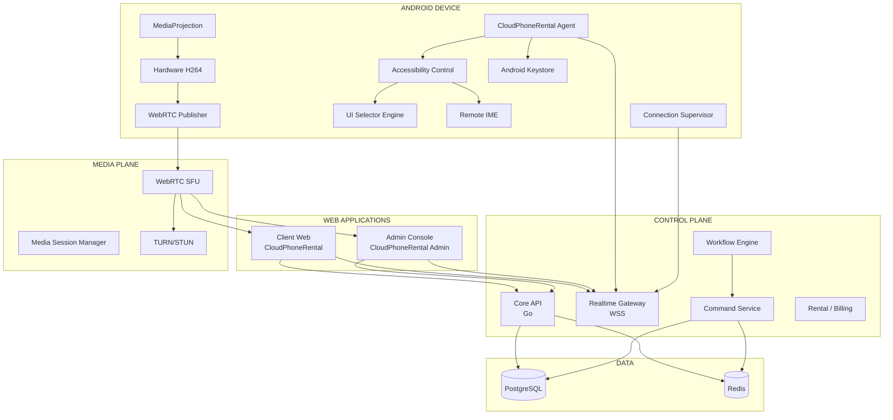

Điểm quan trọng:

```text
CONTROL PLANE ≠ MEDIA PLANE
```

Socket chết không được làm mất enrollment.

Media chết không được làm Device Offline.

UI bị kill không được làm Agent logout.

---

# 3. Target repository

Không nên big-bang rename toàn bộ ngay lập tức.

Target logical structure:

```text
phone-farm/
│
├── api/
│   └── openapi.yaml
│
├── backend/
│   ├── cmd/
│   ├── db/migrations/
│   ├── internal/
│   └── pkg/
│
├── android-agent/
│   └── app/
│
├── web/
│   ├── client/
│   └── admin/
│
├── packages/
│   ├── brand/
│   ├── ui/
│   ├── contracts/
│   ├── api-client/
│   └── device-control/
│
├── infra/
│   ├── caddy/
│   ├── postgres/
│   ├── redis/
│   ├── coturn/
│   ├── media/
│   └── monitoring/
│
├── tests/
│   ├── e2e/
│   ├── soak/
│   ├── load/
│   └── device-lab/
│
└── docs/
    ├── architecture/
    ├── codegraph/
    ├── phases/
    ├── adr/
    └── evidence/
```

**Không di chuyển `backend/` và `android-agent/` chỉ để đẹp cấu trúc.**

Migration frontend được thực hiện theo slice riêng.

---

# 4. Branding / Logo

Logo chúng ta vừa tạo phải trở thành **Single Source of Truth**.

```text
packages/brand/
├── assets/
│   ├── cloudphonerental-mark.png
│   ├── cloudphonerental-mark-512.png
│   ├── cloudphonerental-mark-192.png
│   └── cloudphonerental-mark-foreground.png
│
└── src/
    ├── BrandLogo.tsx
    └── brand-tokens.ts
```

Visual:

```text
Logo Mark:
Cloud + Phone màu xanh

Background:
vòng tròn xanh mint nhạt

Wordmark:
CloudPhoneRental
```

Web nên render:

```text
[logo mark] CloudPhoneRental
```

Text dùng HTML/CSS, không nhúng text vào PNG.

APK launcher:

```text
LOGO MARK ONLY
```

APK Login:

```text
            [ logo ]

       CloudPhoneRental
     Android Device Agent
```

---

# 5. CLIENT WEB

Sidebar chỉ giữ đúng:

```text
Cửa hàng cho thuê
Quản lý thiết bị
Nạp tiền
Document
```

Header:

```text
Logo
Collapse/Expand

                    Language
                    Wallet
                    Profile
```

Routes:

```text
/store
/devices
/devices/:id/control
/wallet
/docs
/profile
```

## Component CodeGraph

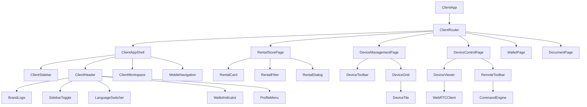

---

# 6. Client — Quản lý thiết bị

Đây phải là màn trọng tâm.

```text
Quản lý thiết bị

50 thiết bị

[ Tất cả ]
[ Online ]
[ Offline ]
[ Thiếu quyền ]
[ Sắp hết hạn ]

Search                 Group ▼

☐ Chọn tất cả

[ 4 cột ] [ 6 cột ] [ 8 cột ]
```

Card:

```text
╭────────────────────────╮
│ CPR-001      ● Online │
│                        │
│    LIVE PREVIEW        │
│                        │
│ Samsung S10            │
│ Android 12             │
│                        │
│ Còn 18 ngày            │
│                        │
│ [ Mở thiết bị ]        │
╰────────────────────────╯
```

Không hiển thị:

```text
CPU
RAM
Temperature
heap
socket generation
```

cho Client.

---

# 7. Multi-device toolbar

Khi chọn nhiều máy:

```text
42 thiết bị đã chọn

[ Wall View ]
[ Đồng bộ ]
[ Workflow ]
[ Mở App ]
[ Screenshot ]
[ ... ]
```

Không để browser gửi 42 REST request.

Browser gửi:

```text
ONE BATCH COMMAND
```

Backend fan-out.

---

# 8. ADMIN CONSOLE

Admin là sản phẩm riêng.

Routes:

```text
/admin/overview

/admin/customers

/admin/devices
/admin/device-groups
/admin/devices/:id

/admin/agent
/admin/agent/token-keys
/admin/agent/releases

/admin/rentals
/admin/plans

/admin/wallets
/admin/transactions

/admin/workflows
/admin/automation-runs

/admin/alerts
/admin/audit

/admin/users
/admin/roles
/admin/settings
```

Sidebar:

```text
TỔNG QUAN
  Tổng quan

KHÁCH HÀNG
  Khách hàng

THIẾT BỊ
  Kho thiết bị
  Nhóm thiết bị
  Wall Monitor

AGENT
  Android Agent
  Token Keys
  APK Releases

AUTOMATION
  Workflow
  Runs

CHO THUÊ
  Đơn thuê
  Gói dịch vụ

TÀI CHÍNH
  Giao dịch
  Ví khách hàng

VẬN HÀNH
  Cảnh báo
  Nhật ký

HỆ THỐNG
  Admin
  Phân quyền
  Cài đặt
```

---

# 9. Admin CodeGraph

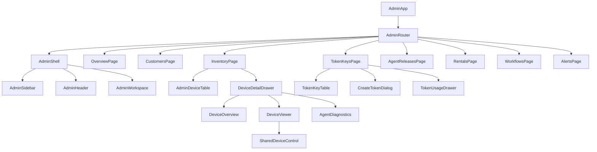

`DeviceViewer` phải nằm ở shared package.

Không viết:

```text
ClientDeviceViewer
AdminDeviceViewer
```

thành hai engine khác nhau.

---

# 10. Shared Device Control package

```text
packages/device-control/
│
├── viewer/
│   ├── DeviceViewer.tsx
│   ├── VideoSurface.tsx
│   └── ViewerOverlay.tsx
│
├── gesture/
│   ├── PointerGestureEngine.ts
│   ├── CoordinateNormalizer.ts
│   └── GestureTypes.ts
│
├── media/
│   ├── MediaSessionClient.ts
│   └── WebRTCClient.ts
│
├── commands/
│   ├── CommandClient.ts
│   └── BatchCommandClient.ts
│
└── controls/
    └── RemoteToolbar.tsx
```

Phần gesture hiện tại của PCP có thể tiếp tục sử dụng.

---

# 11. BACKEND V2

Không rewrite Go backend.

Tách logic thành module rõ hơn:

```text
backend/internal/
│
├── auth/
├── tenant/
├── user/
├── device/
├── agent/
├── enrollment/
├── connection/
├── command/
├── bulkcontrol/
├── media/
├── workflow/
├── rental/
├── billing/
├── alert/
├── audit/
├── cluster/
├── telemetry/
└── transport/
```

CodeGraph:

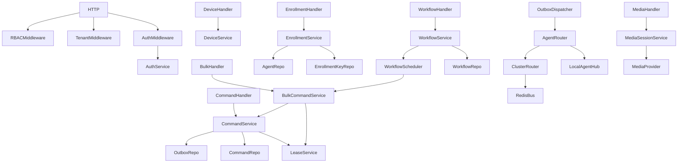

---

# 12. Những phần PCP phải GIỮ

Không cho Antigravity tự rewrite:

```text
RBAC
Tenant Isolation

Command transactional write

command_outbox

Fencing Tokens

Idempotency

ClusterRouter

Agent Socket Presence

Normalized coordinates

Audit foundation
```

Đây là các phần đắt giá nhất của hệ thống hiện tại.

---

# 13. Enrollment Key V2

## Admin tạo key

Form:

```text
User
[ customer01 ▼ ]

Số lượng máy
[ 50 ]

Thời hạn
[ 30 ] ngày

hoặc

☑ Vĩnh viễn

Tên ghi chú
[ Farm A ]

[ Tạo Token Key ]
```

Kết quả:

```text
CPRK-XXXX-XXXX-XXXX-XXXX
```

Chỉ hiện full token **một lần**.

Database chỉ lưu hash.

---

# 14. Database mới

Không sửa migration cũ.

```text
000010_create_agent_enrollment_keys
000011_create_agent_key_bindings
000012_create_device_groups
000013_create_bulk_control_sessions
000014_create_workflow_engine
000015_create_media_wall_sessions
000016_create_agent_releases
```

### `agent_enrollment_keys`

```text
id
organization_id
user_id

key_prefix
key_hash

label

max_devices

expires_at NULLABLE

status

created_by
created_at
last_used_at
revoked_at
```

### `agent_key_bindings`

```text
id
enrollment_key_id

device_id
agent_id

bound_at
released_at

status
```

---

# 15. Enrollment sequence

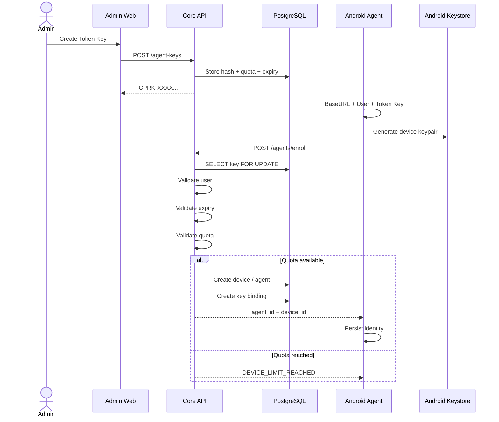

---

# 16. Quy tắc Token quan trọng nhất

Sau Enrollment:

```text
Token Key
     X
KHÔNG còn dùng nữa
```

Không lưu Token Key để reconnect.

Không refresh Token Key.

Không reset Token Key.

Không rotate Token Key vì socket timeout.

---

# 17. ANDROID AGENT V2

`socmtool` được dùng làm **reference implementation cho Accessibility gestures**.

Không copy nguyên SocketManager/ScreenCaptureService.

Target:

```text
android-agent/
└── app/src/main/java/com/cloudphonerental/agent/
    │
    ├── ui/
    │   ├── ConnectActivity.kt
    │   ├── MainActivity.kt
    │   ├── LogsActivity.kt
    │   └── SettingsActivity.kt
    │
    ├── enrollment/
    │   ├── EnrollmentManager.kt
    │   └── EnrollmentApi.kt
    │
    ├── security/
    │   ├── AgentKeyStore.kt
    │   ├── CredentialStore.kt
    │   └── ChallengeSigner.kt
    │
    ├── connection/
    │   ├── AgentConnectionService.kt
    │   ├── ConnectionSupervisor.kt
    │   ├── AgentWebSocket.kt
    │   ├── NetworkMonitor.kt
    │   ├── BackoffPolicy.kt
    │   └── ConnectionState.kt
    │
    ├── protocol/
    │   ├── WSEnvelope.kt
    │   ├── MessageTypes.kt
    │   └── CommandPayload.kt
    │
    ├── control/
    │   ├── DeviceControlService.kt
    │   ├── GestureController.kt
    │   ├── CoordinateMapper.kt
    │   └── GlobalActionController.kt
    │
    ├── automation/
    │   ├── UiSelectorEngine.kt
    │   ├── UiSnapshotProvider.kt
    │   ├── WaitEngine.kt
    │   └── AutomationExecutor.kt
    │
    ├── ime/
    │   └── CloudPhoneInputMethodService.kt
    │
    ├── media/
    │   ├── MediaProjectionService.kt
    │   ├── ScreenCapturer.kt
    │   ├── HardwareEncoder.kt
    │   └── WebRtcPublisher.kt
    │
    ├── permission/
    │   ├── PermissionCoordinator.kt
    │   └── PermissionState.kt
    │
    ├── boot/
    │   └── BootReceiver.kt
    │
    └── logging/
        └── AgentLogger.kt
```

---

# 18. Android Agent CodeGraph

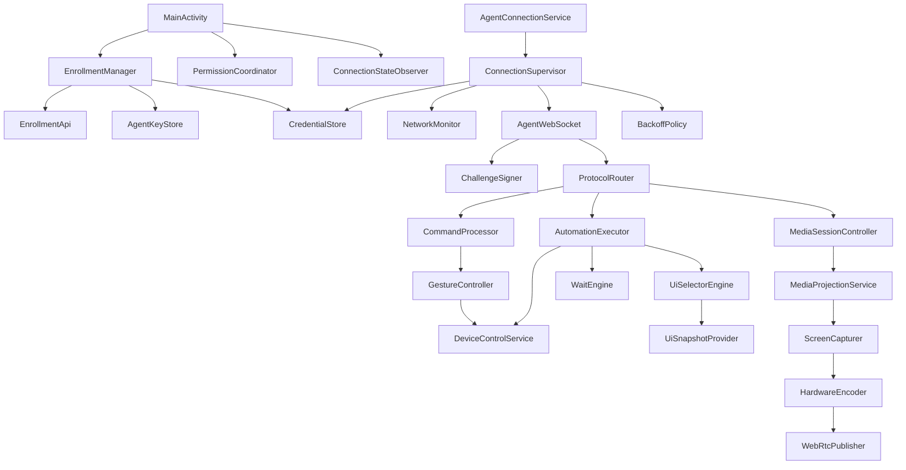

---

# 19. Connection state machine

Đây là phần Antigravity phải ưu tiên hơn streaming.

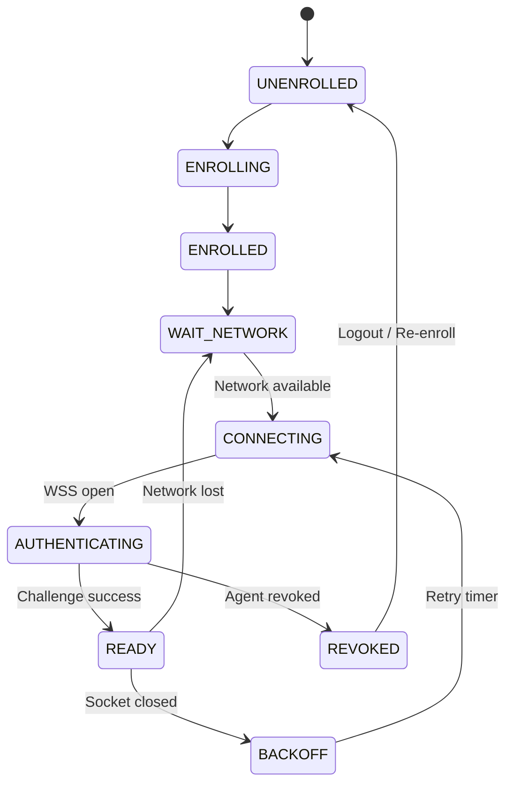

Bắt buộc:

```text
NETWORK_LOST
!=
AUTH_FAILURE

SOCKET_CLOSED
!=
CREDENTIAL_REVOKED
```

---

# 20. Reconnection policy

Ví dụ:

```text
1 sec
2 sec
4 sec
8 sec
15 sec
30 sec
30 sec
...
```

Thêm jitter:

```text
± 20%
```

Để 500 thiết bị không reconnect cùng lúc.

Không có:

```text
reconnectionAttempts = 5
```

rồi ngừng vĩnh viễn.

---

# 21. Activity không sở hữu Connection

Bắt buộc:

```text
MainActivity
     │
     │ observe
     ▼
AgentConnectionService
```

Không:

```text
onDestroy()
   ↓
disconnectSocket()
```

Swipe app khỏi Recent:

```text
UI CLOSED
```

nhưng:

```text
AGENT CONNECTED
```

vẫn là mục tiêu.

---

# 22. APK UI

## Connect

```text
             [ LOGO ]

       CloudPhoneRental
      Android Device Agent


Base URL
[ https://cp.domain.com ]

User
[ customer01 ]

Token Key
[ CPRK-•••••••••••• ]

        [ KẾT NỐI ]
```

Không có nút Save.

Connect tự validate + persist.

---

# 23. APK sau login

Tabs:

```text
Trung tâm
Nhật ký
Cài đặt
```

Trung tâm:

```text
CloudPhoneRental

● Đã kết nối

Samsung Galaxy S10
CPR-000021

Quyền thiết bị

████████████████░░
86%

⚠ Còn thiếu 2 quyền

Screen Capture     ✓
Accessibility      ✓
Keyboard           ✓
Notification       ✓
Microphone         ⚠
Install Apps       ⚠

[ Mở cài đặt ]
```

Không CPU/RAM/Temperature.

---

# 24. Settings APK

```text
Cài đặt

Thông tin kết nối
Base URL

Khởi động Agent
✓ Enabled

Quyền truy cập
86%

Thông báo

Nhật ký chẩn đoán

Phiên bản
1.0.0

────────────────

[ Đăng xuất ]
```

Logout phải confirm:

```text
Bạn có chắc muốn đăng xuất?

Thiết bị sẽ bị ngắt khỏi CloudPhoneRental
và cần Token Key để kết nối lại.

[ Hủy ] [ Đăng xuất ]
```

---

# 25. Control Plane protocol

Giữ envelope:

```json
{
  "version": 2,
  "type": "command.dispatch",
  "message_id": "msg_xxx",
  "timestamp": "...",
  "payload": {}
}
```

Nhóm:

```text
connection.*
device.*
command.*
automation.*
media.*
agent.*
error.*
```

---

# 26. Command types V2

Giữ:

```text
gesture.tap
gesture.swipe

key.global_action
key.press

ime.text_input

device.screen_wake
```

Thêm:

```text
ui.snapshot
ui.find
ui.click
ui.long_click
ui.set_text
ui.scroll
ui.wait
ui.assert

app.launch

screenshot.capture
```

Không cho Client:

```text
raw.shell
raw.adb
```

---

# 27. Automation Engine

Không Appium làm core.

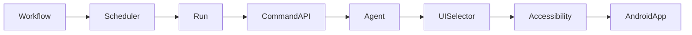

Appium:

```text
OPTIONAL LAB ADAPTER
```

---

# 28. Selector model

```json
{
  "strategy": "resource_id",
  "value": "com.example:id/login_button"
}
```

Hoặc:

```json
{
  "strategy": "text",
  "value": "Đăng nhập"
}
```

Hoặc:

```json
{
  "all": [
    {
      "strategy": "class",
      "value": "android.widget.Button"
    },
    {
      "strategy": "text_contains",
      "value": "Đăng"
    }
  ]
}
```

---

# 29. Workflow CodeGraph

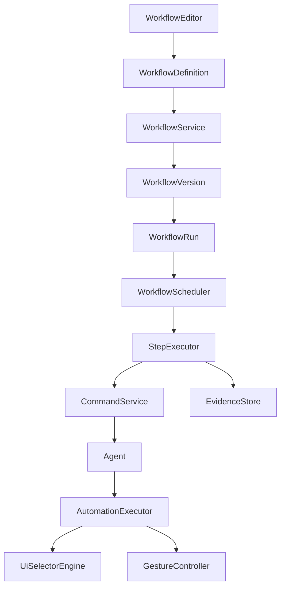

---

# 30. Media Plane

Không dùng cách của socmtool:

```text
RGBA
→ Bitmap
→ JPEG
→ Base64
→ JSON
```

Target:

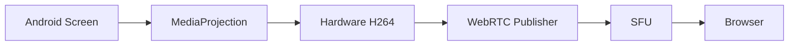

---

# 31. Quality profiles

```text
PREVIEW
180p–360p
2–5 FPS

FOCUS
360p–540p
10–15 FPS

CONTROL
720p
20–30 FPS
```

Không chạy:

```text
50 × 720p × 30fps
```

trên một browser.

---

# 32. Wall 30–50 phones

```text
┌─────┬─────┬─────┬─────┬─────┐
│ 01  │ 02  │ 03  │ 04  │ 05  │
├─────┼─────┼─────┼─────┼─────┤
│ 06  │ 07  │ 08  │ 09  │ 10  │
├─────┼─────┼─────┼─────┼─────┤
│ ...                         │
```

Tile visible:

```text
subscribe preview
```

Tile ngoài viewport:

```text
unsubscribe / pause
```

Click:

```text
preview
    ↓
focus/control quality
```

---

# 33. Bulk Control

Browser:

```text
POST /commands/batch
```

Không:

```text
50 × POST /commands
```

Backend:

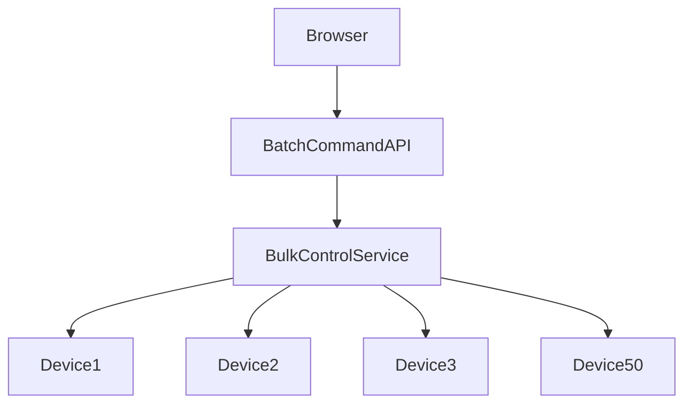

Mỗi device vẫn có:

```text
fencing token riêng
command_id riêng
outbox riêng
audit riêng
```

---

# 34. API V2

Enrollment:

```text
POST /api/v2/agents/enroll
```

Token Key:

```text
POST   /api/v1/agent-keys
GET    /api/v1/agent-keys
GET    /api/v1/agent-keys/{id}
PATCH  /api/v1/agent-keys/{id}
DELETE /api/v1/agent-keys/{id}

GET /api/v1/agent-keys/{id}/devices
```

Bulk:

```text
POST /api/v1/control-sessions/bulk
POST /api/v1/commands/batch
```

Workflow:

```text
POST /api/v1/workflows
GET  /api/v1/workflows

POST /api/v1/workflows/{id}/run

GET  /api/v1/automation-runs/{id}
POST /api/v1/automation-runs/{id}/cancel
```

Media:

```text
POST   /api/v1/media/sessions
DELETE /api/v1/media/sessions/{id}

POST   /api/v1/media/wall-sessions
PATCH  /api/v1/media/wall-sessions/{id}
DELETE /api/v1/media/wall-sessions/{id}
```

---

# 35. Phase triển khai cho Antigravity

Không giao:

```text
Implement CloudPhoneRental V2
```

một lần.

## PHASE 0 — Architecture Rebaseline

Chỉ tài liệu.

Artifacts:

```text
docs/architecture/PRODUCT-CONSTITUTION.md
docs/architecture/SYSTEM-ARCHITECTURE-V2.md
docs/architecture/ANDROID-AGENT-V2.md
docs/architecture/WEB-ARCHITECTURE-V2.md
docs/architecture/MEDIA-PLANE-V2.md
docs/architecture/AUTOMATION-V2.md
docs/codegraph/CODEGRAPH-V2.md
```

**OWNER GATE 0**

---

# PHASE 1 — Brand + Web Foundation

Build:

```text
Brand package
Logo
Design tokens

Client AppShell
Admin AppShell

Header
Sidebar
Responsive
Toast
Modal
Loading
Empty
Error
```

Không backend business.

### Acceptance

```text
Desktop
Tablet
Mobile

No layout overflow
No mock business logic leak
Sidebar collapse stable
Shared branding
```

---

# PHASE 2 — Enrollment Key V2

Implement:

```text
000010 migration

agent_enrollment_keys
agent_key_bindings

Admin Token Keys UI

Quota locking

Expiry
Forever

/api/v2/agents/enroll
```

Test:

```text
limit=5

1 OK
2 OK
3 OK
4 OK
5 OK
6 REJECT
```

Cộng concurrent enrollment test.

**OWNER GATE**

---

# PHASE 3 — APK Agent Foundation

Fork/borrow socmtool Accessibility concepts.

Implement:

```text
CloudPhoneRental branding

Connect UI

BaseURL
User
Token Key

Enrollment

Keystore

CredentialStore
```

Chưa media.

---

# PHASE 4 — Stable Connection

Đây là Gate quan trọng nhất.

Implement:

```text
AgentConnectionService

ConnectionSupervisor

NetworkMonitor

Backoff

WSS

Challenge auth

Heartbeat

Boot recovery
```

Không stream.

Không automation.

Test:

```text
1 phone
24–72 hours
```

Fault injection:

```text
Wi-Fi off/on

Router restart

Backend restart

Redis restart

Socket kill

Screen off

UI killed

Airplane mode
```

Expected:

```text
Device reconnects

NO Token Key reset

NO re-enrollment

NO duplicate connection

same agent_id
same device_id
```

Nếu chưa đạt:

> STOP.

Không sang Phase 5.

---

# PHASE 5 — Remote Control V2

Implement:

```text
Accessibility

Tap
Swipe
Drag
Long press

Back
Home
Recents

IME
```

Re-use:

```text
normalized_display_v1
fencing
outbox
idempotency
```

---

# PHASE 6 — Native Automation

Implement:

```text
UI tree snapshot

Selectors

Find

Click

Input

Wait

Assert

Scroll

App launch

Retry
```

Không Appium.

---

# PHASE 7 — Media V2

Implement:

```text
MediaProjection

Hardware H264

WebRTC

Media session lifecycle
```

Single phone trước.

Gate:

```text
2 hour continuous session

no leak

no reconnect storm

no Agent socket impact
```

---

# PHASE 8 — Media SFU

Thêm:

```text
SFU

Preview quality

Control quality

Adaptive subscription

TURN
```

---

# PHASE 9 — 10 Device Wall

Test:

```text
10 physical devices
```

Không nhảy lên 50.

---

# PHASE 10 — 30 Device Wall

Test:

```text
30 physical devices
```

---

# PHASE 11 — 50 Device Wall

Acceptance:

```text
50 devices online

50 previews

one selected device high-quality

grid smooth

no React rerender storm

browser memory stable

no media leak
```

---

# PHASE 12 — Bulk Control

Implement:

```text
Groups

Multi-select

Batch leases

Batch commands

Sync touch

Sync swipe

Bulk text

Open app
```

---

# PHASE 13 — Workflow Web UI

Visual builder:

```text
Start

Open App

Wait

Find UI

Click

Input

Swipe

Condition

Loop

Delay

Screenshot

Retry

Success
Fail
```

---

# PHASE 14 — Rental + Commercial Client

Cửa hàng:

```text
plans
availability
rent
renew
expire
```

Wallet:

```text
top-up
transactions
billing
```

---

# PHASE 15 — Production Hardening

Security:

```text
tenant isolation
RBAC
IDOR
replay
agent spoofing
rate limits
key leakage
CSRF
WSS auth
```

Soak:

```text
72h
```

Scale:

```text
50 physical devices

100 simulated
250 simulated
500 simulated
1000 simulated agents
```

---

# 36. Definition of Done

Không cho Antigravity nói:

> Phase complete.

nếu chỉ compile.

Mỗi Slice bắt buộc:

```text
Code

Unit Tests

Integration Tests

Lint

Typecheck

Security validation

Manual Verification

Screenshots

Logs

Evidence

CI green

CodeGraph update

Owner Gate
```

---

# 37. Evidence structure

```text
docs/evidence/
│
├── phase-01/
│
├── phase-02/
│   └── enrollment-key/
│       ├── README.md
│       ├── db-tests.txt
│       ├── concurrency-test.txt
│       ├── screenshot.png
│       └── ci-run.md
│
└── phase-04/
    └── stable-connection/
        ├── 24h-soak.txt
        ├── wifi-recovery.txt
        ├── server-restart.txt
        └── reconnect-metrics.json
```

---

# 38. CodeGraph impact rules

Ví dụ khi thêm command:

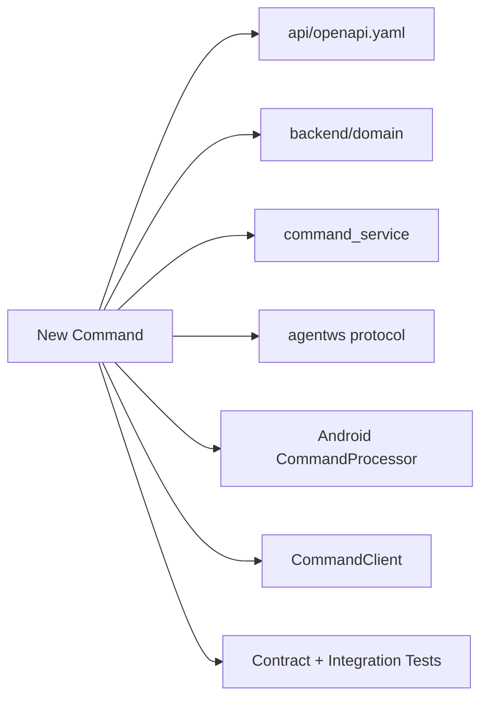

Antigravity không được sửa một phía mà bỏ các phía còn lại.

---

# 39. Master rule cho CodeGraph

Trước mỗi task:

```text
1. Search CodeGraph
2. Identify existing implementation
3. Identify inbound calls
4. Identify outbound calls
5. Identify DB touchpoints
6. Identify API contract
7. Identify Android impact
8. Identify Web impact
9. Define test impact
10. Then code
```

---

# 40. Prompt MASTER để gửi Antigravity

Bạn có thể dùng gần như nguyên văn:

> **Project: CloudPhoneRental V2 — Commercial Physical Android Cloud Phone Platform**
>
> You are working inside the existing Phone Control Platform repository.
>
> The project is being rebaselined into CloudPhoneRental.
>
> Do not perform a big-bang rewrite.
>
> Preserve all working architectural foundations unless the active phase explicitly replaces them:
> - Go backend
> - PostgreSQL
> - Redis
> - RBAC
> - tenant isolation
> - transactional command outbox
> - fencing tokens
> - command idempotency
> - cluster routing
> - normalized display coordinates.
>
> The Android Agent must support stock/non-root physical Android devices. Use `tcandt/socmtool` only as reference for Accessibility gesture/control behavior. Do not copy its Socket.IO, Python server, JPEG/Base64 streaming or lifecycle architecture into production.
>
> CloudPhoneRental Agent V2 architecture:
> - Base URL + User + Token Key enrollment.
> - Token Key is enrollment-only.
> - Every enrolled device gets its own persistent identity.
> - Network or WebSocket failures must never reset enrollment credentials.
> - Activity lifecycle must not own the Agent connection.
> - Persistent connection is managed by AgentConnectionService + ConnectionSupervisor.
> - Media lifecycle must be completely separate from Agent connection lifecycle.
> - Accessibility is the primary production control and automation engine.
> - Appium/UIAutomator2 is optional and must not become the runtime dependency.
> - Screen media uses MediaProjection → hardware H264 → WebRTC.
> - Multi-device media must support adaptive quality and 30–50 device wall operation.
>
> Branding:
> - Product name: CloudPhoneRental.
> - Use the provided green Cloud + Phone logo with pale mint circular background.
> - Use the mark alone for Android launcher icon.
> - Use mark + HTML/text wordmark for Web.
>
> Client Web navigation must contain only:
> - Cửa hàng cho thuê
> - Quản lý thiết bị
> - Nạp tiền
> - Document
>
> Client Header:
> - Logo
> - Sidebar collapse
> - Language
> - Wallet
> - Profile
>
> Admin is a separate Console.
>
> Work strictly with Three-Level Delivery.
>
> Only one Slice may be ACTIVE at a time.
>
> Before implementing any Slice:
> 1. inspect CodeGraph;
> 2. locate existing implementations;
> 3. document affected modules;
> 4. define acceptance criteria;
> 5. define required tests.
>
> Do not begin the next Slice until:
> - implementation complete;
> - tests green;
> - CI green;
> - evidence captured;
> - CodeGraph updated;
> - Owner Gate explicitly approved.
>
> Do not mark work complete because it compiles.
>
> If a task conflicts with current architecture or requires widening scope, STOP and report the conflict to Owner rather than improvising.
>
> Start with **Phase 0 — Architecture Rebaseline only**.
>
> Do not implement product features yet.
>
> Create and present:
> - PRODUCT-CONSTITUTION.md
> - SYSTEM-ARCHITECTURE-V2.md
> - ANDROID-AGENT-V2.md
> - WEB-ARCHITECTURE-V2.md
> - MEDIA-PLANE-V2.md
> - AUTOMATION-V2.md
> - CODEGRAPH-V2.md
> - PHASE-ROADMAP-V2.md
>
> Then STOP at OWNER GATE #0.

Tôi khuyên **đúng lúc này chưa bảo Antigravity code APK hoặc Web ngay**. Cho nó thực hiện duy nhất **Phase 0 — Architecture Rebaseline**, dùng bản blueprint trên để đối chiếu với CodeGraph thật trong repo, xuất ra các file kiến trúc và **STOP ở Owner Gate #0**. Sau khi bạn gửi lại bộ tài liệu Phase 0 mà Antigravity tạo, tôi có thể audit từng phần để phát hiện ngay chỗ nào nó hiểu sai, thiếu hoặc đang chuẩn bị làm dự án drift trước khi bắt đầu code.